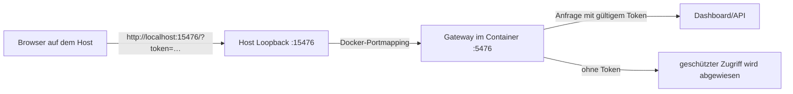
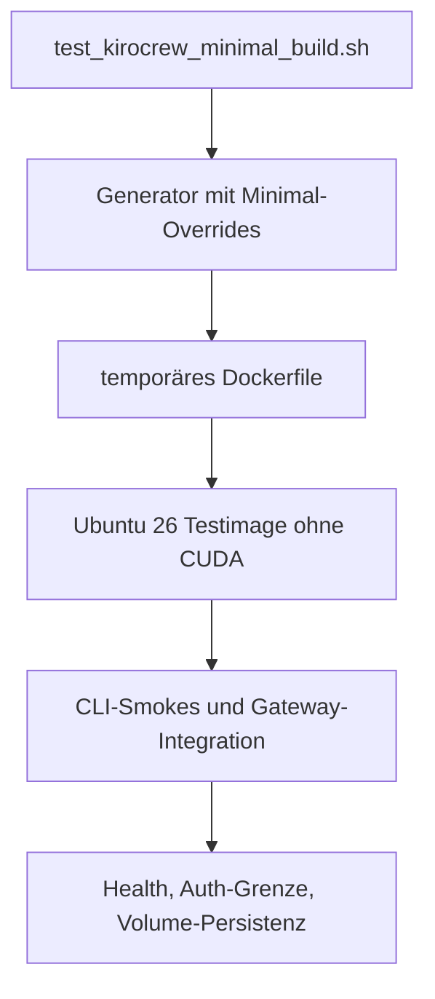

# KiroCrew in der Entwicklungsumgebung: Walkthrough

Dieser Walkthrough beschreibt den implementierten Stand und den manuellen Testlauf vom 1. Oktober 2026. Das Dashboard ließ sich öffnen, der Setup-Import wurde abgeschlossen und die Datenschutz- sowie Personalisierungsseiten wurden angezeigt. Beim letzten protokollierten Gateway-Start scheiterte jedoch die Sandbox-Probe an `unshare(CLONE_NEWUSER): EPERM`; der KiroCrew-Agent konnte deshalb noch nicht starten. Dashboard-Bedienung und erfolgreicher Agentenlauf sind zwei getrennte Nachweise.

## Was eingebaut wurde

Der reguläre Generator kann KiroCrew 0.7.2 optional zusammen mit kiro-cli installieren. KiroCrew wird über den offiziellen Installer mit signierter Release-Prüfung und verwaltetem CPython 3.12 eingerichtet. Die Ausführung bleibt manuell: Docker startet immer die gewohnte Bash. Innerhalb dieser Shell startet `kirocrew` das Gateway mit YOLO-Freigabe; `kirocrew gateway` tut dasselbe. YOLO bedeutet, dass KiroCrew Werkzeugfreigaben nicht einzeln abfragt. Es schaltet die Betriebssystem-Sandbox nicht ab.

```text
Host: ./setup02_run.sh
  └── Container startet in Bash (als root, HOME=/root)
        ├── kiro-cli login       Anmeldung im persistenten CLI-Profil
        └── kirocrew             Gateway manuell mit YOLO starten
```

Der Wrapper lässt Login- und Verwaltungsbefehle wie `kiro-cli login` sowie `kirocrew token` durch. `kirocrew chat` bleibt unverändert; Version 0.7.2 stellt für diesen Terminalchat keinen YOLO-Schalter bereit. Der YOLO-Pfad für Gateway-Daten ist `/root/.kiro/crew-yolo`, getrennt vom normalen KiroCrew-Verzeichnis.

### Persistenz und Identität

`setup02_run.sh` startet derzeit als Root, weil der gewünschte Betrieb mit der Host-UID 1000 (`kiel`) mit den installierten Programmen nicht zuverlässig funktionierte. Das ist eine dokumentierte Betriebsentscheidung, keine Behauptung, dass UID 1000 unmöglich wäre. Die Konfigurations- und Credential-Verzeichnisse des Hostbenutzers werden gezielt in die Root-Home-Verzeichnisse eingehängt. Insbesondere bleiben kiro-cli-Anmeldedaten unter `~/.local/share/kiro-cli` persistent; KiroCrew-Daten bleiben unter `~/.kiro/crew-yolo` persistent. Der Docker-Socket kann optional eingebunden werden und verleiht dem Container weitreichende Rechte auf dem Host.

```mermaid
flowchart LR
  H[Host-Benutzer kiel] -->|Bind-Mount| C[Container als root]
  H1[~/.local/share/kiro-cli] --> C1[/root/.local/share/kiro-cli]
  H2[~/.kiro/crew-yolo] --> C2[/root/.kiro/crew-yolo]
  H3[Codex-, AWS- und weitere Konfiguration] --> C3[/root/...]
  C --> K[kiro-cli und KiroCrew]
```

Die Anmeldedaten selbst werden nicht in das Image kopiert. Sie bleiben im eingehängten Laufzeitverzeichnis. Das Image wird ohne Zugangsdaten gebaut; ein bereits auf dem Host vorhandenes Login kann im Container genutzt werden, sofern dessen Verzeichnis korrekt eingehängt ist.

### Netzwerk und Dashboard

Der Standard nutzt ein Docker-Bridge-Netzwerk. Das Gateway lauscht im Container auf Port 5476; veröffentlicht wird der Port standardmäßig ausschließlich auf `127.0.0.1` des Hosts. `--kirocrew-port` ändert den Host-Port. Ein Dashboard-Link enthält ein Zugriffstoken und soll vertraulich behandelt werden.



Ein typischer manueller Ablauf ist:

```bash
# Im Projektverzeichnis auf dem Host: Container starten.
./setup02_run.sh --kirocrew-port 15476

# In der Bash des Containers: Login nur dann ausführen, wenn nötig.
kiro-cli whoami
# Falls noch nicht angemeldet:
kiro-cli login

# Gateway starten. Diese Vordergrund-Shell offen lassen.
kirocrew gateway --no-open --port 5476
```

In einer zweiten Host-Shell lässt sich ein kurzlebiger Dashboard-Link ausgeben:

```bash
docker ps --format '{{.Names}}'
docker exec -it CONTAINERNAME kirocrew token --port 5476 --ttl 2h
```

Die URL anschließend im Host-Browser öffnen. Der Browser-Onboarding-Ablauf kann Setup-Quellen importieren, Datenschutz-Einstellungen zeigen und das Erscheinungsbild konfigurieren. In unserem manuellen Lauf wurden Codex- und Gemini-Quellen gefunden; der ausgewählte Import meldete 11 importierte und 4 übersprungene Einträge. Zugangsdaten wurden dabei nicht importiert. Ein Link mit Token sollte nicht in Tickets, Screenshots oder öffentliche Logs übernommen werden.

Für Anmeldeabläufe, die zwingend Host-`localhost` erfordern, existiert `--host-network`. In diesem Modus ist `--kirocrew-port` nicht verfügbar. LAN-Zugriff braucht eine passende Origin-Konfiguration; für entfernte Nutzung ist ein TLS-Reverse-Proxy vorgesehen, nicht ein unbedachtes Öffnen des Loopback-Ports.

## CUDA-freier Test-Build

Der Wunsch, die Tests klein zu halten, wird durch einen eigenen temporären Minimal-Build erfüllt. `test_kirocrew_minimal_build.sh` erzeugt ein Ubuntu-26-Image mit den für diese Integration benötigten Komponenten und lässt CUDA, NVIDIA-Runtime-Konfiguration, weitere AI-Tools, große Python-Bibliotheken und Quicklisp weg. Der normale Generator ist eine getrennte Konfiguration; CUDA kann dort unabhängig davon ein- oder ausgeschaltet werden. Ein CUDA-freier Test beweist keine GPU-Funktion.



Der erfolgreiche Integrationstest prüfte, dass der Container mit Bash startet, das Gateway manuell läuft, der Host-Port erreichbar ist, `/api/health` antwortet, ein geschützter API-Zugriff ohne Token abgewiesen wird und KiroCrew-Daten nach Entfernen und Neuerstellen des Containers im Volume erhalten bleiben. Das sind reproduzierbare technische Prüfungen; sie ersetzen weder eine echte Modellanfrage noch eine Sandbox-Prüfung im konkreten Docker-Runtime-Profil.

## Manuelle Prüfung: was funktionierte und was noch fehlt

Der manuelle Lauf zeigte, dass kiro-cli im Container angemeldet war (`kiro-cli whoami` meldete eine IAM Identity Center-Anmeldung). Der Gateway-Prozess startete und das Dashboard war mit Token im Browser erreichbar. Der Onboarding-Import und die folgenden Datenschutz- und Personalisierungsseiten liefen durch.

Der Agentenstart scheiterte dagegen an der inneren Linux-Namespace-Sandbox:

```text
unshare(CLONE_NEWUSER) failed with errno 1 (EPERM)
Sandbox backend unavailable and allow_unsandboxed_exec is not set
```

Das ist fail-closed: KiroCrew verweigert den Agentenprozess, statt ohne Sandbox fortzufahren. Der KiroCrew-kompatible Seccomp-Entwurf ist der bevorzugte nächste Versuch. Er muss dem Docker-Daemon an einem für den Daemon erreichbaren Pfad übergeben werden:

```bash
./setup02_run.sh --kirocrew-sandbox-profile /pfad/auf/dem/host/kirocrew-seccomp.json
```

`setup02_run.sh` ergänzt zu diesem Profil die nötige AppArmor-Einstellung. Das Profil ist nicht `seccomp=unconfined`; trotzdem muss der Sandbox-Probe- und Agentenstart auf der tatsächlichen Host-Runtime erneut geprüft werden. Nicht als Standard setzen: `KIROCREW_ALLOW_UNSANDBOXED=1` oder `agent.sandbox_allow_unsandboxed_exec=true`. Diese Optionen erlauben Agentenprozesse ohne die innere Sandbox und ändern damit die Sicherheitsgrenze.

Beim beobachteten Start gab es außerdem zwei betriebliche Hinweise:

- `systemd-run` fehlte, daher war keine cgroup-v2-Scope-Begrenzung verfügbar. KiroCrew warnte, dass Fork-Bomb-/Speichergrenzen dadurch nicht durchgesetzt werden; `RLIMIT_NOFILE` blieb aktiv.
- Die Probe für kiro-cli konnte wegen desselben Sandbox-Fehlers nicht abgeschlossen werden. Das ist kein Nachweis für einen fehlenden Login; `kiro-cli whoami` war erfolgreich.

## Komponenten im Image

Im normalen Image ergänzen KiroCrew und die zugehörige Ausführung insbesondere:

- KiroCrew 0.7.2 sowie verwaltetes CPython 3.12 und das vom Installer gepinnte `uv`.
- Für den KiroCrew-Installationsschritt: `ca-certificates`, `curl`, `openssl` und `python3-full`.
- Kiro CLI und Hilfsprogramme, sofern `*install-kiro-cli*` aktiviert ist.
- Docker-CLI und Buildx, sofern `*install-docker-cli*` aktiviert ist; der Daemon selbst ist nicht im Container. `gnupg` wird für die Paketquellen-Konfiguration benötigt.
- `sbcl` und `rlwrap`, sofern `*install-sbcl*` aktiviert ist.

Der Minimal-Test schaltet unnötige Generator-Features ab und enthält ausdrücklich weder CUDA-Toolkit noch `nvcc`, NVIDIA-Umgebungsvariablen oder GPU-Weitergabe. Die Paketliste des regulären Images hängt weiter von den Generator-Schaltern ab.

## Learnings und mögliche Fortsetzungen

1. **Dashboard-Erreichbarkeit ist nicht gleich Agentenbereitschaft.** Health-Endpunkt, Token-Authentisierung und UI-Onboarding können funktionieren, während die Sandbox Agentenstarts verhindert.
2. **Credentials hängen am Laufzeit-Mount.** Ein Login unter `/root` ist nur dann derselbe Login, den der Host vorbereitet hat, wenn `setup02_run.sh` genau das zugehörige Verzeichnis dort einbindet. Ein Wechsel auf UID 1000 ist erst nach Ursachenanalyse für alle installierten Tools sinnvoll.
3. **YOLO und Sandbox lösen unterschiedliche Fragen.** YOLO steuert Bestätigungen für Werkzeuge; die Sandbox isoliert den Agentenprozess. Beide Zustände müssen separat geprüft werden.
4. **Kleine Testimages sind nützlich.** Die CUDA-freie Integration prüft Gateway und Persistenz schneller und mit weniger Speicherbedarf. GPU-Verhalten gehört in einen eigenen Testlauf, wenn es für die Änderung relevant ist.
5. **Nächste sinnvolle Validierung:** Seccomp-Profil am echten Docker-Daemon testen, eine harmlose Agentenaufgabe bis zur Antwort durchführen und danach Logout beziehungsweise Tokenablauf prüfen. Danach können die noch offenen HIL- und Abschluss-Punkte im `task.md` aktualisiert werden.

