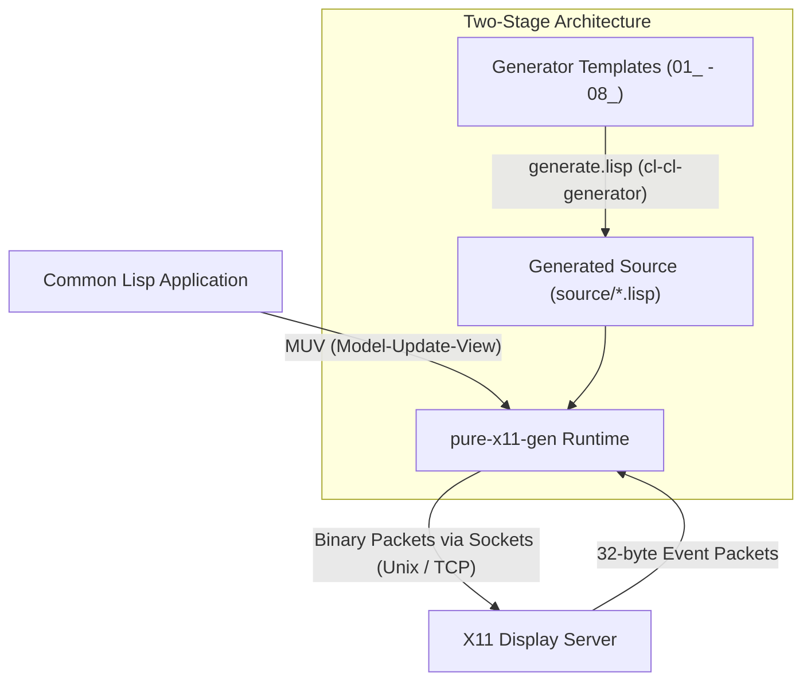
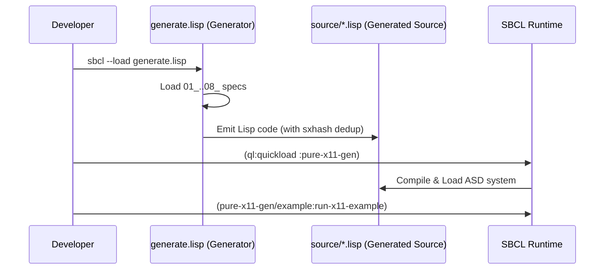

# Overview & Design Philosophy

> Part of the [Pure X11 GUI Toolkit](../README.md) documentation.
> Generated: 2026-07-22

## What is the Pure X11 GUI Toolkit?

The **Pure X11 GUI Toolkit** (`pure-x11-gen`), located in `example/07_pure_x11`, is a lightweight, pure Common Lisp graphical user interface toolkit and X11 client library. Unlike traditional Lisp GUI solutions that rely on C Foreign Function Interface (FFI) bindings to system C libraries (like `Xlib`, `XCB`, `GTK`, or `Qt`), `pure-x11-gen` communicates directly with the X11 display server over raw network sockets (Unix domain sockets or TCP streams).

The entire library and GUI framework are dynamically generated from declarative S-expression specifications using the [`cl-cl-generator`](../../README.md) transpiler framework.

---

## Design Philosophy

The toolkit is designed around several key principles:

### 1. Zero External C Dependencies
By implementing the X11 core protocol framing, socket connections, packet serialization, XAuthority authentication, and event parsing directly in pure Common Lisp, the toolkit runs anywhere SBCL with `sb-bsd-sockets` is available. No C compiler, dynamic libraries (`.so` / `.dll`), or FFI bindings are required.

### 2. Minimization of Network Round-Trip Time (RTT)
Network transparency is a core feature of X11, but poorly designed clients suffer from high RTT latency. `pure-x11-gen` minimizes RTT through:
* **Request Buffering:** Micro-requests are batched into output buffers via `with-buffered-output` and flushed to the socket in a single write operation.
* **Asynchronous Interaction:** Interactive events (like mouse motion) rely on server-push event payloads (`MotionNotify`). Synchronous query requests (such as `QueryPointer`) are avoided during standard user interaction.
* **Server-Side Graphics Primitives:** UI rendering utilizes fast X11 server primitives (`PolyFillRectangle`, `PolySegment` for 3D bevels, `ImageText8` for text) rather than sending pixel arrays over the network.
* **Client-Side Spatial Indexing:** The client maintains an in-memory representation of the widget layout hierarchy, resolving hit testing locally without querying the X server.

### 3. Model-Update-View (MUV) Architecture
Inspired by the Elm Architecture, `pure-x11-gen` enforces predictable, unidirectional data flow:
* **Model (`state`):** Application state is represented by an immutable structure.
* **Update (`update-fn`):** Pure state transition function `(state, message) -> new-state`.
* **View (`view-fn`):** Pure rendering function `(width, height, state) -> Virtual DOM`.

### 4. TeX Glue Layout Engine
Rather than relying on static pixel positioning or complex CSS Flexbox rules, `pure-x11-gen` incorporates Donald Knuth's TeX `glue` model for container layout (`HBOX` and `VBOX`). Widgets express elasticity via `natural` size, `stretch` factor, and `shrink` factor, permitting clean responsive layout calculation.

---

## Two-Stage Architecture: Generator-Time vs. Runtime

The project operates across two distinct lifecycle stages:

1. **Generator-Time (Specification & Emission):**
   - Declarative specification files (`01_package.lisp` through `08_orbit_demo_template.lisp`) define protocol tables, widget data structures, layout engines, and event loops.
   - `generate.lisp` acts as the orchestrator, executing macro-level generation loops (e.g., `,@(loop for req in *x11-requests* ...)`), pretty-printing the output via `emit-cl`, and writing Lisp source files into `source/`.
   - File modification hashing (`sxhash`) avoids touching unchanged files, preserving build cache integrity.

2. **Runtime (Execution & Event Processing):**
   - The emitted Lisp files in `source/` build into a standalone ASDF system (`:pure-x11-gen`).
   - Applications connect to the X11 server, allocate resource IDs, construct layout trees, and execute the MUV event loop (`run-gui`).

---

## Comparison with Alternative Approaches

| Feature | `pure-x11-gen` | `CLX` | `Xlib` / `XCB` (via FFI) | `GTK` / `Qt` Bindings |
| :--- | :--- | :--- | :--- | :--- |
| **Language** | Pure Common Lisp | Pure Common Lisp | C (FFI to Lisp) | C++ / C (FFI to Lisp) |
| **C Library Dependency** | None | None | `libX11.so` / `libxcb.so` | `libgtk-3.so` / `libQt5Core.so` |
| **Code Generation** | Metaprogrammed via `cl-cl-generator` | Hand-written | Hand-bound FFI | CFFI / SWIG bindings |
| **Architecture** | Built-in MUV & TeX Glue GUI | Low-level protocol only | Low-level C wrappers | Heavy C++ Object Model |
| **Size & Boilerplate** | ~730 LOC specs -> ~1900 LOC source | ~30,000 LOC | High FFI boilerplate | Massive binary dependencies |
| **Network Transparency** | High (buffered async socket I/O) | High | Medium/High | Low (heavy client-side rendering) |

---

## Prerequisites & Dependencies

- **Host Compiler:** [Steel Bank Common Lisp (SBCL)](https://www.sbcl.org/)
- **Lisp Libraries:**
  - `sb-bsd-sockets` (SBCL built-in module for Unix/TCP socket streams)
  - `cl-cl-generator` (included in workspace repository)
  - Quicklisp (for dependency management during generation)
- **Environment:**
  - Active X11 Display Server (`DISPLAY` variable pointing to Unix domain socket `/tmp/.X11-unix/X0` or TCP display) or `Xvfb` for headless execution.
