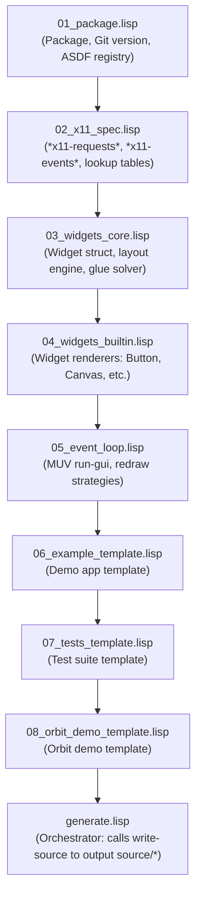

# Code Generation Architecture

> Part of the [Pure X11 GUI Toolkit](../README.md) documentation.
> Generated: 2026-07-22

## Overview

The `pure-x11-gen` client library and widget engine are constructed using a meta-programming approach driven by [`cl-cl-generator`](../../README.md). Instead of manually writing thousands of lines of low-level binary serialization, socket parsing, and widget rendering code, the codebase is emitted from concise, declarative S-expression templates.

---

## Core Emitter Mechanism: `emit-cl` & `write-source`

`cl-cl-generator` transforms S-expressions into idiomatic, formatted Common Lisp source code through two primary functions:


### `emit-cl`
`emit-cl` takes an S-expression representation of Common Lisp code and returns a pretty-printed string. It binds `*print-pprint-dispatch*` to `*cl-pprint-dispatch*`, applying special formatting rules for custom DSL keywords while enforcing lowercase output and proper indentation.

### `write-source`
`write-source` handles file emission and build optimization:
1. Calls `emit-cl` to convert the template tree to a Lisp string.
2. Computes an `sxhash` checksum of the formatted string.
3. Compares the hash with stored file hashes in `*file-hashes*`.
4. Skips writing if the content is unchanged, preventing unnecessary file modification timestamps and downstream re-compilation in ASDF.

---

## DSL Keywords

`cl-cl-generator` extends standard Common Lisp S-expression formatting with specific macro-keywords recognized by its pretty-printer dispatch table:

| Keyword | Description | Example Usage | Emitted Output |
| :--- | :--- | :--- | :--- |
| `toplevel` (or `do0`) | Wraps multiple top-level forms without outer parentheses. Separates forms with blank lines. | `(toplevel (in-package :foo) (defvar *x* 1))` | `(in-package :foo)`<br/><br/>`(defvar *x* 1)` |
| `comment` | Formats a single-line comment. | `(comment "Socket setup")` | `;; Socket setup` |
| `comments` | Formats a multi-line comment block. | `(comments "Line 1" "Line 2")` | `;; Line 1`<br/>`;; Line 2` |
| `raw` | Inserts an unescaped string literal directly into output stream. | `(raw "(defmacro foo () ...)")` | `(defmacro foo () ...)` |

---

## Generator-Time Loops & Meta-Expansion

The primary advantage of generating the X11 protocol code is using Common Lisp's macro and evaluation capabilities at **generator-time**. 

For example, `02_x11_spec.lisp` defines a table `*x11-requests*` containing specifications for 19 X11 requests. In `generate.lisp`, the code generator iterates over this list at generation time to emit the corresponding `defun` forms:

```lisp
;; In generate.lisp:
(comment "Dynamically Generated Request APIs")
,@(loop for req in *x11-requests*
        collect (emit-request-function req))
```

This single generator loop synthesizes all 19 protocol request functions (`make-window`, `poly-fill-rectangle`, `create-pixmap`, `copy-area`, etc.) complete with docstrings, type declarations, packet serialization, reply parsing, and return value handling.

---

## The `raw` Block Pattern for Nested Quasiquoting

When generating Lisp code that itself contains complex macros or nested quasiquoted backtick forms (e.g., `with-packet`, `with-reply`, or `view` functions in templates), standard S-expression evaluation can cause unwanted macro-expansion or quasiquote evaluation at generator-time rather than runtime.

To solve this, `cl-cl-generator` uses `raw` blocks containing exact string forms:

```lisp
;; In generate.lisp (emitting x11-core.lisp):
(raw "
(defmacro with-buffered-output (&body body)
  \"Execute body with request buffering. Flushes on exit.\"
  `(let ((*packet-buffer* (list))
         (*buffering-p* t))
     (unwind-protect (progn ,@body)
       (flush-packets))))
")
```

`raw` blocks pass text verbatim into the output stream, bypassing generator-time evaluation while preserving perfect Lisp indentation and syntax in the output file.

---

## File Numbering & Load Sequence

The generator templates follow a strict numerical loading order to ensure dependencies and spec tables are populated before code emission occurs:



1. **`01_package.lisp`**: Loads Quicklisp dependencies, sets `*output-dir*` (`source/`), queries git hash (`*git-version*`), and defines `make-header-comments`.
2. **`02_x11_spec.lisp`**: Specifies `*set-of-value-mask*`, `*set-of-event*`, `*set-of-key-button*`, `*x11-requests*`, and `*x11-events*`. Defines generator functions `emit-request-function` and `emit-event-parser`.
3. **`03_widgets_core.lisp`**: Template quote tree for `widget` struct, `parse-node`, `resolve-layout`, `solve-glue`, `find-widget-at`, and `find-nearest-widget`.
4. **`04_widgets_builtin.lisp`**: Template quote tree for widget renderer registrations (`PANEL`, `LABEL`, `BUTTON`, `CHECKBOX`, `TEXT-INPUT`, `CANVAS`).
5. **`05_event_loop.lisp`**: Template quote tree for MUV event loop (`run-gui`), dirty tracking (`compute-dirty-widgets`), and redraw mechanisms.
6. **`06_example_template.lisp`**: Template for Athena GUI demo application (`pure-x11-gen/example`).
7. **`07_tests_template.lisp`**: Template for 15 test suites (`pure-x11-gen/tests`).
8. **`08_orbit_demo_template.lisp`**: Template for Hohmann transfer orbit animation (`pure-x11-gen/orbit-demo`).
9. **`generate.lisp`**: Orchestrator script that loads `01` through `08`, defines `x11-core` inline, and invokes `write-source` for all target files.

---

## How to Re-Run Code Generation

Whenever template specifications in `01_` through `08_` or `generate.lisp` are modified, regenerate the runtime source by running SBCL against `generate.lisp`:

```bash
cd /workspace/src/cl-cl-generator/example/07_pure_x11
sbcl --load generate.lisp
```

**Console Output:**
```text
Auto-generated by cl-cl-generator — do not edit manually.
Successfully generated X11 example client codebase in /workspace/src/cl-cl-generator/example/07_pure_x11/source/
```

This updates all files in `source/` (`package.lisp`, `pure-x11-gen.asd`, `x11-core.lisp`, `widgets-core.lisp`, `widgets-builtin.lisp`, `event-loop.lisp`, `example.lisp`, `orbit-demo.lisp`, `tests.lisp`).
