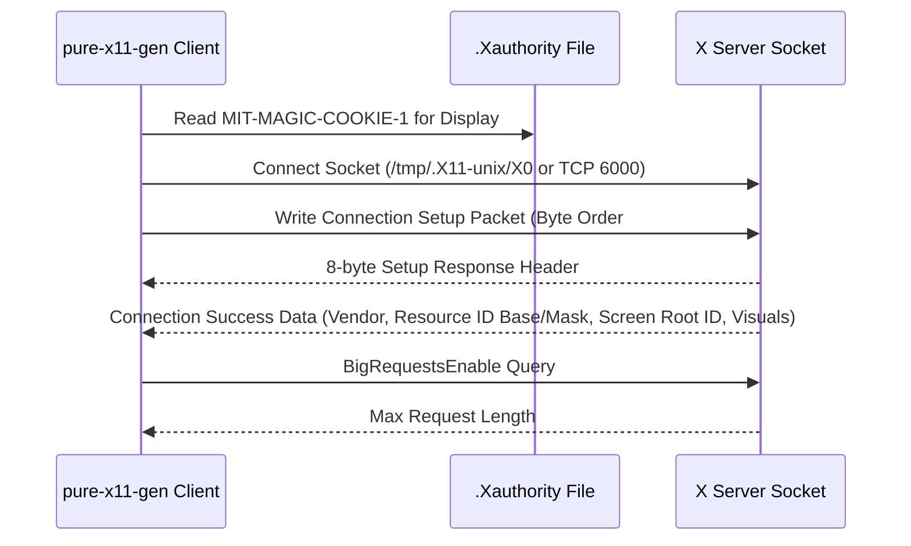

# X11 Protocol Layer

> Part of the [Pure X11 GUI Toolkit](../README.md) documentation.
> Generated: 2026-07-22

## Overview

The X11 protocol layer in `pure-x11-gen` implements a raw, binary X11 client over Unix domain sockets or TCP connections. It eliminates dependencies on C libraries (`Xlib` / `XCB`) by serializing request packets and parsing reply/event streams directly in Common Lisp.

---

## Protocol Fundamentals

### Framing & Data Types
The X Window System core protocol communicates via four packet types:
1. **Requests:** Client-to-server commands starting with a 1-byte opcode. Most requests are asynchronous (fire-and-forget).
2. **Replies:** Server-to-client responses to synchronous requests (32-byte header + optional variable body).
3. **Events:** Server-to-client asynchronous notifications (fixed 32-byte length).
4. **Errors:** Server-to-client fault notifications (fixed 32-byte length, opcode 0).

### 4-Byte Alignment & Padding
All X11 protocol packets must be aligned to 4-byte boundaries. Variable-length fields (like strings) must be padded with zero-bytes. The toolkit computes padding using:

```lisp
(defun pad (n)
  "Difference to next number that is divisible by 4."
  (if (= 0 (mod n 4))
      0
      (- (* 4 (1+ (floor n 4))) n)))
```

---

## Connection Handshake & Authentication

### Handshake Sequence



1. **`connect (&key ip filename port display)`**: Resolves the display string (defaults to `DISPLAY` environment variable or `:0`), connects via Unix domain socket `/tmp/.X11-unix/X<disp>` or TCP port `6000 + disp`.
2. **`get-xauth-cookie (display-str)`**: Parses `~/.Xauthority` or `$XAUTHORITY` via `read-xauthority` to locate an `MIT-MAGIC-COOKIE-1` credential matching the display.
3. **Connection Handshake Packet:** Formats client byte order (`#x6c` for Little-Endian), protocol version (11.0), and authentication credentials.
4. **`read-connection-response` & `parse-initial-reply`**: Reads the server's setup payload, setting key global variables:
   - `*resource-id-base*`: Base offset for client-allocated IDs.
   - `*resource-id-mask*`: Bitmask for client ID space.
   - `*root*`: Root window ID of default screen.
   - `*root-depth*`: Bit depth of default screen (typically 24).

---

## Packet I/O Macros & Buffering

### `with-packet`
Serializes data primitives onto a dynamic byte vector and sends it over socket stream `*s*` (or accumulates it into `*packet-buffer*` if buffering is active):

```lisp
(with-packet
  (card8 1)         ; Opcode: CreateWindow
  (card8 0)         ; Depth
  (card16 (+ 8 n))  ; Length in 4-byte words
  (card32 window)   ; Window ID
  (string8 name)    ; String serialization
  ...)
```

### `with-reply`
Binds buffer parser helpers over an incoming byte array:
- `(card8)`: Reads 8-bit unsigned integer, advances offset by 1.
- `(card16)`: Reads 16-bit Little-Endian integer, advances offset by 2.
- `(int16)`: Reads 16-bit signed integer.
- `(card32)`: Reads 32-bit Little-Endian integer, advances offset by 4.
- `(string8 n)`: Decodes `n` ASCII characters into a string.
- `(inc-current n)`: Skips `n` padding bytes.

### Request Buffering (`with-buffered-output` & `flush-packets`)
To eliminate network latency overhead, drawing and configuration commands can be wrapped in `with-buffered-output`. Packets generated inside the body are accumulated in `*packet-buffer*` and written to socket `*s*` in a single batch write when exiting:

```lisp
(with-buffered-output
  (poly-fill-rectangle '((10 10 100 100)))
  (imagetext8 "Label" :x 12 :y 25))
```

---

## Resource ID Allocation

X11 requires clients to allocate unique 32-bit identifiers for windows, graphics contexts (GCs), pixmaps, and fonts prior to issuing creation requests. IDs are computed dynamically by `next-resource-id`:

```lisp
(defvar *resource-id-counter* 10)
(defun next-resource-id ()
  "Allocate a new X11 resource ID dynamically."
  (logior *resource-id-base* (logand *resource-id-mask* (incf *resource-id-counter*))))
```

---

## Event Queuing & Reply Dispatching

Because events and replies arrive over the same socket stream, reply readers must handle interspersed asynchronous event packets:

```mermaid
flowchart TD
    A["read-reply-packet"] --> B["read-reply-wait"]
    B --> C{"Check packet opcode (aref buf 0) & #x7f"}
    C -->|Code 0 (Error) or Code 1 (Reply)| D["Return reply buffer to caller"]
    C -->|Code >= 2 (Event)| E["Push event to *pending-events* queue"] --> A
```

- **`read-reply-packet`**: Reads incoming packets from `*s*`. If a packet is an event (opcode $\ge 2$), it appends it to global queue `*pending-events*` and continues waiting until the expected reply (opcode 0 or 1) arrives.
- **`*pending-events*`**: Holds queued events for consumption by the main MUV event loop (`run-gui`).

---

## Declarative Request Specifications (`*x11-requests*`)

Requests are specified as property lists in `*x11-requests*` inside `02_x11_spec.lisp`. The helper function `emit-request-function` expands each spec into a complete Lisp `defun`.

### Spec Format
```lisp
(:name request-symbol
 :doc "Docstring"
 :params (args...)
 :decls ((declare ...))
 :bindings ((local-var form)...)
 :packet ((card8 opcode) ...)
 :reply ((var (card32)) ...)   ; Optional for reply requests
 :returns return-form          ; Optional return value specification
 :post ((side-effects...)))    ; Post-processing forms executed after packet write
```

### Complete Reference of Implemented X11 Requests

| Request Function | X11 Opcode | Description & Key Parameters |
| :--- | :---: | :--- |
| `make-window` | 1 (CreateWindow)<br/>55 (CreateGC $\times 5$)<br/>8 (MapWindow) | Creates window, initializes 5 Athena 3D bevel GCs (`*gc-light*`, `*gc-face*`, `*gc-shadow*`, `*gc-dark*`, `*gc-text*`), maps window, sets default background color (`#c0c0c0`), and returns window ID. |
| `map-window` | 8 | Maps window onto screen (`window`). |
| `destroy-window` | 4 | Destroys window and releases server resources (`window`). |
| `change-window-attributes` | 2 | Changes window attributes (`window`, `value-mask`, `values`). |
| `configure-window` | 12 | Configures geometric and stacking parameters (`window`, `value-mask`, `values`). |
| `clear-area` | 61 | Clears rectangular region in window (`:x`, `:y`, `:w`, `:h`, `:exposures`). |
| `draw-window` | 66 | Draws single segment via PolySegment (`x1`, `y1`, `x2`, `y2`, `:gc`). |
| `draw-line` | 66 | Draws single line segment (`x1`, `y1`, `x2`, `y2`, `:gc`). |
| `query-pointer` | 38 | Synchronous query for pointer coordinates and modifiers. Returns `(values root-x root-y win-x win-y)`. |
| `imagetext8` | 76 | Draws single-byte ASCII text string (`str`, `:x`, `:y`, `:gc`). Automatically computes string padding. |
| `poly-rectangle` | 74 | Draws outline of one or more rectangles (`rects` list of `(x y w h)`). |
| `poly-fill-rectangle` | 70 | Draws one or more solid filled rectangles (`rects` list of `(x y w h)`). |
| `poly-arc` | 68 | Draws outlines of one or more arcs (`arcs` list of `(x y w h angle1 angle2)`). |
| `poly-fill-arc` | 71 | Draws one or more filled arc sectors (`arcs` list of `(x y w h angle1 angle2)`). |
| `create-gc` | 55 | Creates Graphics Context resource (`gc`, `:foreground`, `:background`). |
| `create-pixmap` | 53 | Creates offscreen pixmap buffer (`pix`, `width`, `height`, `:depth`). |
| `free-pixmap` | 54 | Frees pixmap resource (`pix`). |
| `copy-area` | 62 | Copies rectangular pixel block from source drawable to destination (`src`, `dst`, `gc`, `src-x`, `src-y`, `dst-x`, `dst-y`, `width`, `height`). |
| `query-extension` | 98 | Queries X server extension status (`name`). Returns major opcode. |
| `big-requests-enable` | *Extension* | Queries and enables `BIG-REQUESTS` extension for payloads > 256KB. Returns max request length. |
| `put-image-big-req` | 72 | Uploads raw pixel byte array to window using BigRequests extended length headers (`img`, `:dst-x`, `:dst-y`). |
| `free-gc` | 60 | Frees Graphics Context resource (`gc`). |
| `create-cursor` | 94 | Creates cursor resource from font glyphs (`cid`, `source-font`, `mask-font`, `source-char`, `mask-char`, colors). |
| `open-font` | 45 | Opens server-side font by name (`fid`, `name`). |
| `close-font` | 46 | Closes opened font resource (`fid`). |
| `grab-pointer` | 26 | Actively grabs pointer control (`grab-window`, `event-mask`, options). Returns status code. |
| `ungrab-pointer` | 27 | Releases active pointer grab (`:time`). |
| `get-keyboard-mapping` | 101 | Queries keycode-to-keysym translation table (`first-keycode`, `count`). Returns `(values keysyms keysyms-per-keycode)`. |

---

## Declarative Event Specifications (`*x11-events*`)

Event parsers are defined in `*x11-events*` in `02_x11_spec.lisp` and compiled into functions named `parse-<event-name>` by `emit-event-parser`.

### Spec Format
```lisp
(event-symbol
  :code opcode-number
  :doc "Docstring"
  :fields ((field-name (card-type)) ...)
  :returns (values return-fields...))
```

### Complete Reference of Implemented Event Parsers

| Event Parser Function | Event Code | Event Type | Extracted Return Values |
| :--- | :---: | :--- | :--- |
| `parse-expose` | 12 | `Expose` | `(values sequence-number window x y width height count)` |
| `parse-motion-notify` | 6 | `MotionNotify` | `(values event-x event-y state time)` |
| `parse-button-press` | 4 | `ButtonPress` | `(values detail event-x event-y state time)` |
| `parse-button-release` | 5 | `ButtonRelease` | `(values detail event-x event-y state time)` |
| `parse-key-press` | 2 | `KeyPress` | `(values detail event-x event-y state time)` |
| `parse-configure-notify` | 22 | `ConfigureNotify` | `(values width height)` |

---

## Lookup Tables & Mask Generators

The protocol layer includes lookup tables to convert symbolic key/event lists into bitmasks:

- `*set-of-value-mask*`: Bitwise flags for window attributes (`background-pixel` `#x2`, `event-mask` `#x800`, `colormap` `#x2000`, etc.). Lookup function: `(value es)`.
- `*set-of-event*`: Bitwise event masks (`KeyPress` `#x1`, `ButtonPress` `#x4`, `PointerMotion` `#x40`, `Exposure` `#x8000`, `StructureNotify` `#x20000`). Lookup function: `(event es)`.
- `*set-of-key-button*`: Modifier mask bits (`Shift` `#x1`, `Lock` `#x2`, `Control` `#x4`, `Mod1` `#x8`, `Button1` `#x100`). Lookup function: `(key-button es)`.

---

## BigRequests Extension Support

Standard X11 request packets are limited to a maximum length of 65,535 4-byte words (256 KB). When uploading large images or canvas buffers via `put-image-big-req`, the client enables the `BIG-REQUESTS` extension:

1. `big-requests-enable` calls `query-extension "BIG-REQUESTS"` to retrieve the dynamic extension opcode.
2. It sends opcode request `(card8 *big-request-opcode*) (card8 0) (card16 1)` to negotiate extended 32-bit length field support.
3. `put-image-big-req` sets length to `0` in the 16-bit header field and inserts a 32-bit length field immediately following, permitting multi-megabyte image transfers.
