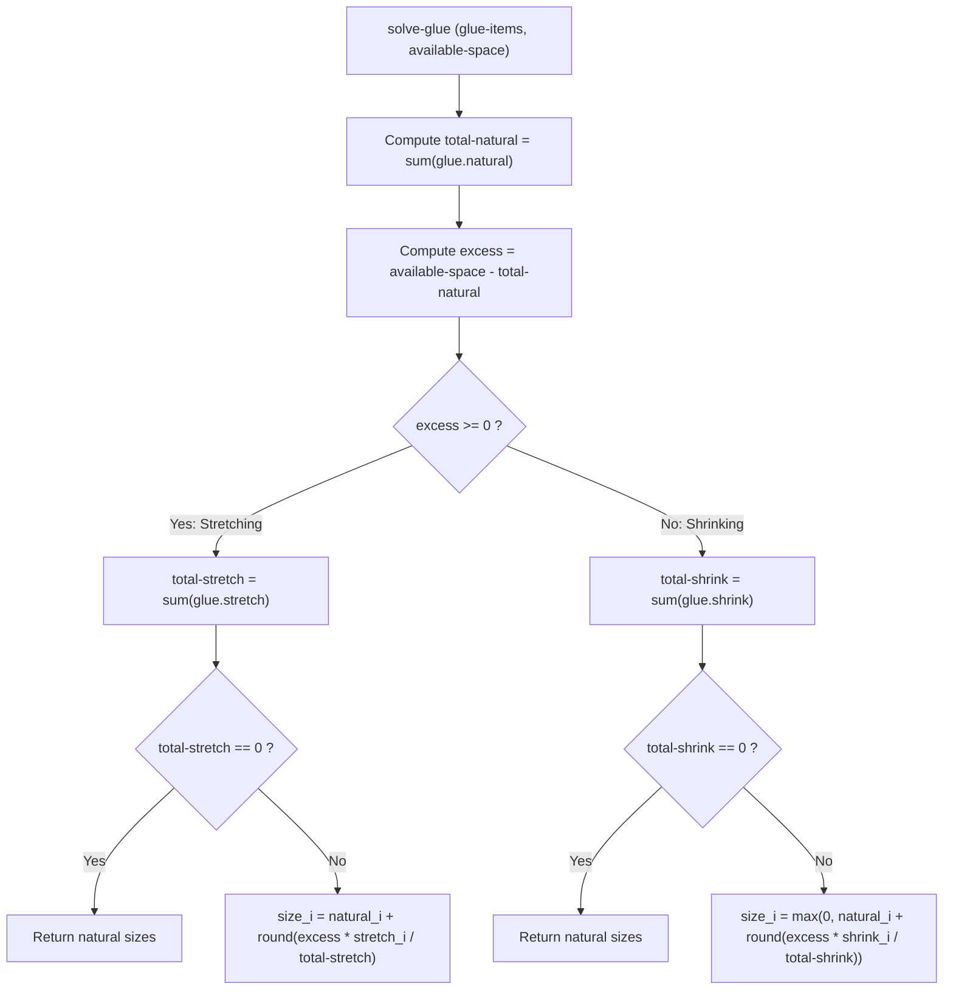

# Widget System & Layout Engine

> Part of the [Pure X11 GUI Toolkit](../README.md) documentation.
> Generated: 2026-07-22

## Overview

The `pure-x11-gen` widget system provides a declarative Virtual DOM layout engine, responsive TeX-style glue solver, bevel rendering pipeline, spatial interaction algorithms (hit testing and directional focus navigation), and a customizable renderer registry.

---

## Widget Structure & Virtual DOM Concept

UI layouts are written as declarative S-expressions (the Virtual DOM) inside application `view` functions. The `parse-node` function transforms these S-expressions into structured `widget` instances:

```lisp
(defstruct widget
  type        ; Symbol or keyword (e.g. PANEL, BUTTON, HBOX)
  name        ; Keyword identifier (e.g. :btn-submit)
  x y w h     ; Resolved integer pixel bounds
  props       ; Property list (:text "OK", :msg (:submit), :glue (...))
  children)   ; List of child widget structures or raw nodes
```

### Node Parsing (`parse-node`)
`parse-node` parses a raw layout node `(type :key val ... children...)`:
- Key-value pairs matching `:name`, `:x`, `:y`, `:w`, `:h` populate explicit slot fields.
- Remaining keyword pairs populate the `:props` property list.
- Non-keyword tail elements form the `:children` list.

---

## TeX Glue Layout Engine

Rather than using rigid pixel positions, container layouts (`HBOX` and `VBOX`) use Donald Knuth's TeX **glue model** to dynamically distribute available space.

### The `glue` Structure
```lisp
(defstruct glue
  (natural 0)   ; Preferred size in pixels
  (stretch 0)   ; Stretchability factor (0 = rigid, >0 = elastic grow)
  (shrink  0))  ; Shrinkability factor (0 = rigid, >0 = elastic shrink)
```

### The `solve-glue` Algorithm
Given a list of `glue` structs and an `available-space` pixel width/height:

```math
\text{excess} = \text{available-space} - \sum \text{natural}
```



### Box Layout Computation (`compute-box-layout`)
`compute-box-layout` handles `HBOX` (`axis=:x`) and `VBOX` (`axis=:y`) container positioning:
1. Reads container properties `:padding` (default 0) and `:spacing` (default 0).
2. Subtracts padding and inter-item spacing from container dimensions to compute `main-available` space.
3. Extracts child glue settings or builds default glue from child natural dimensions.
4. Invokes `solve-glue` to determine each child's size along the layout axis.
5. Returns a list of resolved `(child-node x y w h)` tuples.

### Recursive Coordinate Resolution (`resolve-layout`)
`resolve-layout` traverses the Virtual DOM tree, applying `compute-box-layout` for boxes and recursing into children to calculate absolute `(x, y, w, h)` coordinates for all nodes in the hierarchy.

---

## Spatial Interactions & Navigation

### Hit Testing (`find-widget-at`)
`find-widget-at` performs spatial hit testing to find the deepest leaf widget containing mouse coordinates `(mx, my)`:
- Recursively checks bounding boxes: `x <= mx < x + w` and `y <= my < y + h`.
- Traverses children in z-order so leaf elements shadow containers.
- *Note:* Implementation uses clean linear tree search.

### Cone-Based Focus Navigation (`find-nearest-widget`)
Keyboard directional focus shift (`:up`, `:down`, `:left`, `:right`) locates the nearest focusable widget (`BUTTON`, `CHECKBOX`, `TEXT-INPUT`) using a $\pm 45^\circ$ directional cone search:

```mermaid
flowchart LR
    Current["Current Focused Widget (cx, cy)"] --> Cone{"In Direction Cone?"}
    Cone -->|dot_product > 0 and dot >= |cross|| Candidate["Measure Euclidean Distance^2"]
    Candidate --> Best["Select Minimum Distance Neighbor"]
```

1. Collects all focusable widgets via `collect-focusable-widgets`.
2. Computes center coordinates `(cx, cy)` of current focus and candidate target `(tx, ty)`.
3. Computes vector difference `(dx, dy)` and direction unit vector.
4. Evaluates dot product (`dot > 0` ensures target lies forward in direction) and cross product (`dot >= |cross|` enforces a $90^\circ$ total cone span).
5. Chooses the candidate matching the cone criteria with minimum squared Euclidean distance.

---

## Keycode Translation (`translate-keycode`)

Translates raw X11 keycodes and shift modifier state into characters or keyword symbols using the server's keyboard mapping array:

- ASCII range 32 to 126 $\rightarrow$ Lisp `character` (`#\a`, `#\A`, `#\0`, etc.)
- Keycode `#xff08` $\rightarrow$ `:backspace`
- Keycode `#xff0d` $\rightarrow$ `:return`
- Keycode `#xff51` $\rightarrow$ `:left`
- Keycode `#xff52` $\rightarrow$ `:up`
- Keycode `#xff53` $\rightarrow$ `:right`
- Keycode `#xff54` $\rightarrow$ `:down`

---

## Bevel Drawing Pipeline (`draw-bevel`)

`draw-bevel` renders Athena Xaw3d-style 3D bevel borders around widget rectangles:

```lisp
(draw-bevel x y w h :style :raised :bevel-width 2)
```

- `:raised` (normal state): Light gray/white top-left edges (`*gc-light*`), dark shadow bottom-right edges (`*gc-dark*`).
- `:sunken` (pressed/inset state): Dark shadow top-left edges (`*gc-dark*`), light gray/white bottom-right edges (`*gc-light*`).
- Multi-layer inner bevel line rendering gives classic 3D window trim.

---

## Renderer Registry & Built-in Widgets

Renderers are registered in the global hash table `*widget-renderers*` via `register-widget` and dispatched by `render-widget`:

```lisp
(register-widget "BUTTON"
  (lambda (w-struct focused pressed hovered) ...))
```

### Built-in Widget Catalog

| Widget Type | Purpose & Behavior | Key Properties | Visual Appearance |
| :--- | :--- | :--- | :--- |
| `PANEL` | Outer window or container card background. | `:name`, `:x`, `:y`, `:w`, `:h` | Fills face background (`*gc-face*`), draws raised bevel, renders children. |
| `HBOX` | Horizontal layout box container. | `:padding`, `:spacing`, `:glue` | Invisible container; aligns child widgets horizontally using `solve-glue`. |
| `VBOX` | Vertical layout box container. | `:padding`, `:spacing`, `:glue` | Invisible container; aligns child widgets vertically using `solve-glue`. |
| `LABEL` | Static single-line text string display. | `:text` | Renders text string at coordinate `(x, y)` via `imagetext8`. |
| `BUTTON` | Interactive push button. Triggers message on click. | `:text`, `:msg`, `:glue` | Raised bevel when idle; sunken bevel + 1px text offset when pressed (`is-pressed-p`). |
| `CHECKBOX` | Interactive boolean toggle control. | `:label`, `:checked-p`, `:msg` | Sunken 14x14 checkbox frame with centered "X" when checked, focus outline rectangle. |
| `TEXT-INPUT` | Single-line editable text input box with cursor. | `:text`, `:cursor-pos`, `:msg-change` | Light background fill (`*gc-light*`), sunken bevel, text string, vertical cursor bar. |
| `CANVAS` | 2D diagramming & simulation viewport with world coordinates. | `:xmin`, `:xmax`, `:ymin`, `:ymax`, `:shapes`, `:draw-axes-p` | Double-buffered offscreen pixmap render, auto-scaled grid lines, numeric axes, tick marks, and shape lists. |

---

## Canvas Shape Rendering API

The `CANVAS` widget converts floating-point world coordinates $(wx, wy)$ to integer screen pixel coordinates $(sx, sy)$:

$$sx = \text{round}\left(dw \cdot \frac{wx - x_{\min}}{x_{\max} - x_{\min}}\right)$$

$$sy = dh - 1 + \text{round}\left(-dh \cdot \frac{wy - y_{\min}}{y_{\max} - y_{\min}}\right)$$

### Supported Shape Primitive Specifiers (`:shapes`)

```lisp
;; Example Canvas Shape Specifier List
(list
  '(:disk 0.0 0.0 0.12 :color *gc-sun*)                     ; Filled circle (sun)
  '(:circle 0.0 0.0 1.0 :color *gc-shadow*)                 ; Circle outline (orbit track)
  '(:disk 1.2 0.5 0.06 :color *gc-earth*)                   ; Planet disk
  '(:line -1.0 0.0 1.0 0.0 :color *gc-text*)                ; World-space line
  '(:text "Sun" 0.05 0.05 :color *gc-text*)                 ; World-space text
  '(:poly-line ((0.0 0.0) (0.5 0.8) (1.2 0.5)) :color *gc-spacecraft*)) ; Polyline trajectory
```
