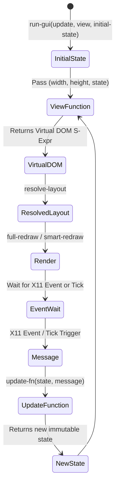
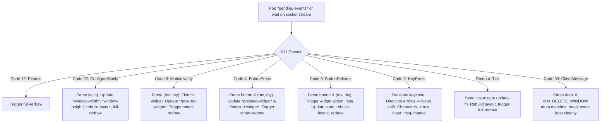
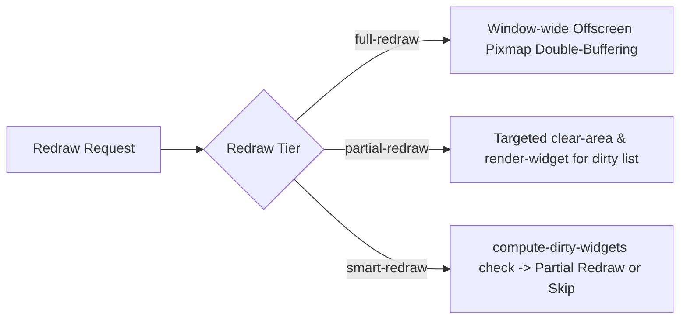

# Event Loop & MUV Architecture

> Part of the [Pure X11 GUI Toolkit](../README.md) documentation.
> Generated: 2026-07-22

## Overview

The runtime event loop (`run-gui`) manages window lifecycle, socket I/O, event dispatching, layout re-building, state transitions, and rendering. It implements an Elm-style **Model-Update-View (MUV)** pattern with smart dirty tracking and pixmap double buffering.

---

## Model-Update-View (MUV) Architecture

MUV organizes application control flow into three functional components:



1. **Model (`state`):** An immutable data structure representing the full application state (e.g., counters, text input strings, toggle states, animation timestamps).
2. **Update (`update-fn`):** Pure state transition function with signature `(state message) -> new-state`. It returns a fresh state structure without mutating the previous instance.
3. **View (`view-fn`):** Pure layout function with signature `(width height state) -> virtual-dom-s-expr`.

---

## `run-gui` Function Reference

### Function Signature
```lisp
(run-gui update-fn view-fn initial-state
         &key (tick-interval nil) (tick-msg '(:tick)) (init-fn nil))
```

### Parameters

| Parameter | Type | Default | Description |
| :--- | :--- | :--- | :--- |
| `update-fn` | Function | *Required* | Pure state update function `(state msg) -> new-state`. |
| `view-fn` | Function | *Required* | Pure view function `(w h state) -> S-expr`. |
| `initial-state` | Structure / Value | *Required* | Initial model state object passed on startup. |
| `tick-interval` | Number / `nil` | `nil` | Timer interval in seconds (e.g., `0.05` for 20 FPS animation). If set, triggers `tick-msg` when idle. |
| `tick-msg` | List / Symbol | `'(:tick)` | Action message sent to `update-fn` on timer tick expiry. |
| `init-fn` | Function / `nil` | `nil` | Optional callback `(init-fn win-id)` invoked after window creation but before mapping (useful for allocating custom GCs). |

---

## Event Dispatch Pipeline

`run-gui` connects to the X server, creates the top-level window, invokes `init-fn`, maps the window, and enters an event processing loop:



### Handled X11 Event Opcodes

- **Code 12 (`Expose`):** Triggered when window area is uncovered. Forces an immediate `full-redraw`.
- **Code 22 (`ConfigureNotify`):** Triggered on window resize. Parses new `(width, height)`, updates `*window-width*` / `*window-height*`, rebuilds layout tree, and executes `full-redraw`.
- **Code 6 (`MotionNotify`):** Mouse motion. Checks `find-widget-at`. If the hovered widget under cursor changes, updates `*hovered-widget*` and calls `smart-redraw`.
- **Code 4 (`ButtonPress`):** Mouse button click down. Sets `*pressed-widget*`. If the hit widget is focusable (`BUTTON`, `CHECKBOX`, `TEXT-INPUT`), updates `*focused-widget*` and calls `smart-redraw`.
- **Code 5 (`ButtonRelease`):** Mouse button release. If released inside the pressed widget, evaluates its action property (`:msg`), passes it to `update-fn`, rebuilds layout, and triggers `full-redraw`.
- **Code 2 (`KeyPress`):** Keyboard press. If focused element is a `TEXT-INPUT`, handles character entry, backspace, and cursor navigation (`:left`/`:right`). Otherwise, arrow keys trigger cone-based focus shift (`find-nearest-widget`).
- **Code 33 (`ClientMessage`):** Parsed by `handle-client-message-event`. If the event's data matches the interned `WM_DELETE_WINDOW` atom ID (`*wm-delete-window-atom*`), the event loop exits cleanly via ICCCM protocol.

---

## Dirty Tracking & Redraw Strategies

To maintain high performance and eliminate screen flickering, `pure-x11-gen` provides three rendering tiers:



### 1. `full-redraw`
- Allocates a window-wide offscreen pixmap (`create-pixmap`).
- Redirects rendering stream `*window*` to the pixmap.
- Renders the complete layout tree (`render-layout`).
- Copies the pixmap to the primary window in a single `copy-area` operation.
- Frees the offscreen pixmap (`free-pixmap`) and updates visual state snapshot (`save-visual-state`).
- **Use case:** Window resize, expose events, timer ticks, or state updates changing UI structure.

### 2. `compute-dirty-widgets` & `save-visual-state`
Tracks changes across `*focused-widget*`, `*pressed-widget*`, and `*hovered-widget*` relative to `*prev-focused*`, `*prev-pressed*`, and `*prev-hovered*`. Returns a list of widget names whose visual appearance changed.

### 3. `partial-redraw (layout dirty-names)`
Iterates over `dirty-names`, creates a temporary offscreen pixmap, paints background and widget content offscreen, and copies each dirty widget's bounding rectangle to the window via `copy-area` for flicker-free partial updates.

### 4. `smart-redraw (layout)`
Executes `compute-dirty-widgets`. If dirty widgets exist, performs a `partial-redraw`; if no visual state changed, drawing socket operations are completely skipped.

---

## Interactive Controls & Text Input Processing

### Mouse Interaction Flow
1. **Hover Tracking:** Moving the cursor updates `*hovered-widget*`. `smart-redraw` highlights hover states.
2. **Press Tracking:** Clicking down sets `*pressed-widget*`. Buttons draw sunken bevels.
3. **Click Execution:** Releasing mouse inside the original pressed widget emits the button's `:msg` property to `update-fn`.

### Keyboard Navigation & Text Editing
- **Focus Shift:** Pressing `:up`, `:down`, `:left`, or `:right` invokes `find-nearest-widget`. Focus transfers smoothly between adjacent controls.
- **Character Insertion:** Typing characters into a focused `TEXT-INPUT` inserts the character at `cursor-pos` and dispatches `:msg-change` to `update-fn`.
- **Backspace:** Pressing Backspace removes the preceding character and decrements `cursor-pos`.
- **Cursor Arrows:** Left and Right arrow keys move `cursor-pos` within the string bounds.
