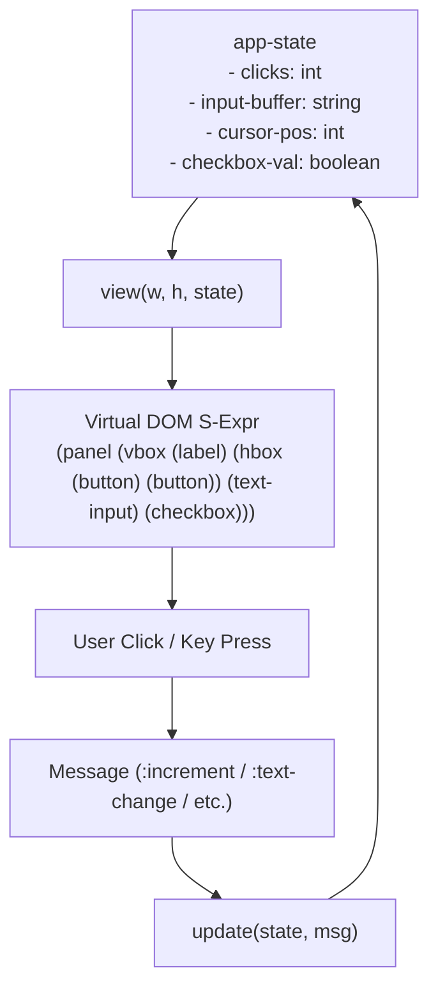
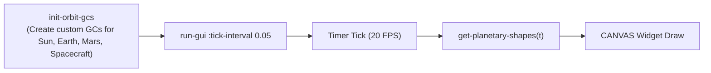

# Example Applications

> Part of the [Pure X11 GUI Toolkit](../README.md) documentation.
> Generated: 2026-07-22

## Overview

The `pure-x11-gen` repository includes two complete, runnable example applications demonstrating the Model-Update-View (MUV) architecture:
1. **Athena GUI Demo (`pure-x11-gen/example`):** Interactive UI with buttons, text fields, checkboxes, and counter state.
2. **Planetary Orbit Demo (`pure-x11-gen/orbit-demo`):** Real-time simulation of an Earth-to-Mars Hohmann transfer trajectory rendered on a double-buffered 2D canvas.

---

## 1. Athena GUI Demo Application

Located in `source/example.lisp` (generated from `06_example_template.lisp`), this demo showcases traditional form controls and state management.



### Application Model (`app-state`)
```lisp
(defstruct app-state
  (clicks 0)
  (input-buffer "Type here")
  (cursor-pos 9)
  (checkbox-val nil))
```

### Pure Update Function (`update`)
```lisp
(defun update (state msg)
  "Pure state update function."
  (let ((clicks (app-state-clicks state))
        (buf (app-state-input-buffer state))
        (pos (app-state-cursor-pos state))
        (chk (app-state-checkbox-val state)))
    (case (car msg)
      (:increment
       (make-app-state :clicks (1+ clicks) :input-buffer buf :cursor-pos pos :checkbox-val chk))
      (:decrement
       (make-app-state :clicks (1- clicks) :input-buffer buf :cursor-pos pos :checkbox-val chk))
      (:toggle-checkbox
       (make-app-state :clicks clicks :input-buffer buf :cursor-pos pos :checkbox-val (not chk)))
      (:text-change
       (let ((new-text (cadr msg))
             (new-pos (caddr msg)))
         (make-app-state :clicks clicks :input-buffer new-text :cursor-pos new-pos :checkbox-val chk)))
      (:cursor-move
       (let ((new-pos (caddr msg)))
         (make-app-state :clicks clicks :input-buffer buf :cursor-pos new-pos :checkbox-val chk)))
      (t state))))
```

### View Function (`view`)
```lisp
(defun view (w h state)
  "Pure layout render function returning the virtual DOM."
  (let ((clicks (app-state-clicks state))
        (buf (app-state-input-buffer state))
        (pos (app-state-cursor-pos state))
        (chk (app-state-checkbox-val state)))
    `(panel :name :root :x 0 :y 0 :w ,w :h ,h
       (vbox :name :main-vbox :x 10 :y 10 :w ,(- w 20) :h ,(- h 20) :padding 0 :spacing 10
         (label :name :title :text ,(format nil "Athena GUI Demo (Clicks: ~a)" clicks)
                :glue (:natural 20 :stretch 0 :shrink 0))
         (hbox :name :buttons :glue (:natural 30 :stretch 0 :shrink 0) :spacing 10
           (button :name :btn-inc :text "Increment" :msg (:increment)
                   :glue (:natural 120 :stretch 1 :shrink 0))
           (button :name :btn-dec :text "Decrement" :msg (:decrement)
                   :glue (:natural 120 :stretch 1 :shrink 0)))
         (text-input :name :txt :text ,buf
                     :cursor-pos ,pos
                     :msg-change (:text-change)
                     :glue (:natural 30 :stretch 1 :shrink 0))
         (checkbox :name :chk :label "Enable Action Mode"
                   :checked-p ,chk
                   :msg (:toggle-checkbox)
                   :glue (:natural 24 :stretch 0 :shrink 0))))))
```

### Running the Demo
Launch via SBCL or shell script:

```bash
# Option 1: Shell script
./run-example.sh

# Option 2: SBCL REPL
sbcl --eval '(push "/workspace/src/cl-cl-generator/example/07_pure_x11/source/" asdf:*central-registry*)' \
     --eval '(ql:quickload :pure-x11-gen)' \
     --eval '(pure-x11-gen/example:run-x11-example)'
```

---

## 2. Planetary Orbit Demo Application

Located in `source/orbit-demo.lisp` (generated from `08_orbit_demo_template.lisp`), this application visualizes an Earth-to-Mars Hohmann transfer orbit in real time.



### Physics & Orbital Mechanics Math
The demo models Keplerian orbital motion in normalized Astronomical Units (AU):
- **Earth Orbit:** Radius $r_e = 1.0$ AU, angular frequency $\omega_e = 1.0$ rad/yr.
- **Mars Orbit:** Radius $r_m = 1.524$ AU, angular frequency $\omega_m = 1/1.88$ rad/yr.
- **Hohmann Ellipse Transfer Orbit:**
  - Semi-major axis: $a = \frac{r_e + r_m}{2} = \frac{1.0 + 1.524}{2} = 1.262$ AU
  - Eccentricity: $e = \frac{r_m - r_e}{r_m + r_e} = \frac{0.524}{2.524} \approx 0.208$
  - Polar radius equation: $r(\theta) = \frac{a(1 - e^2)}{1 + e \cos(\theta)}$

### Custom Graphics Context (GC) Setup
Custom color GCs are allocated during window creation via `:init-fn`:

```lisp
(defun init-orbit-gcs (win)
  (declare (ignore win))
  (setf *gc-sun* (next-resource-id)
        *gc-earth* (next-resource-id)
        *gc-mars* (next-resource-id)
        *gc-spacecraft* (next-resource-id))
  (create-gc *gc-sun* :foreground #x00ffcc00)         ; Yellow
  (create-gc *gc-earth* :foreground #x003399ff)       ; Blue
  (create-gc *gc-mars* :foreground #x00ff3300)        ; Red
  (create-gc *gc-spacecraft* :foreground #x0033cc33)) ; Green
```

### Shape Generation & View
`get-planetary-shapes` computes positions for Sun, Earth, Mars, spacecraft, and historical trajectory trace points, returning a shape list passed into the `CANVAS` widget.

```lisp
(defun run-orbit-demo ()
  "Connect to X11 and run the planetary orbit trajectory visualization."
  (run-gui #'update #'view (make-app-state)
           :tick-interval 0.05
           :init-fn #'init-orbit-gcs))
```

### Running the Orbit Demo
```bash
# Option 1: Shell script
./run-orbit-demo.sh

# Option 2: SBCL REPL
sbcl --eval '(push "/workspace/src/cl-cl-generator/example/07_pure_x11/source/" asdf:*central-registry*)' \
     --eval '(ql:quickload :pure-x11-gen)' \
     --eval '(pure-x11-gen/orbit-demo:run-orbit-demo)'
```

---

## 3. How to Write Your Own MUV Application

Follow this step-by-step guide to build a custom MUV application:

### Step 1: Define Application Package & State Struct
```lisp
(defpackage :my-app
  (:use :cl :pure-x11-gen))
(in-package :my-app)

(defstruct my-state
  (counter 0)
  (status "Ready"))
```

### Step 2: Write Pure Update Function
```lisp
(defun my-update (state msg)
  (case (car msg)
    (:add (make-my-state :counter (+ (my-state-counter state) (cadr msg))
                         :status "Added"))
    (:reset (make-my-state :counter 0 :status "Reset"))
    (t state)))
```

### Step 3: Write View Function
```lisp
(defun my-view (w h state)
  `(panel :name :root :x 0 :y 0 :w ,w :h ,h
     (vbox :name :box :x 10 :y 10 :w ,(- w 20) :h ,(- h 20) :padding 5 :spacing 10
       (label :name :lbl :text ,(format nil "Count: ~a (~a)" (my-state-counter state) (my-state-status state))
              :glue (:natural 24 :stretch 0 :shrink 0))
       (hbox :name :btns :glue (:natural 32 :stretch 0 :shrink 0) :spacing 10
         (button :name :b1 :text "+1" :msg (:add 1) :glue (:natural 80 :stretch 1 :shrink 0))
         (button :name :b2 :text "+5" :msg (:add 5) :glue (:natural 80 :stretch 1 :shrink 0))
         (button :name :b-reset :text "Reset" :msg (:reset) :glue (:natural 80 :stretch 1 :shrink 0))))))
```

### Step 4: Launch via `run-gui`
```lisp
(defun start ()
  (run-gui #'my-update #'my-view (make-my-state)))
```
