# Testing Framework & Reference

> Part of the [Pure X11 GUI Toolkit](../README.md) documentation.
> Generated: 2026-07-22

## Overview

The `pure-x11-gen` testing framework in `source/tests.lisp` (generated from `07_tests_template.lisp`) provides automated unit and integration tests covering node parsing, spatial hit testing, glue solver math, focus navigation, renderer dispatch, packet buffering, dirty widget tracking, and binary protocol opcode verification.

---

## Test Framework Architecture

The framework relies on a minimal, zero-dependency testing macro `assert-test`:

```lisp
(defparameter *test-failures* 0)

(defmacro assert-test (form &optional msg)
  `(if ,form
       (format t "PASS: ~a~%" ,(or msg (format nil "~s" form)))
       (progn
         (format t "FAIL: ~a~%" ,(or msg (format nil "~s" form)))
         (incf *test-failures*))))
```

`run-all-tests` executes all 9 test suites sequentially. If `*test-failures*` is zero upon completion, it prints `ALL TESTS PASSED!`. If failures exist, it exits SBCL with non-zero exit status `(sb-ext:exit :code 1)`, integrating seamlessly with CI/CD runners.

---

## Complete Test Suite Reference

The test suite consists of 9 targeted verification functions:

```mermaid
graph TD
    Runner["run-all-tests"] --> T1["1. test-parse-node"]
    Runner --> T2["2. test-collect-focusable"]
    Runner --> T3["3. test-hit-testing"]
    Runner --> T4["4. test-cone-focus-search"]
    Runner --> T5["5. test-widget-registry"]
    Runner --> T6["6. test-glue-solver"]
    Runner --> T7["7. test-bevel-coordinates"]
    Runner --> T8["8. test-dirty-widgets"]
    Runner --> T9["9. test-x11-opcodes"]
    Runner --> T10["10. test-event-handlers"]
    Runner --> T11["11. test-client-message-event"]
    Runner --> T12["12. test-put-image-big-req"]
    Runner --> T13["13. test-canvas-pixmap-cleanup"]
    Runner --> T14["14. test-live-x11-connection"]
```



### 1. `test-parse-node`
- **Purpose:** Verifies that S-expression node trees are correctly parsed into `widget` struct fields.
- **Checks:** `widget-type` ("PANEL"), `widget-name` (`:main-panel`), coordinates `(x=10, y=20, w=100, h=200)`, and child node list `'((button :name :b1))`.

### 2. `test-collect-focusable`
- **Purpose:** Verifies that recursive widget tree traversal collects all interactive focusable widgets (`BUTTON`, `CHECKBOX`, `TEXT-INPUT`) while ignoring static elements (`LABEL`, `PANEL`).
- **Checks:** Total focusable count equals 3 (`:b1`, `:c1`, `:t1` in correct document order).

### 3. `test-hit-testing`
- **Purpose:** Verifies spatial bounding box resolution in `find-widget-at`.
- **Checks:** Mouse coordinates inside `:b1` return `:b1`; inside `:b2` return `:b2`; inside panel background return `:main-panel`; out of bounds `(500, 500)` return `nil`.

### 4. `test-cone-focus-search`
- **Purpose:** Verifies 4-directional cone focus navigation in `find-nearest-widget`.
- **Checks:** From `:b1` at `(40, 40)`: `:right` selects `:b2` at `(140, 40)`, `:down` selects `:b3` at `(40, 140)`. Inverse directional queries (`:b2 -> :left`, `:b3 -> :up`) return `:b1`.

### 5. `test-widget-registry`
- **Purpose:** Verifies renderer function registration in `*widget-renderers*` and execution dispatch via `render-layout`.
- **Checks:** Registers custom `"MOCK"` widget renderer and asserts callback execution upon layout rendering.

### 6. `test-glue-solver`
- **Purpose:** Verifies TeX glue distribution math in `solve-glue`.
- **Checks:**
  - Uniform stretch to 300px: `(100 100 100) -> (100 100 100)`
  - Uniform stretch to 600px: `(100 100 100) -> (200 200 200)`
  - Proportional stretch 1:2: natural `(100 100)` stretched to 300px yields `(133 167)`
  - Shrink to 300px: natural `(200 200)` shrunk to 300px yields `(150 150)`

### 7. `test-bevel-coordinates`
- **Purpose:** Verifies bevel line calculation and packet buffering.
- **Checks:** Invoking `draw-bevel` inside `with-buffered-output` pushes exactly 8 `draw-line` byte packets to `*packet-buffer*` (4 outer border lines + 4 inner bevel lines).

### 8. `test-dirty-widgets`
- **Purpose:** Verifies visual state tracking in `compute-dirty-widgets` and state snapshotting in `save-visual-state`.
- **Checks:** Focus shifts (`:w1`) and hover shifts (`:w2`) register as dirty; after `save-visual-state`, `compute-dirty-widgets` returns `nil`.

### 9. `test-x11-opcodes`
- **Purpose:** Verifies binary byte serialization and major X11 opcode numbers in packet output buffers.
- **Checks:**
  - `poly-fill-rectangle` packet byte 0 equals major opcode `70`
  - `imagetext8` packet byte 0 equals major opcode `76`
  - `poly-rectangle` packet byte 0 equals major opcode `74`

### 10. `test-event-handlers`
- **Purpose:** Verifies extracted modular event handlers (`handle-motion-event`, `handle-button-press-event`, `handle-button-release-event`, `handle-configure-event`, `handle-expose-event`, `handle-key-press-event`).
- **Checks:** Hover state updates, button press/release transitions, layout rebuild triggers on `ConfigureNotify`, expose redraws, and key press handling.

### 11. `test-client-message-event`
- **Purpose:** Verifies binary event parsing for opcode 33 (`ClientMessage`) and ICCCM `WM_DELETE_WINDOW` atom matching.
- **Checks:** Returns `:close` keyword when receiving window manager close request.

### 12. `test-put-image-big-req`
- **Purpose:** Verifies socket buffer flushing during big request payload streaming.
- **Checks:** Pushing requests to `*packet-buffer*` prior to `put-image-big-req` flushes buffered requests to socket stream `*s*` before raw image bytes are written.

### 13. `test-canvas-pixmap-cleanup`
- **Purpose:** Verifies `unwind-protect` exception safety and server-side pixmap reclamation during canvas widget rendering.
- **Checks:** Opcode 54 (`FreePixmap`) is guaranteed to be emitted into the request stream after rendering.

### 14. `test-live-x11-connection`
- **Purpose:** End-to-end integration test against a live X server (e.g. Xvfb on `$DISPLAY`).
- **Checks:** Connects to `$DISPLAY` Unix domain socket, parses initial setup reply, allocates window/atom resource IDs, creates and maps a live window, sends properties, and cleanly closes the connection.

---

## Running Tests

### 1. Running Unit Tests in SBCL REPL
Unit tests do not require an active X11 display server:

```lisp
(push "/workspace/src/cl-cl-generator/example/07_pure_x11/source/" asdf:*central-registry*)
(ql:quickload :pure-x11-gen)
(pure-x11-gen/tests:run-all-tests)
```

**Output:**
```text
--- Running test-parse-node ---
PASS: Widget type is PANEL
PASS: Widget name is :main-panel
...
--- Running test-x11-opcodes ---
PASS: poly-fill-rectangle major opcode is 70
PASS: imagetext8 major opcode is 76
PASS: poly-rectangle major opcode is 74
ALL TESTS PASSED!
```

### 2. Headless Integration Testing with Xvfb
To test actual X11 socket communication and user interaction without a physical display monitor, use `Xvfb` (X Virtual Framebuffer) and `xdotool`:

```bash
# Launch Xvfb virtual screen on display :99
Xvfb :99 -screen 0 640x480x24 &
export DISPLAY=:99

# Run integration test runner script
./run-xvfb-test.sh
```

**`run-xvfb-test.sh` Execution Flow:**
1. Starts `Xvfb :99`.
2. Launches demo application `./run-example.sh` in background.
3. Uses `xdotool mousemove 200 95 click 1` to focus the text input box.
4. Uses `xdotool type " Hello"` to inject real keyboard events over X11.
5. Captures root window screenshot via ImageMagick (`import -window root screenshot.png`).

---

## How to Add New Tests

To add a new test suite:

1. Open `07_tests_template.lisp`.
2. Define a test function `(defun test-my-feature () ...)` using `assert-test`:
   ```lisp
   (defun test-my-feature ()
     (format t "--- Running test-my-feature ---~%")
     (assert-test (= (+ 2 2) 4) "Basic arithmetic check"))
   ```
3. Register `(test-my-feature)` inside `run-all-tests` body.
4. Re-run generator: `sbcl --load generate.lisp`.
5. Execute `(pure-x11-gen/tests:run-all-tests)`.
