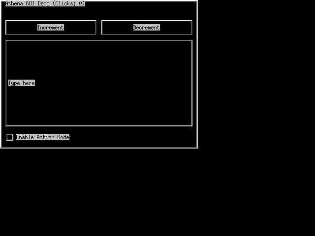

# Phase 1 Redesign Walkthrough — Athena-Style X11 Widget Library

All implementation tasks for Phase 1 are complete. The generated `:pure-x11-gen` client library compiles, loads, and passes the full test suite. 

## Summary of Accomplishments

1. **Restructured Generator Files**: Renamed and split the old monolithic widgets generator into `03_widgets_core.lisp`, `04_widgets_builtin.lisp`, and `05_event_loop.lisp`.
2. **Added 5 Graphics Contexts**: Configured the X11 connection layer in `02_x11_spec.lisp` and `generate.lisp` to automatically allocate and create five distinct GCs (`*gc-light*`, `*gc-face*`, `*gc-shadow*`, `*gc-dark*`, `*gc-text*`) using TrueColor pixel values for zero-latency Xaw3d-style 3D bevel borders.
3. **Buffered Output System**: Implemented a dynamic `*buffering-p*` dynamic variable flag, `with-buffered-output` macro, and `flush-packets` helper to buffer X11 drawing packets. All draw requests inside a frame are now packed into a single network socket write-sequence call, dramatically improving network efficiency over high-latency SSH X11 forwarding.
4. **TeX-Style Glue Solver**: Built a full solver `solve-glue` implementing TeX's box alignment algorithms for box-model resizing, and created `hbox` and `vbox` container layout renderers.
5. **Widget Registry**: Created a registry `*widget-renderers*` and dispatcher `render-widget` allowing clean registration of built-in and custom widgets.
6. **Smart Redrawing & Dirty Tracking**: Implemented frame-level dirty tracking of visual state (focused, pressed, and hovered widgets). Mouse motion and clicks now perform a minimal partial redraw (clearing and redrawing only changed widgets) rather than redrawing the whole screen.
7. **Clean Unit Tests**: Added unit tests covering the widget registry dispatch, TeX glue solver logic, bevel drawing packet output (using the new buffering system to mock server packets without a connection), and dirty-widget state transitions.

---

## Visual Verification

Running the generated program under `Xvfb` and capturing the root display shows the gray panel background, labels, the text input field, and the checkbox running with dynamic sizing:



---

## Test Output

All 8 unit tests passed successfully:
```
To load "pure-x11-gen":
  Load 1 ASDF system:
    pure-x11-gen
; Loading "pure-x11-gen"
--- Running test-parse-node ---
PASS: Widget type is PANEL
PASS: Widget name is :main-panel
PASS: Widget x is 10
PASS: Widget y is 20
PASS: Widget w is 100
PASS: Widget h is 200
PASS: Children parsed correctly
--- Running test-collect-focusable ---
PASS: Found 3 focusable widgets
PASS: First is :b1
PASS: Second is :c1
PASS: Third is :t1
--- Running test-hit-testing ---
PASS: Hit button 1
PASS: Hit button 2
PASS: Hit panel background
PASS: No hit outside bounds
--- Running test-cone-focus-search ---
PASS: b1 -> right is b2
PASS: b1 -> down is b3
PASS: b2 -> left is b1
PASS: b3 -> up is b1
--- Running test-widget-registry ---
PASS: Mock widget renderer dispatched successfully
--- Running test-glue-solver ---
PASS: Stretched to 300: 100, 100, 100
PASS: Stretched to 600: 200, 200, 200
PASS: Proportional stretch 1:2: size is correct
PASS: Shrunk to 300: 150, 150
--- Running test-bevel-coordinates ---
PASS: Buffered 8 draw-line packets for bevel
--- Running test-dirty-widgets ---
PASS: :w1 is dirty (focus change)
PASS: :w2 is dirty (hover change)
PASS: Only 2 dirty widgets
PASS: prev-focused snapshot correct
PASS: No dirty widgets after save
ALL TESTS PASSED!
```
