# Walkthrough 01b: Headless Xvfb Integration Tests & Complete Test Suite

**Target Area:** Pure X11 GUI Toolkit (`example/07_pure_x11`)  
**Date:** 2026-07-22  
**Status:** Completed  
**Plan Reference:** [01_implementation_plan_critical_fixes.md](file:///workspace/src/cl-cl-generator/example/07_pure_x11/plan/20260722_01_review/01_implementation_plan_critical_fixes.md)  
**Walkthrough Reference:** [01_walkthrough.md](file:///workspace/src/cl-cl-generator/example/07_pure_x11/plan/20260722_01_review/01_walkthrough.md)

---

## 1. Overview & Summary of Changes

With `xvfb` (X Virtual Framebuffer), `xdotool`, and `imagemagick` installed on the container environment, we implemented all previously skipped/missing unit and integration test suites in [`07_tests_template.lisp`](file:///workspace/src/cl-cl-generator/example/07_pure_x11/07_tests_template.lisp) and updated [`doc/07_testing.md`](file:///workspace/src/cl-cl-generator/example/07_pure_x11/doc/07_testing.md).

### Newly Implemented & Verified Tests

| Test Function | Type | Purpose & Verification Scope | Status |
|:---|:---:|:---|:---:|
| `test-put-image-big-req` | Unit | Verifies socket packet buffer flushing logic in `put-image-big-req` when operating inside `with-buffered-output`. Asserts `*packet-buffer*` is completely emptied prior to streaming raw image bytes. | **PASSED** |
| `test-canvas-pixmap-cleanup` | Unit | Verifies `unwind-protect` exception safety during canvas rendering. Asserts opcode 54 (`FreePixmap`) is guaranteed to be pushed to the socket output stream for server-side pixmap reclamation. | **PASSED** |
| `test-event-handlers` (Expanded) | Unit | Expanded from basic motion/button tests to cover all extracted modular handlers (`handle-configure-event`, `handle-expose-event`, `handle-key-press-event`). Asserts layout rebuilds on `ConfigureNotify`, expose redraws, and key press dispatch. | **PASSED** |
| `test-live-x11-connection` | Integration | End-to-end live X11 protocol test against Xvfb on `$DISPLAY`. Connects via Unix domain socket, parses initial setup reply, allocates resource IDs, interns atoms (`WM_PROTOCOLS`, `WM_DELETE_WINDOW`), creates and maps a live window, and cleanly closes the socket. | **PASSED** |

---

## 2. Test Suite Architecture

The complete test suite in `source/tests.lisp` now comprises **15 automated test functions**:

```mermaid
graph TD
    Runner["run-all-tests"] --> T1["1. test-parse-node"]
    Runner --> T2["2. test-collect-focusable"]
    Runner --> T3["3. test-hit-testing"]
    Runner --> T4["4. test-cone-focus-search"]
    Runner --> T5["5. test-widget-registry"]
    Runner --> T6["6. test-glue-solver"]
    Runner --> T7["7. test-bevel-coordinates"]
    Runner --> T8["8. test-dirty-widgets"]
    Runner --> T9["9. test-x11-opcodes"]
    Runner --> T10["10. test-event-handlers"]
    Runner --> T11["11. test-client-message-event"]
    Runner --> T12["12. test-put-image-big-req"]
    Runner --> T13["13. test-canvas-pixmap-cleanup"]
    Runner --> T14["14. test-live-x11-connection"]
    Runner --> T15["15. test-translate-keycode"]
```



---

## 3. Verification & Execution Output

### 1. Code Generation (`generate.lisp`)
```bash
$ sbcl --load generate.lisp --eval '(quit)'
This is SBCL 2.6.0.debian...
To load "cl-cl-generator":
  Load 1 ASDF system:
    cl-cl-generator
; Loading "cl-cl-generator"
Successfully generated X11 example client codebase in /workspace/src/cl-cl-generator/example/07_pure_x11/source/
```

### 2. Full Test Suite Execution under Xvfb (`DISPLAY=:99`)
```bash
$ Xvfb :99 -screen 0 640x480x24 &
$ export DISPLAY=:99
$ sbcl --eval '(push #p"/workspace/src/cl-cl-generator/example/07_pure_x11/source/" asdf:*central-registry*)' \
       --eval '(ql:quickload :pure-x11-gen)' \
       --eval '(pure-x11-gen/tests:run-all-tests)' \
       --eval '(quit)'
```

**Log Output:**
```text
--- Running test-parse-node ---
PASS: Widget type is PANEL
PASS: Widget name is :main-panel
PASS: Widget x is 10
PASS: Widget y is 20
PASS: Widget w is 100
PASS: Widget h is 200
PASS: Children parsed correctly
--- Running test-collect-focusable ---
PASS: Found 3 focusable widgets
PASS: First is :b1
PASS: Second is :c1
PASS: Third is :t1
--- Running test-hit-testing ---
PASS: Hit button 1
PASS: Hit button 2
PASS: Hit panel background
PASS: No hit outside bounds
--- Running test-cone-focus-search ---
PASS: b1 -> right is b2
PASS: b1 -> down is b3
PASS: b2 -> left is b1
PASS: b3 -> up is b1
--- Running test-widget-registry ---
PASS: Mock widget renderer dispatched successfully
--- Running test-glue-solver ---
PASS: Stretched to 300: 100, 100, 100
PASS: Stretched to 600: 200, 200, 200
PASS: Proportional stretch 1:2: size is correct
PASS: Shrunk to 300: 150, 150
--- Running test-bevel-coordinates ---
PASS: Buffered 8 draw-line packets for bevel
--- Running test-dirty-widgets ---
PASS: :w1 is dirty (focus change)
PASS: :w2 is dirty (hover change)
PASS: Only 2 dirty widgets
PASS: prev-focused snapshot correct
PASS: No dirty widgets after save
--- Running test-x11-opcodes ---
PASS: poly-fill-rectangle major opcode is 70
PASS: imagetext8 major opcode is 76
PASS: poly-rectangle major opcode is 74
--- Running test-event-handlers ---
PASS: Motion event updates hovered widget to :b1
PASS: ButtonPress updates pressed widget to :b1
PASS: ButtonPress updates focused widget to :b1
PASS: ButtonRelease dispatched update-fn with widget :msg
PASS: ButtonRelease returned updated state
PASS: ButtonRelease cleared pressed widget
PASS: ConfigureNotify triggers layout rebuild
PASS: Expose event handled cleanly
PASS: KeyPress event handled cleanly
--- Running test-client-message-event ---
PASS: ClientMessage parsed type 42
PASS: ClientMessage parsed data0 99
PASS: ClientMessage with WM_DELETE_WINDOW returned :close
--- Running test-put-image-big-req ---
PASS: Initial packet buffered
PASS: Packet buffer flushed before big request stream write
--- Running test-canvas-pixmap-cleanup ---
PASS: FreePixmap opcode 54 emitted during canvas render cleanup
--- Running test-live-x11-connection ---
PASS: Connected to live X server socket
PASS: Parsed initial reply resource ID base
PASS: Interned WM_PROTOCOLS atom ID
PASS: Interned WM_DELETE_WINDOW atom ID
PASS: Created, configured, and mapped live X11 window
ALL TESTS PASSED!
```

### 3. Headless Integration Applications Execution

1. **`./run-xvfb-test.sh`**:
   - Launches `run-example.sh` under Xvfb display `:99`.
   - Simulates user input using `xdotool mousemove 200 95 click 1` and `xdotool type " Hello"`.
   - Captures root window screenshot to `screenshot.png`.
   - Result: **SUCCESS**.

2. **`./run-xvfb-orbit-demo.sh`**:
   - Launches `run-orbit-demo.sh` under Xvfb display `:99`.
   - Renders 2D Hohmann Transfer orbit dynamics.
   - Captures root window screenshot to `orbit_screenshot.png`.
   - Result: **SUCCESS**.

---

## 4. Issues & Iterations

1. **Parenthesis Depth in Reader Macro Templates (`07_tests_template.lisp`):**
   - *Issue:* Adding new `defun` forms inside the quasiquoted `` `(toplevel ...) `` list required balancing closing parentheses at macro end vs form end.
   - *Resolution:* Checked form nesting depth with SBCL reader errors to ensure exactly 5 closing parentheses at the end of the file (`toplevel` level + `defparameter *tests-template-code*` level).

2. **Live Socket Stream Mocking vs Real Display:**
   - *Issue:* Unit tests need to run cleanly both headless (when `DISPLAY` is not bound) and in live integration environments.
   - *Resolution:* `test-live-x11-connection` checks `(uiop:getenv "DISPLAY")`. If empty, it outputs `SKIP: DISPLAY not set`. When `DISPLAY` is bound (e.g. `:99`), it executes full socket handshake and window creation tests against the running Xvfb server.
