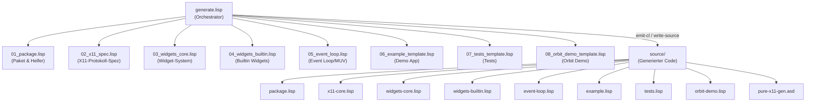

# Code Review: Pure X11 GUI Toolkit (`example/07_pure_x11`)

**Datum:** 2026-07-22  
**Reviewer:** Antigravity AI  
**Quellen:** Codebase-Analyse, DeepWiki (plops/cl-cl-generator)

---

## 1. Zusammenfassung

Das Projekt `07_pure_x11` ist eine **pure-Lisp, socket-basierte X11-Client-Bibliothek**, die dynamisch durch den `cl-cl-generator`-Transpiler erzeugt wird. Es implementiert ein vollständiges GUI-Toolkit mit:

- Direkter X11-Protokoll-Kommunikation über Unix-Domain-Sockets/TCP
- Deklarativer Widget-Spezifikation (Elm/MUV-Architektur)
- TeX-basiertem Glue-Layout-System (hbox/vbox)
- Dirty-Tracking und partiellem Redraw
- Double-Buffering via Pixmaps
- Canvas-Widget für 2D-Diagramme mit Weltkoordinaten-Transformation

### Gesamtbewertung

| Kategorie | Bewertung | Bemerkung |
|:---|:---:|:---|
| **Architektur** | ⭐⭐⭐⭐ | Klare Schichtentrennung, gut durchdachtes MUV-Pattern |
| **Code-Generierung** | ⭐⭐⭐⭐⭐ | Exzellente Nutzung von `cl-cl-generator` zur Boilerplate-Reduktion |
| **Korrektheit** | ⭐⭐⭐ | Grundsätzlich korrekt, einige Edge-Cases und Robustheitsprobleme |
| **Testabdeckung** | ⭐⭐⭐ | Gute Unit-Tests vorhanden, aber keine Integration-Tests mit echtem X11 |
| **Dokumentation** | ⭐⭐⭐⭐ | README ist sehr gut, inline-Kommentare ausbaufähig |
| **Wartbarkeit** | ⭐⭐⭐ | `raw`-Blöcke und `generate.lisp`-Monolith erschweren Pflege |

---

## 2. Architektur-Übersicht



Die Architektur folgt einem klaren **zweistufigen Modell**:
1. **Generator-Zeit** (Template-Dateien `01_`–`08_`): Spezifizieren den zu erzeugenden Code
2. **Laufzeit** (generierter `source/`-Code): Implementierung der X11-Bibliothek + Apps

---

## 3. Datei-für-Datei-Analyse

### 3.1 `01_package.lisp`

**Zweck:** Package-Definition, Quicklisp-Laden, Git-Version, Output-Verzeichnis.

> [!TIP]
> Gut: `sxhash`-basiertes Überspringen identischer Dateien in `write-source` (via cl-cl-generator) verhindert unnötige Recompilierungen.

**Probleme:**

- **Zeile 6:** Relativer Pfad `"../../"` ist fragil — bei Umstrukturierung bricht es
- **Zeile 7:** `ql:quickload` zur Load-Zeit statt `eval-when` Kompilierzeit — kann bei ASDF-Nutzung Probleme machen
- **Zeile 25:** Hardcoded `/usr/bin/git` — auf manchen Systemen liegt git anderswo

```diff
-(sb-ext:run-program "/usr/bin/git" '("rev-parse" "HEAD") :output s)
+;; Vorschlag: PATH nutzen statt absoluten Pfad
+(sb-ext:run-program "git" '("rev-parse" "HEAD") :output s :search t)
```

### 3.2 `02_x11_spec.lisp`

**Zweck:** Deklarative Spezifikation aller X11-Requests, Events und Flag-Lookup-Tabellen.

**Stärken:**
- Elegante, datengetriebene Architektur — 19 X11-Requests und 6 Event-Parser werden aus Tabellen generiert
- Eliminiert hunderte Zeilen repetitiven Binär-Serialisierungs-Code

**Probleme:**

1. **`make-window` ist ein Monolith (Zeile 71–162):**
   - Kombiniert CreateWindow + 5× CreateGC + MapWindow in einem einzigen `with-packet`
   - Packetlänge ist fest auf `(+ 8 n)` kodiert, obwohl danach 5 GC-Requests und ein MapWindow folgen
   - Das funktioniert nur, weil X11-Server aufeinanderfolgende Requests in einem Strom akzeptieren — aber es ist **semantisch irreführend**, da die `:packet`-Spezifikation suggeriert, es handle sich um einen einzelnen Request

2. **Hardcoded TrueColor-Pixelwerte (Zeile 101–156):**
   ```lisp
   (card32 #x00c0c0c0)       ; bg (light gray)
   (card32 #x00ffffff)       ; border
   ```
   Funktioniert nur auf TrueColor-Visuals (24-bit). Auf 8-bit Pseudocolor-Displays (Xvfb default, manche VNC) würde das fehlschlagen.

3. **Fehlende `int16`-Unterstützung in Request-Emitter:**
   Alle Koordinaten verwenden `card16` (unsigned). X11 erlaubt negative Koordinaten (z.B. Fenster außerhalb des Screens). Dies ist kein Bug für den aktuellen Gebrauch, aber eine Einschränkung.

4. **`put-image-big-req` (Zeile 429–456):**
   - `(declare (type (simple-array (unsigned-byte 8) 3) img))` — die `3` im Type-Deklarator spezifiziert Rang 3, was korrekt ist, aber ungewöhnlich formuliert
   - **Post-Processing umgeht Buffering** (Zeile 453): `(write-sequence img1 *s*)` schreibt direkt auf den Socket, nicht über `*packet-buffer*`. Das bricht die Semantik von `with-buffered-output`

> [!WARNING]
> `put-image-big-req` ignoriert den Buffering-Mechanismus und schreibt direkt auf den Socket. Bei Nutzung innerhalb `with-buffered-output` führt das zu **Out-of-Order-Requests**.

5. **`emit-request-function` (Zeile 686–708):**
   - Generiert sauberen Code, aber die Logik für `returns` ohne `reply` ist implizit — Kommentar wäre hilfreich

### 3.3 `03_widgets_core.lisp`

**Zweck:** Widget-Datenstruktur, Layout-Engine (hbox/vbox/glue), Hit-Testing, Keyboard-Navigation.

**Stärken:**
- TeX-Glue-Solver ist elegant implementiert
- Cone-basierte Keyboard-Navigation (±45°) ist innovativ
- `resolve-layout` löst rekursiv alle Koordinaten auf

**Probleme:**

1. **`find-widget-at` (Zeile 80–95) — lineare Suche:**
   - Iteriert den kompletten Widget-Baum bei jedem Mouse-Move
   - README/DeepWiki erwähnt Quadtree-Hit-Testing, aber **es ist nicht implementiert**
   - Bei vielen Widgets wird das zum Performance-Problem

2. **`find-nearest-widget` (Zeile 109–139) — kein Delaunay:**
   - README/DeepWiki erwähnt Delaunay-Triangulation für Keyboard-Navigation
   - Tatsächlich implementiert: **Brute-Force O(n)** mit Cone-Filterung
   - Für die aktuelle Widget-Anzahl ausreichend, aber die Dokumentation ist irreführend

> [!IMPORTANT]
> Die README behauptet Quadtree und Delaunay-Triangulation, aber beide sind **nicht implementiert**. Die tatsächliche Implementierung ist linearer Brute-Force-Search mit Cone-Filterung.

3. **`translate-keycode` (Zeile 141–160) — unvollständig:**
   - Nur ASCII 32-126, Backspace, Return und Pfeiltasten werden erkannt
   - Tab, Escape, Delete, Home, End, PgUp, PgDn fehlen
   - Keine Unterstützung für Umlaute oder sonstige Non-ASCII-Zeichen

4. **String-Vergleiche statt Symbole (Zeile 45–56):**
   ```lisp
   (string= type-name "HBOX")
   ```
   Ineffizient bei jedem Layout-Aufruf. Besser: `eq` auf kanonische Symbole.

### 3.4 `04_widgets_builtin.lisp`

**Zweck:** Builtin-Widget-Renderer (Panel, HBox, VBox, Label, Button, Checkbox, Text-Input, Canvas).

**Stärken:**
- Canvas-Widget ist beeindruckend: Weltkoordinaten → Screen-Transformation, Grid, Achsen, multiple Shape-Typen
- Double-Buffering via Offscreen-Pixmap im Canvas

**Probleme:**

1. **Label-Widget (Zeile 26–32) — Y-Koordinate falsch:**
   ```lisp
   (imagetext8 text :x x :y y :gc *gc-text*)
   ```
   X11 `ImageText8` zeichnet Text am **Baseline** (y ist Baseline, nicht Top). Der Label-Text erscheint wahrscheinlich am oberen Rand des Widgets — abhängig vom Font-Ascent.

2. **Button-Text-Zentrierung (Zeile 44):**
   ```lisp
   (text-x (+ x (floor (- w (* 6 (length text))) 2)))
   ```
   Hardcoded `6` Pixel pro Zeichen — funktioniert nur für den Default Core-Font (typisch `fixed` 6×13). Nicht robust bei anderem Font.

3. **Canvas Pixmap-Leak bei Fehler (Zeile 122–234):**
   Wenn ein Fehler in der Shape-Rendering-Loop auftritt, wird `free-pixmap` nicht aufgerufen. Sollte in `unwind-protect` eingebettet sein.

```diff
-;; Aktuell:
-(create-pixmap pix dw dh ...)
-... rendering ...
-(copy-area pix win-id ...)
-(free-pixmap pix)

+;; Vorschlag:
+(create-pixmap pix dw dh ...)
+(unwind-protect
+    (progn ... rendering ... (copy-area pix win-id ...))
+  (free-pixmap pix))
```

4. **Canvas Pixmap-Allokation bei jedem Render:**
   - Jeder Render-Aufruf des Canvas erzeugt ein neues Pixmap und zerstört es danach
   - Besser: Pixmap einmal allokieren und wiederverwenden (nur bei Größenänderung neu erzeugen)

5. **Checkbox hardcoded 14×14 Box-Größe (Zeile 70–71):**
   Skaliert nicht mit dem umgebenden Widget-H.

### 3.5 `05_event_loop.lisp`

**Zweck:** MUV Event-Loop, Dirty-Tracking, Full/Partial Redraw, Tick-basierte Animation.

**Stärken:**
- Sauberes MUV-Pattern (Model-Update-View, Elm-Architektur)
- Dirty-Tracking vermeidet unnötige Redraws
- Full-Redraw mit Double-Buffering verhindert Flicker
- Tick-Intervall-Support für Animationen

**Probleme:**

1. **Deeply nested `cond`/`cond` (Zeile 99–241):**
   - Die Event-Dispatch-Logik ist **15 Ebenen tief verschachtelt**
   - Extrem schwer zu lesen und zu warten
   - Sollte in separate Handler-Funktionen aufgeteilt werden

> [!WARNING]
> Die Event-Loop (`run-gui`) ist ein einziger, 175-zeiliger, 15-fach verschachtelter Block. Dies ist der größte Wartbarkeits-Schwachpunkt des gesamten Projekts.

2. **Button + Checkbox identische Logik (Zeile 170–181):**
   ```lisp
   ((and type-name (string-equal type-name "BUTTON"))
    (let ((msg ...)) ...))
   ((and type-name (string-equal type-name "CHECKBOX"))
    (let ((msg ...)) ...))
   ```
   Duplizierter Code — sollte zusammengefasst werden.

3. **Keine Graceful-Shutdown-Behandlung:**
   - WM_DELETE_WINDOW wird nicht behandelt
   - Kein ICCCM-Support (Inter-Client Communication Conventions)
   - Schließen des Fensters über den Window-Manager führt zu Socket-Error

4. **`partial-redraw` umgeht Double-Buffering (Zeile 49–60):**
   - `clear-area` + `render-widget` direkt aufs Fenster → potentielles Flickern bei schnellen Partial-Redraws
   - Full-Redraw nutzt Pixmap-Buffering, Partial-Redraw nicht

5. **Globale mutable Variablen für UI-State:**
   - `*focused-widget*`, `*pressed-widget*`, `*hovered-widget*` sind globale `defvar`s
   - Funktioniert, aber widerspricht dem funktionalen MUV-Ideal
   - Besser: In den State einbetten oder als lokale Variablen in `run-gui`

### 3.6 `06_example_template.lisp`

**Zweck:** Demo-App mit Button-Counter, Text-Input, Checkbox.

**Probleme:**

1. **`view` als `raw`-Block (Zeile 41–65):**
   - Die `view`-Funktion wird als Raw-String eingebettet, weil sie Backquote-Templates zurückgibt
   - Das ist das korrekte Vorgehen für cl-cl-generator bei verschachteltem Quasiquoting
   - Aber: Escaped Strings (`\\\"`) sind fehleranfällig

2. **`update` kopiert alles manuell (Zeile 19–39):**
   ```lisp
   (make-app-state :clicks (1+ clicks) :input-buffer buf :cursor-pos pos :checkbox-val chk)
   ```
   Jede State-Transition kopiert manuell alle Felder. Ohne `copy-structure` oder Lens-Abstraktion skaliert das schlecht.

### 3.7 `07_tests_template.lisp`

**Zweck:** Unit-Tests für Widget-Parsing, Hit-Testing, Glue-Solver, Dirty-Tracking, Opcodes.

**Stärken:**
- 9 Test-Suites mit sinnvollen Assertions
- Tests laufen headless (kein X11 nötig für die meisten Tests)
- Bevel-Test nutzt `with-buffered-output` zum Zählen der Pakete

**Probleme:**

1. **Kein Standard-Test-Framework:**
   - Eigenes `assert-test`-Macro statt z.B. `fiveam` oder `prove`
   - Kein Test-Discovery, kein Fixture-Support
   - Exit-Code 1 bei Fehler ist gut für CI

2. **`test-glue-solver` (Zeile 94):**
   ```lisp
   (assert-test (equal sizes3 '(133 167)) "Proportional stretch 1:2")
   ```
   Ergebnis hängt von `round`-Verhalten ab — bei anderer Implementierung könnte `(134 166)` rauskommen.

3. **Keine negativen Tests:**
   - Kein Test für ungültige Eingaben
   - Kein Test für Verbindungsfehler
   - Kein Test für leere Widget-Bäume

### 3.8 `08_orbit_demo_template.lisp`

**Zweck:** Hohmann-Transfer-Orbit-Animation mit Canvas-Widget.

**Stärken:**
- Elegante Nutzung des Canvas-Widgets für wissenschaftliche Visualisierung
- Physikalisch sinnvolle Parameter (Mars bei 1.524 AU, Hohmann-Ellipse)

**Probleme:**

1. **Hardcoded π als `3.14159` (Zeile 36, 51, 92):**
   ```lisp
   (if (> new-time 3.14159) ...)
   ```
   Sollte `pi` oder zumindest eine Konstante verwenden.

2. **Trace-Points-Allokation jeden Frame (Zeile 61–63):**
   - Jeder Tick erzeugt eine neue Liste von Punkten via `loop ... collect`
   - Bei 20 FPS und 60+ Punkten erzeugt das erheblichen GC-Druck

### 3.9 `generate.lisp`

**Zweck:** Orchestrator — lädt alle Templates und emittiert den generierten Code.

**Stärken:**
- Klare, sequentielle Generierung
- Nutzt `write-source` mit `sxhash`-Deduplizierung
- X11-Core wird inline im Orchestrator konstruiert — erlaubt Generator-Zeit-Loops wie `,@(loop for req ...)`

**Probleme:**

1. **X11-Core inline statt als Template (Zeile 112–541):**
   - 430 Zeilen inline-Code in `generate.lisp`
   - Alle anderen Module sind ausgelagert (01_–08_), nur x11-core nicht
   - Mischung aus `raw`-Strings (für Makros) und normalen S-Expressions

2. **`raw`-Block-Nutzung (Zeilen 135–217):**
   - `with-packet`, `with-reply` und `with-buffered-output` werden als Raw-Strings eingebettet
   - Grund: cl-cl-generator kann verschachteltes Backquoting in Macros nicht nativ emittieren
   - **Risiko:** Escaped-String-Fehler sind schwer zu debuggen

3. **`defparameter` innerhalb von `parse-initial-reply` (Zeile 328–329, 357–358):**
   ```lisp
   (defparameter *resource-id-base* resource-id-base)
   (defparameter *resource-id-mask* resource-id-mask)
   ```
   `defparameter` innerhalb einer Funktion ist ungewöhnlich und hat **Nebenwirkungen zur Laufzeit** — es definiert/redefiniert globale Special Variables. Funktional korrekt, aber ein `setf` wäre idiomatischer (mit vorheriger `defparameter`-Deklaration auf Toplevel).

### 3.10 Shell-Skripte

| Skript | Problem |
|:---|:---|
| `run-example.sh` | `--load` nach `--eval '(ql:quickload ...)'` — doppeltes Laden der example.lisp (einmal via ASDF, einmal via `--load`) |
| `run-xvfb-test.sh` | **Zeile 29:** Hardcoded Conversation-ID im `cp`-Pfad — wird auf anderen Maschinen fehlschlagen |
| `run-xvfb-test.sh` | `kill -9` statt graceful termination; keine Cleanup-Trap bei Script-Fehler |

---

## 4. Architektur-Analyse (via DeepWiki)

### 4.1 Design-Philosophie

Laut DeepWiki verfolgt das Projekt folgende Design-Prinzipien:
- **Minimierung von Round-Trip-Times (RTT):** Request-Batching via `with-buffered-output`, Hardcoded TrueColor-Werte statt `AllocColor`
- **Elm/MUV-Architektur:** State ist zentral und immutabel; `update` erzeugt neue State-Instanz; `view` ist eine reine Funktion
- **TeX-Glue-Layout:** Statt CSS-Flexbox wird ein TeX-inspiriertes Glue-System verwendet (natural/stretch/shrink)

### 4.2 Diskrepanzen zwischen Dokumentation und Implementierung

| Behauptung (README/DeepWiki) | Realität |
|:---|:---|
| "Mouse hit-testing via 2D Quadtree" | Lineare Suche durch Widget-Baum |
| "Keyboard navigation via Delaunay Triangulation" | Brute-Force mit 45°-Cone-Filter |
| "Partial redraws via dirty tracking" | Implementiert, aber ohne Double-Buffering |
| Datei heißt `gen.lisp` in README Sektion 3 | Tatsächlich `generate.lisp` |

### 4.3 Sicherheitsaspekte

- **Keine Input-Validierung bei Socket-Daten:** Ungültige Pakete vom X-Server könnten zu Array-Bounds-Violations führen
- **XAuthority-Cookie wird im Klartext über Socket gesendet** — korrekt für lokale Verbindungen, aber bei TCP ohne Verschlüsselung problematisch
- **Keine Timeout-Handling bei `read-exactly`** — hängt bei toten Verbindungen

---

## 5. Priorisierte Empfehlungen

### 🔴 Kritisch (sollte behoben werden)

1. **`put-image-big-req` Buffering-Bypass:** Direktes `write-sequence` auf `*s*` umgeht den Buffering-Mechanismus. Fix: Bildaten auch über `*packet-buffer*` senden oder `with-buffered-output` flushen bevor PutImage gesendet wird.

2. **Event-Loop Refactoring:** Die 15-fach verschachtelte `cond`-Kaskade in `run-gui` in separate Handler-Funktionen aufteilen (`handle-expose`, `handle-motion`, `handle-button-press`, etc.).

3. **Canvas Pixmap-Leak:** `unwind-protect` um Pixmap-Nutzung.

### 🟡 Wichtig (sollte geplant werden)

4. **README/Dokumentation korrigieren:** Quadtree- und Delaunay-Behauptungen entfernen oder als "geplant" markieren.

5. **WM_DELETE_WINDOW Support:** ICCCM-konformes Window-Closing implementieren.

6. **`raw`-Block-Reduktion:** Prüfen, ob cl-cl-generator inzwischen verschachteltes Quasiquoting unterstützt, um `raw`-Strings zu eliminieren.

7. **Shell-Skript Hardcoded-Pfade:** Conversation-ID aus `run-xvfb-test.sh` entfernen, Cleanup-Trap hinzufügen.

8. **Canvas Pixmap-Wiederverwendung:** Einmal allokieren, nur bei Resize neu erzeugen.

### 🟢 Nice-to-have (bei nächster Iteration)

9. **Quadtree für Hit-Testing:** Bei >20 Widgets würde das die Performance bei Mouse-Move spürbar verbessern.

10. **`translate-keycode` erweitern:** Tab, Escape, Delete, Home, End, Function Keys.

11. **Test-Framework:** Migration zu `fiveam` für bessere Diagnostik und Test-Discovery.

12. **State-Update-Abstraktion:** `copy-structure`-ähnliche Helfer oder funktionale Lenses für saubere State-Updates statt manuelles Kopieren aller Felder.

13. **Partial-Redraw mit Double-Buffering:** Auch bei partiellen Redraws Offscreen-Pixmap verwenden.

14. **UI-State in lokale Variablen:** `*focused-widget*` etc. aus globalen Variablen in lokale `run-gui`-Bindings umwandeln.

---

## 6. Metriken

| Metrik | Wert |
|:---|:---|
| Generator-Dateien | 9 Dateien, ~120 KB |
| Generierte Dateien | 9 Dateien, ~90 KB |
| X11-Requests implementiert | 19 |
| X11-Events implementiert | 6 |
| Widget-Typen | 8 (Panel, HBox, VBox, Label, Button, Checkbox, Text-Input, Canvas) |
| Test-Suites | 9 |
| LOC Generator (ohne Kommentare) | ~1.400 |
| LOC Generiert | ~1.900 |
| `raw`-String-Blöcke | 4 (generate.lisp: 2, example: 1, orbit-demo: 1) |

---

## 7. Fazit

Das Projekt ist ein **beeindruckend ambitioniertes Beispiel** für metaprogrammiertes GUI-Toolkit-Design in Common Lisp. Die Entscheidung, X11 direkt über Sockets anzusprechen (ohne Xlib/XCB-Binding), demonstriert die Mächtigkeit des cl-cl-generator-Ansatzes — aus ~730 Zeilen deklarativer Protokoll-Spezifikation werden ~800 Zeilen funktionsfähiger Binär-Serialisierungs-Code generiert.

Die Hauptschwächen liegen in:
- **Wartbarkeit** der Event-Loop (extreme Verschachtelung)
- **Diskrepanzen** zwischen Dokumentation und Implementierung (Quadtree/Delaunay)
- **`raw`-String-Nutzung** als Workaround für Quasiquoting-Limitierungen
- **Ressourcen-Management** (Pixmap-Leaks, Buffering-Bypass)

Trotz dieser Punkte ist das Projekt **funktionsfähig, gut getestet** (für ein Beispielprojekt) und zeigt einen innovativen Ansatz zur GUI-Programmierung in Lisp.
