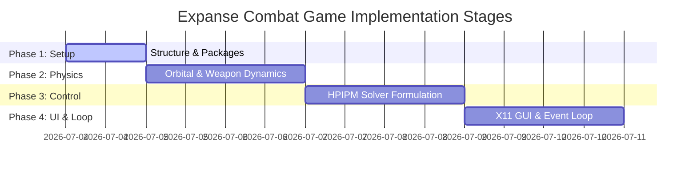

# Implementation Plan: 08_expanse_combat

This plan outlines the steps to build **Example 08: Expanse-Style 2D Orbital Tactical Simulation**. It combines the Model Predictive Control solver structures of `06_hpipm_cffi` with the raw socket-based X11 visual client library of `07_pure_x11`.

---

## 1. Project Directory Structure

We will create a new example directory at `/workspace/src/cl-cl-generator/example/08_expanse_combat/` structured as follows:

```
example/08_expanse_combat/
├── plan/
│   └── 01_plan.md              # [This file]
├── gen.lisp                     # Transpiler orchestrator
├── 01_package.lisp              # Generator package definition
├── 02_physics_template.lisp     # Template for relative orbit and weapon mechanics
├── 03_mpc_template.lisp         # Template for the 2D HPIPM controller wrapper
├── 04_gui_template.lisp         # Template for the X11 GUI and event loop
└── run.sh                       # Launch script to generate and run the demo
```

The output code will be emitted into a generated subfolder `source/`:
- `source/package.lisp`
- `source/physics.lisp`
- `source/mpc.lisp`
- `source/game.lisp`
- `source/expanse-combat.asd`

---

## 2. Decided Game Design Details

Following the design alignment session, these core mechanics are established:

1. **Dual MPC Autopilot Control**:
   - **Player ship (*Rocinante*)**: Can be piloted manually (keys) or flown by a **Full MPC Autopilot**. When engaged, the MPC takes complete control of the thrusters to navigate to the target docking port, allowing the player to focus on weapon targeting, firing, and crew G-strain management.
   - **Enemy ship**: Maneuvers on its own relative orbit, guided by its own **MPC Autopilot** programmed to intercept the player and maintain tactical firing range.
2. **Targetable Subsystems**:
   - The enemy ship has four subsystems, each with its own health bar on the player's HUD:
     - **Fuel/Propellant**: If destroyed, the enemy's MPC is disabled, leaving the ship to drift helplessly on its relative orbit.
     - **Weapons**: If destroyed, the enemy ship cannot fire railguns or launch torpedoes.
     - **Radar**: If destroyed, the enemy ship loses sensor lock, blind-firing or disabling its MPC tracking.
     - **Reactor**: If destroyed, the ship dismantles, the enemy crew escapes in safety pods, and the reactor safely shuts down, neutralizing the ship.
3. **Player Combat Actions**:
   - The player selects a subsystem to target via the HUD side panel and triggers fires using **Dashboard Buttons** ("Fire Railgun" / "Launch Torpedo").
4. **LEO Scale & Physics**:
   - Coordinates represent a 250m x 200m arena around the target docking port.
   - Orbital mean motion $n = 0.00113\text{ rad/s}$ (ISS orbit), causing relative drift curves on the canvas.

---

## 3. Implementation Roadmap



### Phase 1: Code Generator Setup
1. Define the package `:cl-cl-generator/example-expanse-gen` inside `01_package.lisp`.
2. Configure `gen.lisp` to load the templates and write the files to the output directory using the `write-source` utility.
3. Establish the ASDF system definition (`expanse-combat.asd`) linking all generated source files.

### Phase 2: 2D Relative Orbit & Weapon Physics (`02_physics_template.lisp`)
1. **Hill-Clohessy-Wiltshire (CW) Dynamics**:
   - Implement analytical discrete-time propagation for the 2D relative state space:
     $$x_{k+1} = A_d x_k + B_d u_k$$
   - State: $x = [x, y, \dot{x}, \dot{y}]^T$, Control: $u = [u_x, u_y]^T$.
2. **Torpedo Mechanics**:
   - Propagate torpedo positions toward the ship using Proportional Navigation.
   - Steer at constant acceleration until the fuel buffer `torpedo-fuel` is depleted.
   - Fall back to unguided relative drift (CW propagation) when fuel is zero.
3. **Railgun Trajectories**:
   - Propagate slugs as unguided orbital bodies using CW dynamics (appearing as curved lines relative to the ship).
4. **Point Defense Cannon (PDC)**:
   - Identify the nearest torpedo within range.
   - Spawn PDC tracer bullet lines directed at the torpedo's coordinates.
   - Handle hit detection (destroying torpedoes when bullet timers expire).

### Phase 3: 2D HPIPM Controller Formulation (`03_mpc_template.lisp`)
1. **2D Wrapper Generator**:
   - Call HPIPM bindings configured for $N_x = 4$ and $N_u = 2$.
2. **Cost Function & Bounds**:
   - State weights $Q$ (penalizing distance from docking port) and control weights $R$ (penalizing excessive fuel burn).
   - Dynamic thruster constraints $-u_{limit} \le u_k \le u_{limit}$:
     - `Safe Mode`: $u_{limit} = 30\text{ m/s}^2$ (~3 G).
     - `Juice Mode`: $u_{limit} = 150\text{ m/s}^2$ (~15 G).
3. **Collision Avoidance Constraints**:
   - Formulate moving safety cylinders (circles in 2D) representing predicted torpedo positions.
   - Represent railgun danger lanes as linear inequalities:
     $$lg \le C x_k \le ug$$
     where $C$ defines the normal vector to the railgun projectile line.

### Phase 4: Event Loop & X11 GUI Integration (`04_gui_template.lisp`)
1. **Game State Management**:
   - Define the `game-state` struct matching the Model-Update-View architecture.
   - Implement the `update-game-state` function handling keyboard events (manual thruster pulses), button triggers (Safe/Juice mode, autopilot toggle), and `:tick` events (advancing physics and invoking MPC).
2. **GUI Dashboard**:
   - Draw a side panel featuring propellant remaining, G-strain gauges, juice injection reserves, and status messages.
3. **Dynamic Canvas Visuals**:
   - Render the ship polygon rotated toward its velocity vector.
   - Animate thruster plumes.
   - Draw railgun traces, torpedo arcs, and PDC tracers.
   - Overlay the MPC-predicted trajectory path as a green dotted line.
