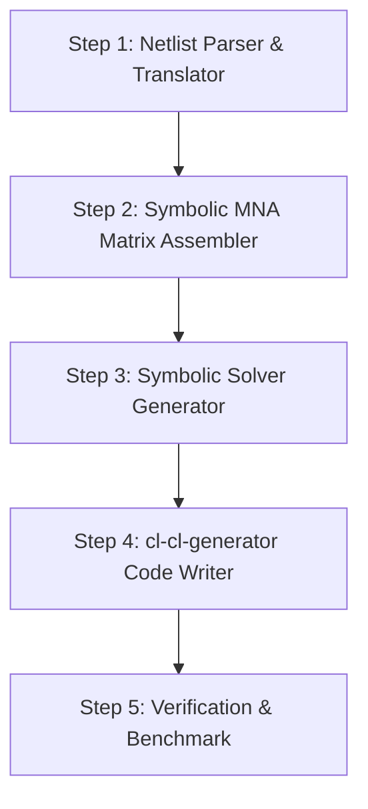

# Implementation Plan: Multi-Domain Lumped-Element Circuit Compiler

This plan outlines the design and step-by-step implementation of a symbolic multi-domain lumped-element compiler. It compiles generalized network descriptions (analogous to electrical, mechanical, thermal, and fluid networks) into highly optimized, zero-allocation Common Lisp simulation code.

---

## 1. Core Mathematical Concept: Generalized MNA

Modified Nodal Analysis (MNA) is the standard algorithm in SPICE. We generalize it to support any network domain using the following mappings:

### Generalized Variables:
*   **Across Variable ($x$)**: Potential difference across a component (Voltage $V$, Velocity $v$, Temperature $T$, Pressure $P$).
*   **Through Variable ($y$)**: Flow passing through a component (Current $I$, Force $F$, Heat Flow $q$, Volumetric Flow $Q$).

### Generalized Elements:
1.  **Conductance / Resistance ($G = 1/R$)**:
    $$y = G \cdot x$$
2.  **Capacity ($C$)**:
    $$y = C \cdot \frac{dx}{dt}$$
3.  **Inductance ($L$)**:
    $$x = L \cdot \frac{dy}{dt}$$
4.  **Across-Source ($E$)**: Sets the absolute potential difference.
5.  **Through-Source ($J$)**: Injects a fixed flow into a node.

### Discretization (Backward Euler / Companion Models):
To simulate transient behavior in time steps of $h$, we replace time-derivatives with finite differences:
*   **Capacity ($C$)**: Replaced by a parallel combination of a conductance $G_{eq} = \frac{C}{h}$ and an historic through-source $J_{eq} = \frac{C}{h} x(t-h)$.
*   **Inductance ($L$)**: Replaced by a parallel combination of a conductance $G_{eq} = \frac{h}{L}$ and an historic through-source $J_{eq} = y(t-h)$.

Using these companion models, any dynamic network is solved at each time step as a purely static linear system:
$$\mathbf{A} \cdot \mathbf{x} = \mathbf{b}$$

---

## 2. Proposed DSL (Netlist Syntax)

We define a clean S-expression DSL to specify multi-domain systems:

```lisp
(defparameter *example-system*
  '(;; Domain: Mechanical / Mass-Spring-Damper
    (mass M1 :nodes (1 0) :value 2.0)            ; Mass connected to ground (node 0)
    (spring K1 :nodes (1 2) :value 10.0)         ; Spring between node 1 and 2
    (damper B1 :nodes (2 0) :value 0.5)          ; Damper connected to ground
    (force-source F1 :nodes (1 0) :value 5.0)    ; External force applied to mass

    ;; Domain: Coupled Thermal
    (thermal-resistor Rth1 :nodes (3 0) :value 2.5)
    (thermal-capacity Cth1 :nodes (3 0) :value 0.1)
    ;; Coupled heater: converts mechanical damping power (F*v) into thermal heat flow
    (power-coupling P1 :from-mechanical-damper B1 :to-thermal-node 3)))
```

---

## 3. Step-by-Step Implementation Strategy



### Step 1: Netlist Parser & Translator
*   Define Lisp structures for each domain-specific component (e.g., `mass`, `spring`, `thermal-capacity`, `resistor`).
*   Translate these components into their generalized MNA equivalents:
    *   `mass` $\to$ `capacity` to ground.
    *   `spring` $\to$ `inductance` between nodes.
    *   `damper` $\to$ `conductance` between nodes.

### Step 2: Symbolic MNA Matrix Assembler
*   Write Lisp code to dynamically build the symbolic $\mathbf{A}$ matrix and $\mathbf{b}$ vector based on the nodes and component values.
*   The matrix elements will be represented as symbolic expressions (e.g., `(+ (/ C1 dt) G1)`).

### Step 3: Symbolic Solver Generator
*   Implement a lightweight symbolic equation solver (using Gaussian elimination / Cramer's rule / LU decomposition) to solve $\mathbf{A} \mathbf{x} = \mathbf{b}$ for the node voltages/potentials.
*   This outputs the symbolic expression for each node potential at step $t$ as a function of the states at step $t-h$.

### Step 4: Code Emission using `cl-cl-generator`
*   Emit the final simulation driver function.
*   Apply strict `double-float` type declarations to all variables, arrays, and parameters.
*   Generate the outer simulation loop that updates historic state variables and writes data to a CSV or stream.

### Step 5: Verification & Benchmark
*   Verify the simulation results for a **Masse-Feder-Dämpfer** (Mass-Spring-Damper) system and a **coupled thermal heatsink** against analytical solutions.
*   Measure execution speed and verify zero heap allocation.

---

## 4. Deliverables

1.  `package.lisp`: Definition of the library package.
2.  `compiler.lisp`: The parser, symbolic MNA assembler, and Lisp code emitter.
3.  `example-simulations.lisp`: Concrete examples (Mass-Spring-Damper, Electro-Thermal Diode/LED).
4.  `run-sim.sh`: A shell script to run the simulations and output data.
