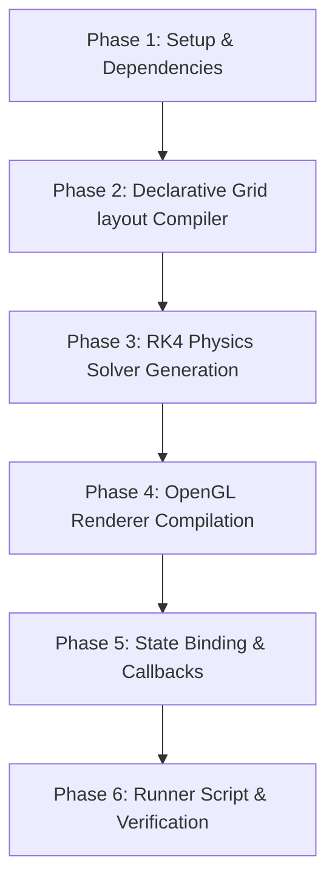

# Implementation Plan: Barium 3D Double Pendulum Simulator & Phase Space Plotter

This document contains the research summaries and step-by-step implementation plan for introducing **Example 11 (Barium GUI)** to the `cl-cl-generator` workspace.

---

## 1. References & Resources Searched

During the research phase, the following repositories and files were analyzed:

1. **Barium Git Repository**:
   - Repository URL: `https://git.hq.sig7.se/barium.git` (Cloned locally to [barium_src](file:///workspace/src/cl-cl-generator/example/11_barium/barium_src))
   - [bmi-calculator.lisp](file:///workspace/src/cl-cl-generator/example/11_barium/barium_src/demo/bmi-calculator.lisp): Simple 2D widget UI using Barium.
   - [molview.lisp](file:///workspace/src/cl-cl-generator/example/11_barium/barium_src/demo/molview.lisp): Interactive 3D OpenGL viewport (`gl-area`) combined with 2D sliders and settings panel.
   - [Barium Core Source Files](file:///workspace/src/cl-cl-generator/example/11_barium/barium_src/src): Checked `gl-area.lisp`, `grid.lisp`, `slider.lisp`, `canvas.lisp` to map out available widgets and packing features.

2. **Workspace Examples**:
   - [example/07_pure_x11/README.md](file:///workspace/src/cl-cl-generator/example/07_pure_x11/README.md) & [generate.lisp](file:///workspace/src/cl-cl-generator/example/07_pure_x11/generate.lisp): A pure Lisp client that communicates with X11 directly via socket streams without using C libraries.
   - [example/10_multi_domain_solver/README.md](file:///workspace/src/cl-cl-generator/example/10_multi_domain_solver/README.md) & [oscillator-gui.lisp](file:///workspace/src/cl-cl-generator/example/10_multi_domain_solver/oscillator-gui.lisp): MNA physical solver generator and dynamic real-time rolling graph visualization using the generated pure X11 library.

---

## 2. Summaries of Found Information

### Barium Widget Toolkit
* **API Style**: Uses `with-barium` to establish a session, and `with-objects` to declare local widgets (e.g. `window`, `button`, `label`, `entry`, `gl-area`, `hslider`).
* **Callbacks**: Relies on macros like `with-signal` (e.g. `:clicked`, `:value-changed`) and `with-event` (e.g. `motion-notify-event`, `resize-event`) to bind event handlers.
* **Layout Management**: Layout is handled via a structured Grid system. Controls like `grid-col-configure` and `grid-row-configure` allow weight-based spacing, and `grid-pack` places lists of widgets into grids.
* **OpenGL Viewport**: The `gl-area` widget binds directly to `cl-opengl` and triggers `:draw` signals for rendering. Standard mouse events (`motion-notify-event`, `button-press-event`) are supported on the viewport for camera rotations/zooms.

### cl-cl-generator Context
* The code generator is designed to emit formatted Common Lisp code from S-expressions.
* Example 07 implements a complete raw X11 socket client, widget state manager, and box-layout engine.
* Example 10 uses the compiler to build a physical matrix equation solver for electrical, mechanical, and thermal lumped-elements using Backward Euler discretizations.
* Integrating Barium as Example 11 allows us to move away from raw X11 socket communication and focus on compiling a high-level widget tree and physics simulation to a mature toolkit.

---

## 3. What the Tool Should Display (Visual Design)

The generated application will show a unified, scientific telemetry dashboard:
* **OpenGL 3D Viewport**: Live 3D animation of the double pendulum. Features a fading trace trail following the lower pendulum's mass. Click-and-drag rotation/zoom is supported.
* **Telemetry Display**: Displays current frame rates (FPS), physical energy values ($T$, $V$, $E_{total}$), and angular displacement variables.
* **Interactive Control Sidebar**: 
  - Sliders for $L_1, L_2$, masses $m_1, m_2$, gravity, damping.
  - Action buttons: *Play/Pause*, *Reset*, *Step*, and *Kick* (adds momentum to bob 2).
  - Selection dropdown for initial presets.
* **Phase Space Plot**: A 2D Cairo plot representing $\theta_1$ vs $\theta_2$ to visualize chaos.

---

## 4. Implementation Steps

### Phase 1: Setup & Barium Integration
1. Define the system configuration in `example/11_barium/package.lisp` and `example/11_barium/generate.lisp`.
2. Configure the system dependency to look for local Barium installation by pushing `example/11_barium/barium_src/` to `asdf:*central-registry*`.

### Phase 2: Transpiler Layout Compiler
1. Implement a compiler function that parses an S-expression representation of the UI (e.g. `(grid-layout (row (label "A") (hslider ...)))`) and compiles it into:
   - Nested widget instantiation bindings in `with-objects`.
   - Appropriate `grid-pack` and grid-configuring calls.

### Phase 3: Physics Solver Generator
1. Implement a system of ODEs solver for a double pendulum using the Runge-Kutta 4th order (RK4) method.
2. The generator will output highly optimized, zero-allocation double-float solver functions.

### Phase 4: OpenGL Viewport Generator
1. Emit drawing routines utilizing `cl-opengl`.
2. Generate helper forms to render spheres (using GLUT or custom math), cylinders/rods, and trails.
3. Generate camera matrix transformations based on dragging state variables.

### Phase 5: Event Bindings & State Integration
1. Compile event callback mappings so that slider updates modify the physics simulation parameters on-the-fly.
2. Implement the Elm-like loop structure where the simulation tick updates state, and redraws the OpenGL viewport and the 2D Cairo phase space canvas.

### Phase 6: Run Scripts and Verification
1. Create `example/11_barium/run_demo.sh` to run the generator and start the application.
2. Provide a script to verify packages load correctly.
