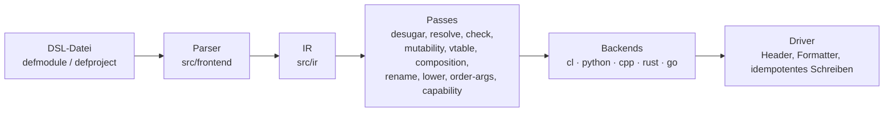

# Polyglot-Generator (Beispiel 13)

Ein Transpiler, der aus **einer** Common-Lisp-ähnlichen S-Expression-Eingabe
idiomatischen Code für **C++20, Python 3, Rust, Common Lisp und Go** erzeugt.
Zwischen Eingabe und Ausgabe liegt eine generische Zwischenrepräsentation
(IR) mit Passes; jede Zielsprache ist ein austauschbares Backend. Die
Konzeption steht in [plan.md](../../plan/20260929_01_compare/plan.md), die
Umsetzung in [walkthrough.md](../../plan/20260929_01_compare/walkthrough.md).

## Schnellstart

```bash
./run-tests.sh                                   # Unit- und Spec-Tests (FiveAM)
./polyglot-gen.sh examples/01_shapes/project.lisp --out /tmp/shapes
./run-integration.sh                             # 12 Programme x 5 Ziele bauen und vergleichen
```

`polyglot-gen.sh` schreibt pro Ziel ein Verzeichnis (`cpp/`, `python/`,
`rust/`, `go/`, `cl/`) mit Build-Dateien (`CMakeLists.txt`, `Cargo.toml`,
`go.mod`, `.asd`). Eine Datei wird nur neu geschrieben, wenn sich ihr Inhalt
ändert. Die committete Ausgabe des Beispiels liegt unter
[examples/01_shapes/source01/](examples/01_shapes/source01/).

## Die DSL in Kürze

```lisp
(in-package :polyglot-user)
(in-dsl)                                  ; Readtable :invert, Doubles als Standard

(defmodule geometry (:export point distance)
  (defstruct point (x :f64 0d0) (y :f64 0d0))
  (defun square (v) (declare (type :f64 v) (values :f64)) (* v v))   ; privat
  (defun distance (a b)
    (declare (type point a b) (values :f64))
    (sqrt (+ (square (- (dot a x) (dot b x))) (square (- (dot a y) (dot b y)))))))

(defmodule app (:import geometry)
  (defun main ()
    (print-line (format-string "{:.3f}" (distance (make-point :x 3d0) (make-point :y 4d0))))))

(defproject demo (:modules geometry app) (:entry app))
```

- Semantik wie in Common Lisp: `and`/`or`/`not` logisch, `logand`/`logior`
  bitweise, `/` nur für Floats, `truncate`/`floor`/`mod`/`rem` mit
  CL-Rundung, `/=` heißt „ungleich“.
- Parameter-Modi `(mode :in|:inout|:sink x)` werden zu `&T`/`&mut T`/`T`
  (Rust), `const T&`/`T&`/`T` (C++) und `T`/`*T` (Go).
- Borrows: `(view :string)`, `(ref T :a)`, `(declare (borrows-from x y))`
  erzeugen Lifetimes nur dort, wo Rust sie verlangt.
- `definterface`, `defstruct (:implements …)`, `defclass (base)` mit
  `(virtual)`, `(override)` und `call-super`; Rust und Go bekommen die
  Vererbung über den Pass `inheritance->composition`.
- Notausgänge: `target-case`, Formen aus `cpp:`/`py:`/`rs:`/`go:`, `raw`,
  `defextern`, `define-dsl-macro`.

Die vollständige, aus den Tests erzeugte Formenliste mit der Ausgabe pro
Ziel steht in [SUPPORTED_FORMS.md](SUPPORTED_FORMS.md).

## Architektur



| Verzeichnis | Inhalt |
|---|---|
| `src/ir/` | Knoten (`define-node`), Typen mit Borrow-Regionen |
| `src/frontend/` | Parser, DSL-Makros, `target-case`, Intrinsic-Signaturen |
| `src/passes/` | alle Passes, konfiguriert über die Backend-Config |
| `src/printer/` | Zeilen-Writer, Präzedenz-Engine, Literale |
| `src/backend/` | Protokoll und die fünf Backends |
| `src/driver/` | `write-project`, Formatter, CLI |
| `tests/` | Unit-, Spec-, Zufalls- und Integrationstests |

## Tests

| Befehl | Prüft |
|---|---|
| `./run-tests.sh` | Unit- und Spec-Tests mit SBCL |
| `./run-tests.sh --ecl` | dieselben Tests mit ECL |
| `./run-tests.sh --docs-check` | `SUPPORTED_FORMS.md` ist aktuell (`--docs` erzeugt sie neu) |
| `./run-tests.sh --paren` | 400 Zufallsausdrücke, voll und minimal geklammert, in allen Zielen |
| `./run-integration.sh [prog…] [--targets …]` | Programme bauen, Gates (`ruff check`, `g++ -Werror`, `clippy -D warnings`, `go vet`) und Ausgabe gegen `expected.txt` |
| `./run-integration.sh --determinism` | zweimal erzeugen: bytegleich, unveränderte mtimes |
| `tools/lisp-check.sh [--indent] [--ecl] datei…` | Syntax-Gate für Lisp-Dateien |

Benötigt werden SBCL mit Quicklisp (trivia, fiveam, named-readtables,
alexandria, cl-ppcre), für die Ziele g++ ≥ 13, Python ≥ 3.12 mit ruff, Rust
mit clippy und Go ≥ 1.23; clang-format, rustfmt, ruff und gofmt formatieren
die Ausgabe, falls vorhanden.

## Bekannte Grenzen

- Kein Generics/Templates, keine `Result`-Propagation, keine geteilten
  Referenzen (`Rc<RefCell>`/`shared_ptr`) im portablen Kern.
- `:inout` auf Copy-Typen gibt es in Python und CL nicht
  (`unsupported-construct`); zyklische Modulimporte sind ein Fehler.
- `string-find`/`string-slice` arbeiten mit ASCII-Byte-Offsets; `length`
  auf Strings ist absichtlich verboten (`string-byte-length` bzw.
  `string-char-count`).
- In Go ist `clone` eines Structs eine flache Kopie.
- Modulnamen sind flach.
