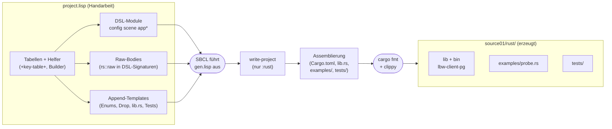

# Implementierungsplan: Low-Bandwidth-Client im Polyglot-Generator

Stand: 2026-10-04. Aufgabe: `plan/20261004_01_port/prompt.txt`.
Ziel: Der MVP-Client aus `source7_mvp` (TCP-Empfang, AV1-Dekodierung,
Szenen-Aufbau, Fenster + Eingabe) wird als Lisp-Input für den
Polyglot-Transpiler neu ausgedrückt. Es wird **nur Rust** erzeugt.
Validierung gegen den unveränderten `source7_mvp`-Server.

> Dieser Plan soll einen unabhängigen AI-Agenten befähigen, ohne
> Rückfragen einen tragfähigen Kontext aufzubauen und die Arbeit
> auszuführen. Die serielle Abarbeitung steht in `task.md`.

## 1. Kontext-Dateien (Leseliste für den Agenten)

Jede Datei mit Pfad (relativ zu `/workspace/src`, im Docker des
Auftraggebers `/home/kiel/stage`) und Lesezweck. Lesereihenfolge:
Gruppe A → B → C → D.

### A. Der zu portierende Client (Verhaltens-Referenz)

| Datei | Zweck |
|---|---|
| `cl-rust-generator/examples/29_lowbandwidth/source7_mvp/client/src/lib.rs`, `main.rs`, `01_config.rs` | Verdrahtung, Fenster-Setup, CLI-Config (`clap derive`) |
| `.../client/src/02_av1.rs` | rav1d-Wrapper (`unsafe` an einer Stelle), `Decoder`, `Rgba` |
| `.../client/src/03_net.rs` | Netz-Thread, Reconnect-Backoff, `Event`-Enum, `Net` + `Drop` |
| `.../client/src/04_scene.rs` | Reine Szenen-Logik: `blit`, `pixel`, `apply`, `Link`-Enum |
| `.../client/src/05_app.rs` | macroquad-Schleife: HUD, Text, Eingabe-Tabellen (19 Tasten, 3 Maustasten) |
| `.../client/examples/probe.rs` | Headless-Smoke-Client (Vorbild für unseren Probe) |
| `.../client/tests/loopback.rs` | Loopback-Test gegen Stub-Server (Vorbild für unseren Loopback) |
| `.../common/src/01_types.rs` | Protokolltypen (`ServerMsg`, `ClientMsg`, `TextItem`, `Rect`, `SIZE`) — bleiben extern |
| `.../server/src/05_av1.rs` | Encoder-Einstellungen (`rav1e`) — für den Test-Helper spiegeln |
| `.../source7_mvp/deps.md` | Begründete Deps-Entscheidungen von `source7` (u. a. warum `macroquad`) |
| `.../source7_mvp/Cargo.toml` | Workspace-Profile (`opt-level = 3` auch für Deps im dev-Profil) |

### B. Der Transpiler (Polyglot-Generator, Beispiel 13)

| Datei | Zweck |
|---|---|
| `cl-cl-generator/example/13_polyglot_generator/README.md` | Überblick, DSL-Kurzform, Testbefehle |
| `.../SUPPORTED_FORMS.md` | Alle DSL-Formen mit Ausgabe je Ziel (generiert, maßgeblich) |
| `.../polyglot-generator.md` | DeepWiki-Extrakt: Architektur, Pass-Pipeline |
| `.../examples/01_shapes/project.lisp`, `gen.lisp` | Vorbild für Projekt-Layout und Generierungs-Skript |
| `.../examples/01_shapes/source01/rust/` | Generierte Crate-Struktur (`src/main.rs`, Module, `Cargo.toml` ohne Deps) |
| `.../src/00-package.lisp` | Extension-Pakete (`rs::` etc., **Doppel-Doppelpunkt-Syntax** bei Nutzung) |
| `.../src/frontend/20-registry.lisp` | `define-dsl-macro`, `target-case`-Parsing |
| `.../src/frontend/24-modules.lisp` | `defmodule` (quotiert!), `register-module`, `defproject` |
| `.../src/frontend/24-items.lisp` | `defstruct`/`defun`/`defmethod`-Parsing (Felder 2–3 Elemente, Receiver-Modi) |
| `.../src/ir/11-types.lisp` | Typsystem; `(rs::type "...")` für Raw-Typen |
| `.../src/backend/rust/artifacts.lisp` | Crate-Layout: nur Binär-Crate, `Cargo.toml` ohne `[dependencies]` |
| `.../src/backend/rust/expr.lisp` (`rs-index`, `target-form-expr`) | Index-Auto-Cast (`as usize`), `rs::raw`-Emission |
| `.../src/backend/rust/lifetimes.lisp` (`mark-used-params`) | **Unbenutzte Params werden `_name`** (wichtig für Raw-Regel, s. §4) |
| `.../src/driver/82-write.lisp` | `write-project` mit `:targets (:rust)` |
| `.../polyglot-gen.sh` | CLI (`--targets rust --out DIR`) |
| `.../tests/integration/programs/p04_collections/project.lisp` | Idiome: `vec-of`, `aref`, `setf`, `dolist`, `if-let` |
| `.../tests/integration/programs/p05_modes/project.lisp` | Idiome: Receiver `:in`/`:inout`/`:sink`, `(move x)`, `optional` |

### C. Methodik-Vorbild (anderer Transpiler, gleiche Domäne)

| Datei | Zweck |
|---|---|
| `cl-rust-generator/examples/29_lowbandwidth/plan/20261003_03_transpiler/walkthrough.md` | Wie `source7` → `source8` mit `,@`-Splices portiert wurde; Lektionen: flache `let`s, **Splices nur auf oberster Schablonenebene**, kein Byte-Diff (Demo-Freiheit, §2.8), T9-Refactor |

### D. Eigene Arbeitsdateien (dieser Ordner)

| Datei | Zweck |
|---|---|
| `examples/02_lowbandwidth/plan.md` (diese Datei) | Architektur + Lösungen + Vorschläge |
| `examples/02_lowbandwidth/task.md` | Serielle Phasen mit Gates |
| `examples/02_lowbandwidth/deps.md` | Deps in `org/projekt`-Notation |
| `examples/02_lowbandwidth/project.lisp` | Transpiler-Input (DSL + Raw + Lisp-Tabellen) |
| `examples/02_lowbandwidth/gen.lisp` | Generierung + Assemblierung der Crate |
| `examples/02_lowbandwidth/source01/rust/` | Erzeugte Crate `lbw-client-pg` (Bin + Lib, s. §3) |

## 2. Architektur

### 2.1 Gesamtbild



### 2.2 Modul-Abbildung (source7 → DSL-Anteil)

| source7-Modul | DSL-Anteil | Raw-Anteil | Append-Template |
|---|---|---|---|
| `01_config` | Struct, Default, `parse-args`-Logik | `process::exit` bei Fehlgebrauch | — |
| `02_av1` | Structs `Decoder`/`Rgba`, Signaturen, Docs | Bodies (`unsafe`, rav1d-FFI), Konstruktor | `impl Drop` |
| `03_net` | Struct `Net` (Raw-Typ-Felder), Signaturen | Thread, Channels, Session-Loop | `enum Event`, `impl Drop` |
| `04_scene` | Struct, `blit`, `pixel`, Zähler, HUD-Text | `apply` (`match`), Text-Helfer | `enum Link` |
| `05_app` | `run`-Signatur, HUD-Aufruf | minifb-Loop, Text-Raster, Input-Poll | Key-Match-Arme (splice-generiert) |
| `main` | Dünnes `main` (DSL) | Args-Collect | — |
| `probe`, Tests | — | — | Vollständige Templates in Lisp |

Prinzip: **Signaturen, Docs und reine Logik im DSL** (typgeprüft,
linter-sauber), alles Jenseitige (Threads, `unsafe`, Enums, externe
APIs) als `rs::raw` in DSL-Signaturen oder als Append-Template.
Generierte Dateien werden **nie per Hand editiert** (nur ergänzt);
`gen.lisp` ist idempotent (`write-if-changed`).

### 2.3 Crate-Montage ohne Chirurgie

Der Transpiler erzeugt nur eine Binär-Crate ohne Deps. `gen.lisp`
macht daraus (ohne generierte Dateien zu verändern):

1. `write-project` mit `:targets (:rust)` nach `source01/rust/`.
2. `Cargo.toml` patchen: Edition 2024, `[dependencies]`
   (`lbw-common` per relativem Pfad, `minifb` ohne Wayland, `font8x8`,
   `rav1d`), `[dev-dependencies]` (`rav1e` für Test-Kacheln).
3. `src/lib.rs`-Template dazulegen: `pub mod` je generierter Datei
   (außer `main.rs`) — dadurch nutzen `examples/` und `tests/` die Lib,
   die Binär-Crate bleibt unverändert.
4. `examples/probe.rs`, `tests/*.rs`, `tests/data/` aus Templates schreiben.
5. `cargo fmt`, `cargo clippy -- -D warnings`, `cargo test`.

## 3. Lösungsansätze (Details)

### 3.1 GUI: `minifb` + `font8x8` statt `macroquad` + `clap`

`macroquad` verlangt `async main` mit Derive-Attribut und `clap`
ein Derive-Makro — beides kann der DSL nicht ausdrücken (keine
Item-Attribute, kein `async`). Statt den generierten `main` per
String-Chirurgie zu verunstalten, ersetzen wir beide:

- **Fenster/Input:** `minifb` (`default-features = false, features =
  ["x11"]` — kein Wayland, klein, läuft unter `xvfb`). Sync-API,
  `u32`-Framebuffer, Unicode-Zeichen via `InputCallback`.
- **Text:** `font8x8` (0 Abhängigkeiten): 8×8-Bitmap-Glyphen, per
  Integer-Faktor auf die OCR-Box skaliert, fehlende Glyphen → `?`.
- **CLI:** Hand-Parsing (`--connect ADDR`, ein Argument) statt `clap`.

Folge: 4 direkte Deps (wie bisher), aber deutlich leichterer Baum
und kleinere Binary; kein `async`, kein Derive im Transpiler-Input.
Abweichung vom Original ist laut `prompt.txt` erlaubt; Details und
Messung landen im Walkthrough.

### 3.2 Enums ohne `defenum`

Der DSL kennt keine Enums (kein `match`). `Event` (net) und `Link`
(scene) liegen als Lisp-String-Templates in `project.lisp` und werden
von `gen.lisp` an die generierten Moduldateien **angehängt**. Der
Rest der Module (Structs, Signaturen, reine Funktionen) bleibt DSL.
`match`-Bodies (`apply`, Input-Mapping) sind `rs::raw`.

### 3.3 Konstruktoren als freie Funktionen

Der DSL kennt keine assoziierten Funktionen ohne Receiver. `Scene::new`,
`Decoder::new`, `Net::connect` werden freie Funktionen (`scene-new`,
`decoder-new`, `net-connect`). Methoden **mit** Receiver (`decode`,
`send`, `blit`, `close`) bleiben Methoden (`:in`/`:inout`/`:sink`).

### 3.4 Loopback-Kachel ohne `lbw-server`-Dev-Dep

Der Loopback-Test braucht eine echte AV1-Kachel. Statt `lbw-server`
(zieht `ort`/`rav1e`/`enigo` in unsere Dev-Deps) zu verwenden,
kodiert ein Test-Helper die 64×64-Flachkachel zur Testzeit mit `rav1e`
selbst; die Encoder-Einstellungen sind aus `server/src/05_av1.rs`
gespiegelt und dort als solche dokumentiert.

### 3.5 `lbw-common` als relativer Pfad-Dep (temporär)

Bis `common` selbst portiert ist (Folgeaufgabe), hängt die Crate per
relativem Pfad an `source7_mvp/common`. Der Pfad funktioniert auf
beiden bekannten Checkouts (`/workspace/src`, `/home/kiel/stage`),
weil beide Repos nebeneinander liegen.

### 3.6 Kein Byte-Vergleich mit `source7`

Wie in `source8` (§2.8 dort) gilt: `source7` ist Demo, kein
Byte-Template. Es zählen gleiche Tests/gleiches Verhalten (Protokoll!),
nicht gleiche Bytes.

## 4. Konventionen für `rs::raw` (verifiziert per Probe)

Per Probe (`/tmp/pgprobe`, Build + Clippy + Fmt grün) gelten:

1. **Syntax:** `rs::raw` / `rs::type` mit **Doppel-Doppelpunkt**
   (`rs:raw` scheitert schon beim Lisp-Reader).
2. **Params, die nur Raw-Code nutzt, heißen im Raw `_name`**
   (der Transpiler stellt `_` voran, `mark-used-params`).
   Params, die auch DSL-Code nutzt, heißen `name`.
3. **Locals aus `let`, die nur Raw-Code nutzt, heißen `name`**
   (kein Prefix). Raw-mutierte Locals **in Raw deklarieren**
   (`let mut ...`), da die `mut`-Inferenz Raw nicht sieht.
4. **`:sink`-Params** brauchen an DSL-Call-Sites `(move x)`.
5. **`(vec T)`-Params** werden `&[T]`; auch `(vec (rs::type "..."))`
   ist erlaubt.
6. **Module mit Splices** via `(register-module \`(defmodule ... ,@...))`
   bauen — `defmodule` selbst quotiert und versteht kein `,@`.
7. **Splices nur auf oberster Schablonenebene** (keine
   Backquote-Schachtelung; Lektion aus `source8`, §2.6 dort).
8. **Klammern:** nach jeder Änderung `sbcl`-Paren-Check (s. `task.md`);
   nach zwei erfolglosen Fix-Versuchen stoppen und fragen.

Beispiel (von der Probe verifiziert):

```lisp
(register-module
 `(defmodule net (:export net-connect)
    (defun net-connect (addr)
      "Connect in background, like source7 Net::connect."
      (declare (type :string addr)
               (values (rs::type "Net")))
      ;; _addr: raw-only param => underscore (rule 2)
      (rs::raw "Net::connect_thread(_addr.to_string())"))))
```

## 5. Lisp-Faktorisierung (Beispiele, nicht vollständig)

Zentrale Tabellen oben in `project.lisp`, per `loop`/`collect` in
DSL-Formen **und** Raw-Strings expandiert:

```lisp
(defparameter +key-table+
  ;; (source7-name minifb-Key)
  '(("Enter" Enter) ("Esc" Escape) ("Tab" Tab)
    ("Backspace" Backspace) ("Delete" Delete)
    ("Up" Up) ("Down" Down) ("Left" Left) ("Right" Right)
    ("Home" Home) ("End" End)
    ("PageUp" PageUp) ("PageDown" PageDown)
    ("Shift" LeftShift) ("Shift" RightShift)
    ("Control" LeftCtrl) ("Control" RightCtrl)
    ("Alt" LeftAlt) ("Alt" RightAlt)))

(defparameter +btn-table+
  '((Left 1) (Middle 2) (Right 3)))

(defun key-match-arms ()
  "Raw match arms over minifb::Key, generated from +key-table+."
  (loop for (name key) in +key-table+
        collect (format nil "minifb::Key::~a => Some(\"~a\")," key name)))

(defun key-test-forms ()
  "One DSL assert-form per table row (used in tests template)."
  (loop for (name key) in +key-table+
        collect `(assert-key-roundtrip ,(format nil "~a" key) ,name)))
```

Verwendung: `(rs::raw (format nil "match _k {~%~{  ~a~%~}}"
(key-match-arms)))` — **Achtung:** `rs::raw` verlangt laut Parser
einen String im Form; ob ein Funktionsaufruf als Argument akzeptiert
wird, muss die Implementierung prüfen (Probe in T1!). Falls nein:
Raw-String per `register-module`-Backquote mit `,(...)` einsetzen,
also `(rs::raw ,(make-key-match))` innerhalb der Modul-Schablone.

## 6. Vorschläge des Agenten (Review des Prompts)

Was im Prompt fehlt oder beachtenswert ist:

1. **GUI-Entscheidung dokumentieren** (s. §3.1): `minifb`+`font8x8`
   statt `macroquad`, Hand-CLI statt `clap`. Alternative (falls der
   Auftraggeber `macroquad` will): generierten `main` per Template
   ersetzen — dann bleibt nur der Rest Transpiler-Output.
2. **Textqualität:** 8×8-Font ist grob; Umlaute nur soweit `ext_latin`
   reicht. Für später: `fontdue` + eingebettetes TTF evaluieren
   (kostet ~700 KB Binary).
3. **`unsafe impl Send` für `Decoder` prüfen:** In `source7` wird der
   Decoder im Thread erzeugt — das `Send` ist vermutlich toter Code.
   Weglassen und kompilieren lassen; falls nötig, als Template anhängen.
4. **Windows/macOS sind außer Scope:** `minifb` nur mit `x11`-Feature;
   Wayland/Windows baut diese Crate nicht (bewusst, wegen Binary-Größe).
5. **Protokoll-Drift verhindern:** `lbw-common`-Version in `deps.md`
   festhalten; Loopback + Probe laufen gegen echte Server-Typen.
6. **`Cargo.lock` committen:** reproduzierbare Builds (wie `source7`).
7. **Laufzeit-Flag `--stay N` für Probe** übernehmen (Durchsatzmessung).
8. **`target/` nicht committen**, `source01/` schon (wie `01_shapes`).
9. **Klammer-Regel operationalisieren:** `tools/lisp-check.sh` des
   Transpilers (falls vorhanden) oder minimaler `sbcl`-Reader-Check
   vor jedem `gen.lisp`-Lauf (s. `task.md`).
10. **Folgeaufgabe vormerken:** `common`-Port entkoppelt uns vom
    `source7`-Pfad-Dep; `server`-Port folgt danach.

## 7. Commit-Konvention (Conventional Commits)

Jede `task.md`-Phase endet mit genau einem Commit, erst wenn ihre
Gates grün sind. Format:

```
<typ>(02_lowbandwidth): <kurz, imperativ, deutsch oder englisch>

<Was und warum, 3–8 Zeilen: Entscheidungen, Abweichungen von source7,
Gates mit Ergebnis.>
```

Typen: `feat` (neues Modul/Phase), `test` (nur Tests),
`docs` (plan/task/deps/walkthrough), `chore` (Cargo/Upgrade).
Beispiele:

- `docs(02_lowbandwidth): implementierungsplan und task-liste`
- `feat(02_lowbandwidth): config-modul mit hand-geparster CLI`
- `feat(02_lowbandwidth): scene-modul (blit/pixel im DSL, link als template)`
- `test(02_lowbandwidth): loopback gegen stub-server mit rav1e-kachel`

Gemischte Sprachen in einer Message vermeiden; Scope immer
`02_lowbandwidth`.
