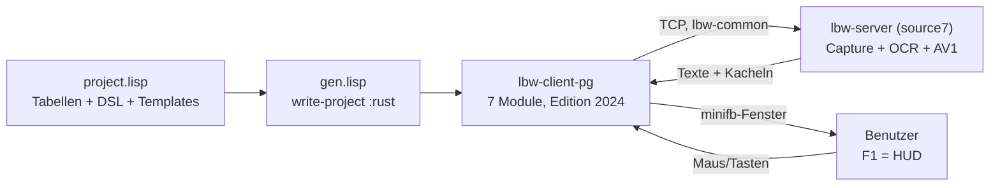
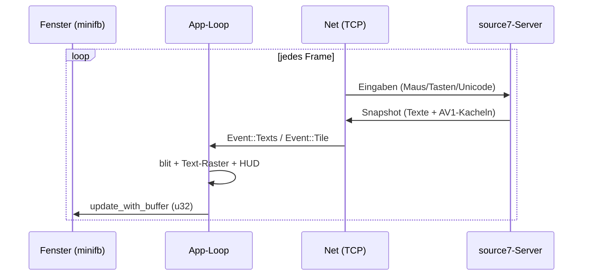

# Walkthrough: Low-Bandwidth-Client als Polyglot-Eingabe (`02_lowbandwidth`)

Stand: 2026-10-04. Aufgabe aus `plan/20261004_01_port/prompt.txt`:
den minimalen Low-Bandwidth-Remote-Desktop-Client aus
`cl-rust-generator`, Beispiel `29_lowbandwidth/source7_mvp/client/`,
als kompakte Lisp-Eingabe für den Polyglot-Generator nachbauen
(`example/13_polyglot_generator/examples/02_lowbandwidth/`, nur Rust-Ausgabe).

## Kurzfassung

Der Port ist vollständig und verifiziert: Aus `project.lisp` (Tabellen +
DSL-Module + Templates) erzeugt `gen.lisp` die Crate `lbw-client-pg`
(Rust 2024, 7 Module, 745 Zeilen). Alle Gates sind grün —
`cargo test` 14/14, `cargo fmt --check`, `cargo clippy -D warnings`,
Generator-Fixpunkt `stable: YES`. Gegen den echten `source7`-Server
liefert unsere `probe` `OK (5 texts, 1 tiles, 557 B)`, der GUI-Client
rendert unter Xvfb, folgt Live-Änderungen und toggelt per F1 sein HUD
(per Screenshot-Diff bewiesen). Das gestrippte Release-Binary ist mit
2,1 MiB um 33 % kleiner als das `source7`-Original (3,1 MiB) bei
143 statt 240 Lock-Paketen.

## 1. Implementiert

Eingabe (Hand geschrieben, Lisp): `project.lisp` (~1220 Zeilen),
`gen.lisp` (Treiber), dazu `plan.md`, `task.md` (gleiches Verzeichnis)
und `../../deps.md`.
Ausgabe (generiert, nicht hand-editieren): `source01/rust/` mit
`Cargo.toml`, `src/*.rs`, `tests/*.rs`, `examples/probe.rs`.

| Modul | Inhalt | Zeilen (gen.) |
|---|---|---|
| `config` | CLI ohne Dep: `--connect ADDR`, `--help`, Exit 2 bei Fehler | 46 |
| `scene` | Bildspeicher 640×640, `blit`, OCR-Textliste, HUD-Text, `Link`-Enum | 129 |
| `av1` | `rav1d`-Decoder-Wrapper, `Drop`-Impl, RGBA-Ausgabe | 141 |
| `net` | TCP-Session, Framing via `lbw-common`, `Event`-Enum, Reconnect | 156 |
| `input` | Tasten-/Maus-Tabellen aus einer Quelle generiert (s. u.) | 40 |
| `main` | minifb-Loop, Text-Raster, HUD, F1-Toggle, Input-Poll | 225 |
| `lib` | Re-Exporte für Tests und `probe` | 8 |

Tests (14, alle grün): `config` (3), `scene` (7), `av1` (1),
`input` (2, je Tabellenzeile ein Assert), `loopback` (1, Stub-Server
mit Hello/Text/AV1-Kachel/Abriss, Kachel per `rav1e` kodiert).

Bedienung:

```sh
cd example/13_polyglot_generator/examples/02_lowbandwidth/source01/rust
cargo run --release -- --connect 127.0.0.1:7878   # F1 = HUD an/aus
cargo run --release --example probe -- 127.0.0.1:7878
```

Herzstück der Lisp-Seite: **eine Tabelle, drei Ziele**. Die
Tastenzuordnung steht einmal in `+key-table+`; normale Lisp-Funktionen
expandieren sie in einen `match`-Rumpf, ein Array-Literal und die
Testzeilen — per `,@`-Splice in einem `register-module`-Backquote
(`defmodule` quotiert selbst, dort griffe `,@` nicht):

```lisp
(defparameter +key-table+
  '(("Enter" Enter) ("Esc" Escape) ("Tab" Tab) ...))

(register-module
 `(defmodule input (:export key-name btn-table)
    (defun key-name (k)
      ...
      (rs::raw ,(make-key-match)))   ; match-Arme aus der Tabelle
    (defun btn-table ()
      ...
      (rs::raw ,(make-btn-table))))) ; Array-Literal aus der Tabelle
```

Der generierte Test (`tests/input.rs`, per `(make-input-test)`)
enthält pro Tabellenzeile ein Assert — Tabelle und Test können
nicht auseinanderdriften.

## 2. Architektur und Ablauf





Der Client hält kein Video vor, sondern komponiert die Szene aus
zwei Kanälen: **OCR-Texte** (Vektor-Overlays, billig) und
**AV1-Kacheln** (nur geänderte 64×64-Blöcke, `rav1d`-dekodiert).
Genau das macht ihn „low-bandwidth"-tauglich.

## 3. Verifikation (T6)

Gates (final, alle grün): `cargo fmt --check`, `cargo clippy
--all-targets -- -D warnings`, `cargo test` (8 Targets ok, 14 Tests),
`cargo upgrade` (keine neueren Versionen), Generator-Fixpunkt
(`stable: YES`, zweiter Lauf byte-identisch, `git status` sauber).

Echter Server (`source7`, Release, Modelle aus `source7_mvp/models`,
Xvfb `:99`, xterm mit 4 Testzeilen):

- Unsere `probe` meldet `rc 0` und `OK (5 texts, 1 tiles, 557 B)`;
  alle 4 `SMOKE-PG-0x`-Texte plus Shell-Prompt werden mit
  Koordinaten erkannt — **Protokoll-Interop bewiesen**.
- Das Server-Log zeigt unsere Probe-Eingaben (`MouseMove`,
  `Button 1 down/up`, `Text("hi")`, `Key Enter`) —
  **Eingabe-Pfad bewiesen**.
- GUI-Smoke per `xwd`-Screenshot + Pixel-Diff in der
  640×640-Client-Region: nach xterm-Verschiebung ändern sich
  262 039 px (**Live-Update bewiesen**); F1 ändert 2 555 px in
  der oberen BBox (HUD aus) und 2 533 px zurück (HUD an) —
  **F1-Toggle bewiesen**.

So sah das Client-Fenster aus (ASCII, HUD-Zeile oben, xterm-Inhalt
unten — dazwischen 27 dunkle Zeilen gekürzt):

```text
 --:-::= = --:=:   ::   =:   +.-=.-:.=.=:   ::   +.:=   =+:----.+--= +.--   :- =--=:+:-=:+:   *=.=
         .    .                        .         .  .      .                   .              .
 ... (dunkel) ...
..............
%+#++****+#+*%*+:-=-++*-:=-+*************************************************:
%-*---=+=-*:+%%%:*++*%@=-+=*@@@@@@@@@@@@@@@@@@@@@@@@@@@@@@@@@@@@@@@@@@@@@@@@@-
%-*=--+++-*-+%%%:+++*%%=:-+=@@@@@@@@@@@@@@@@@@@@@@@@@@@@@@@@@@@@@@@@@@@@@@@@@-
%-*==-++=-+:+%%%:**=*%%=:+=-@@@@@@@@@@@@@@@@@@@@@@@@@@@@@@@@@@@@@@@@@@@@@@@@@-
@--+=*+*##%*#@@@*@%#%@@#*%%*@@@@@@@@@@@@@@@@@@@@@@@@@@@@@@@@@@@@@@@@@@@@@@@@@-
@+++=##%%*@%@@@@*%%#@*%@@@#%%#@*%@@@+%%#%%%%#@#*@@@@@@@@@@@@@@@@@@@@@@@@@@@@@-
%:+*=%@@%*@%@@@@*#%*@#%@@%###*@#%@@@*@#*%*###%**@@@@@@@@@@@@@@@@@@@@@@@@@@@@@-
@*#@%@@@@@@@@@@@@@@@@@@@@@@@@@@@@@@@@@@@@@@@@@@@@@@@@@@@@@@@@@@@@@@@@@@@@@@@@-
=*@@@@@@@@@@@@@@@@@@@@@@@@@@@@@@@@@@@@@@@@@@@@@@@@@@@@@@@@@@@@@@@@@@@@@@@@@@@-
 :@@@@@@@@@@@@@@@@@@@@@@@@@@@@@@@@@@@@@@@@@@@@@@@@@@@@@@@@@@@@@@@@@@@@@@@@@@@-                    -+
 :@@@@@@@@@@@@@@@@@@@@@@@@@@@@@@@@@@@@@@@@@@@@@@@@@@@@@@@@@@@@@@@@@@@@@@@@@@@-                    ++
```

Binary-Vergleich (Release, `strip`): `lbw-client-pg` 2 200 224 B
(2,1 MiB) gegen `source7`-Client 3 283 840 B (3,1 MiB) — **−33 %**.
Lock-Pakete: 143 gegen 240 im `source7`-Workspace.

## 4. Spontane Architektur-Änderungen

Manches wich vom ersten Plan ab — jeweils mit Grund:

| Plan | Wirklichkeit | Grund |
|---|---|---|
| `macroquad` wie `source7` | `minifb` (nur x11) + `font8x8` | DSL kann kein `async`-Main und keine Derive-Makros; Sync-API, kleinerer Baum |
| `clap`-CLI | Hand-Parsing, 15 Zeilen | ein Flag; Derive nicht ausdrückbar |
| `unsafe impl Send` für Decoder | ersatzlos gestrichen | Decoder lebt im Netz-Thread, wird nie versendet — toter Code |
| `lbw-server` als Dev-Dep | `rav1e`-Test-Helper | Server zöge `ort`/`enigo` in die Tests; Helper spiegelt `server/src/05_av1.rs` |
| Module direkt in `main.rs` | Lib/Bin-Split per `gen.lisp` | Module wurden sonst doppelt kompiliert (Clippy-`dead_code`); `crate::` → `lbw_client_pg::` |
| `lbw-common` aus Registry | Pfad-Dep auf `source7_mvp/common` | temporär, bis `common` selbst portiert ist |
| `as`-Casts und `<<` im DSL | `to-i64`-/`to-u32`-Intrinsics, `*` statt Shift, Vergleiche umgedreht | `x as T < ...` / `as u32 <<` parsen nicht (Generics-Ambiguität) |
| `02_av1.rs`-Nummern wie `source7` | `config/scene/av1/net/input/main` | Generator bestimmt Dateinamen; Nummern nicht nötig |
| „2. Lauf → 0 written" | Kriterium `stable: YES` | Templates werden immer neu geschrieben (byte-identisch); Fixpunkt zählt, nicht der Zähler |
| F1-Test per `windowactivate` | `xdotool key --window …` | ohne Window-Manager scheitert `_NET_ACTIVE_WINDOW` |

Enums (`Event`, `Link`), `Drop`-Impls und `use`-Zeilen entstehen
als `*append-to*`-Templates — das DSL hat kein `defenum`/`match`.
Konstruktoren sind freie Funktionen (`scene-new`, `decoder-new`,
`net-connect`), weil das DSL keine `impl`-Methoden mit `Self`
baut.

## 5. Learnings und Erweiterungen

Gelernt (gilt für künftige Polyglot-Eingaben, Details in `plan.md` §4):

- `rs::raw` braucht **zwei** Doppelpunkte (`rs:raw` frisst der
  Lisp-Reader); Splices nur auf Top-Level (`register-module`,
  nicht `defmodule`).
- Raw-Konvention: nur-raw-Parameter heißen `_name`, nur-raw-Locals
  ohne Unterstrich; `symbol-name` statt `~a` (sonst Großschrift).
- Umlaute + `file-length` = NUL-Bytes im Output: Dateien als
  String lesen (`uiop:read-file-string`), nicht nach Byte-Länge.
- `rustfmt.toml` mit `style_edition = "2021"` pinnen — der
  Generator formatiert mit `--edition 2021`, die Crate ist 2024.
- Test-Design: in ein `sleep` getippter Text ist unsichtbar —
  Live-Beweise brauchen ein Echo (Shell) oder Fenster-Moves.
- `/tmp/struct.py` beschattet das Stdlib-`struct`, sobald das
  Skript-Verzeichnis im `sys.path` steht — Analyse-Skripte
  woandershin legen.

Offene Erweiterungen:

- `lbw-common` ebenfalls portieren (Pfad-Dep ablösen).
- Schärfere Texte via `fontdue` + TTF statt 8×8-Bitmap.
- Wayland-Feature für `minifb` (derzeit x11-only).
- `probe --stay N` für Durchsatzmessung über Zeit.
- OCR-Jitter im HUD: Zähler ändern sich pro Frame — optional
  glätten.

## 6. Neue Pakete fürs Dockerfile

Für Build + T6-Verifikation zusätzlich installiert (Ubuntu 26):

| Paket | Wofür |
|---|---|
| `x11-apps` | `xwd` (Screenshots), `xev` (X-Sanity) |
| `netpbm` | `xwdtopnm` (XWD→PPM für Diff-Analyse) |
| `python3-pil` | Screenshot-Diffs (`/usr/bin/python3`, System-Python) |
| `xdotool` | Fenster suchen/verschieben, Tasten ans Fenster senden |
| `xterm`, `xvfb` | Test-Quelle mit Text, headless Display |

Laufzeit braucht der Client nur `libx11` (via `minifb`-x11).

## 7. Glossar

- **Polyglot-Generator**: Lisp-Transpiler, der aus einer Eingabe
  mehrere Sprachen erzeugen kann — hier nur Rust.
- **DSL** (domain-specific language): die Lisp-Formen (`defmodule`,
  `defun`, `dotimes` …), die der Generator nach Rust übersetzt.
- **Splice** (`,@`): fügt eine berechnete Liste in ein Backquote-
  Template ein — hier: Tabellenzeilen → Codezeilen.
- **Raw** (`rs::raw`): Fluchtluke — Rust-Code als String, den der
  Generator unverändert übernimmt (für `unsafe`, `match`, Threads).
- **Append-Template** (`*append-to*`): Rust-Text, den `gen.lisp`
  ans Ende einer generierten Datei hängt (Enums, `Drop`, `use`).
- **Intrinsic**: neue DSL-Operation in `project.lisp`
  (`to-i64`: Lisp-Ausdruck → `$x as i64`).
- **AV1 / rav1d**: moderner Video-Codec; `rav1d` ist sein
  speichersicherer Rust-Decoder. Der Server schickt nur geänderte
  Kacheln kodiert, der Client dekodiert sie.
- **OCR-Text**: vom Server per Texterkennung (PP-OCRv6) gelesene
  Schrift — wird als Text-Overlay übertragen statt als Pixel.
- **Kachel**: 64×64-Pixel-Block für alles Nicht-Textliche.
- **HUD** (head-up display): Statuszeile im Client-Fenster
  („Link | n Texte | n Kacheln (n B) | F1 HUD").
- **Loopback-Test**: Test mit Stub-Server im selben Prozess —
  simuliert Hello/Text/Kachel/Abriss ohne echten Server.
- **Xvfb**: X-Server ohne Bildschirm — lässt GUI-Programme im
  Container laufen; `xwd` fotografiert sein Bild.

## 8. Fehlende DSL-Funktionen (Vorschläge)

Bilanz der Fluchtwege: `project.lisp` enthält 26 `rs::raw`-Stellen und
5 `*append-to*`-Templates; `match` kommt 16-mal nur in Raw-Strings vor.
Jeder der folgenden Vorschläge würde einen solchen Fluchtweg überflüssig
machen — sortiert nach Nutzen für diesen Port:

| Prio | Fehlende Form | Heute (Fluchtweg) | Vorschlag (Skizze) |
|---|---|---|---|
| 1 | `defenum` | `Link`/`Event` als Append-Template | `(defenum link (connecting up (down string)))` |
| 2 | `match`-Ausdruck | alles Raw (Verzweigung, Destrukturierung) | `(match e ((connected body…) (_ default)))` |
| 3 | `use`-Importe mit Pfaden | jede Datei braucht handgeschriebene `use`-Zeilen | `(:import (lbw_common (client-msg text-item)))` in `defmodule` |
| 4 | `impl`-Methoden mit `Self` | Konstruktoren als freie Funktionen (`scene-new` …) | `(defmethod scene (clear (self) …))` → `impl Scene` |
| 5 | Trait-Impls + Attribute | `Drop`, `InputCallback`, `#[derive(…)]` als Template | `(defimpl drop (decoder) …)`, `(derive (clone debug))` |
| 6 | `Result`-Ergonomie | `Ok`/`Err`/`return Err(…)` in Raw-Strings mit `\"`-Escapes | `?`-Operator, `(ok x)`/`(err …)` als Formen |
| 7 | Closures | `thread::spawn(move || …)` nur raw | `(closure (move) () …)` oder eigene `spawn`-Form |
| 8 | `unsafe`-Block | `unsafe { … }` nur als String | `(unsafe …)` als eigene Form (sichtbar + grepbar) |
| 9 | Casts + Shifts | `to-i64`-Intrinsics; `<<` parst nicht | `(as x u32)`, `(shl x 16)` im Parser reparieren |
| 10 | `if-let`/`while-let` | nur raw (z. B. `CharCollector` mit Let-Chain) | `(if-let ((some ch) …) …)` |

Zwei Beispiele, was das brächte. Statt Template-String:

```lisp
;; Wunsch: Enum direkt im DSL
(defenum (derive (clone debug partial-eq eq)) link
  (connecting) (up) (down (string)))
;; => #[derive(Clone, Debug, PartialEq, Eq)]
;;    pub enum Link { Connecting, Up, Down(String) }
```

```lisp
;; Wunsch: match statt Raw-String
(match _e
  ((connected) (setf (field _scene link) (link-up)))
  ((disconnected reason) (setf …))
  (_ (return-nil)))
```

Bewusst **nicht** vorgeschlagen: `async`/await und Derive-Makros
wie `clap`/`serde` — das wäre ein Sprung in eine andere
Transpiler-Klasse (Zustandsautomaten, Makro-Expansion) und sprengt den
Rahmen eines Ports wie diesem. `for … in`-Iteratoren, Tupel und
`const`/`static` wären nette Zugaben, wurden hier aber nicht vermisst
(`dotimes`, Structs und Tabellen reichten).

Faustregel für die Priorisierung: Eine Form lohnt sich, sobald sie an
drei oder mehr Stellen einen Raw-String ersetzt — `defenum`, `match`
und `use` erfüllen das in diesem Port mit Abstand.

## 9. Reproduktion

```sh
# Generieren + Gates
cd example/13_polyglot_generator
./tools/lisp-check.sh examples/02_lowbandwidth/project.lisp
sbcl --non-interactive --load examples/02_lowbandwidth/gen.lisp
cd examples/02_lowbandwidth/source01/rust
cargo fmt --all -- --check
cargo clippy --all-targets -- -D warnings
cargo test   # 14/14

# Integration (Server-Repo, Modelle liegen bei)
cd ../../../../../../../../cl-rust-generator/examples/29_lowbandwidth/source7_mvp
Xvfb :99 -screen 0 1280x800x24 &
DISPLAY=:99 xterm -T smoke -e sh -c 'printf "%s\n" A B C D; exec sh' &
DISPLAY=:99 ./target/release/lbw-server --listen 127.0.0.1:17879 \
  --models ./models -v &
# .../02_lowbandwidth/source01/rust/target/release/examples/probe 127.0.0.1:17879
# DISPLAY=:99 .../target/release/lbw-client-pg --connect 127.0.0.1:17879
```

Alle Commits tragen Scope `02_lowbandwidth` (Conventional Commits):
`feat` (T1–T5), `test` (T6), `docs` (dieser Walkthrough, T7).
