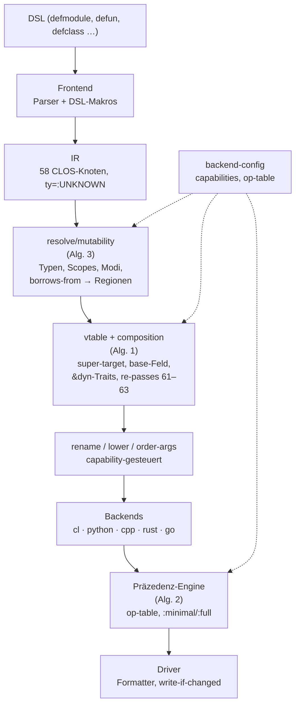

# plops/cl-cl-generator — Polyglot Generator (`example/13_polyglot_generator`)

## GitHub & DeepWiki

- GitHub: https://github.com/plops/cl-cl-generator
- DeepWiki: https://deepwiki.com/plops/cl-cl-generator

---

## Kurze Einführung

Der `polyglot-generator` ist ein Multi-Target-Transpiler, der aus **einer** S-Expression-DSL idiomatischen Code für C++20, Python 3, Rust, Common Lisp und Go erzeugt. [1](#1-0)  Kernidee: statt fünf sprachspezifischer Generatoren gibt es eine generische IR mit einer Pass-Pipeline; jedes Ziel ist ein austauschbares Backend. [2](#1-1)  Zielgruppe: Entwickler, die portablen Code einmal schreiben und linter-sauber (`g++ -Werror`, `clippy -D warnings`, `ruff check`, `go vet`) in fünf Sprachen erhalten wollen. [3](#1-2) 

## Die 3 wichtigsten (oder komplexesten) Algorithmen

### 1. Capability-gesteuerte Pass-Pipeline mit Inheritance→Composition-Umschreibung

**Verortung:** `src/passes/30-pipeline.lisp` (`pass`-Struct, `define-pass`, `run-passes`), `src/passes/35-vtable.lisp`, `src/passes/36-composition.lisp`, `36-composition-rewrite.lisp`. [4](#1-3) 

**Funktionsweise:** Jeder Pass ist eine Funktion IR→IR mit Ordnungsnummer und `enabled-p`-Bedingung, die über `capability-p` die Backend-Features abfragt (`:implementation-inheritance`, `:block-expressions`, …). [5](#1-4)  `run-passes` arbeitet auf einer Deep-Copy (`copy-node-tree`) — die Eingabe-IR bleibt unverändert, sodass dieselbe IR pro Backend neu transformiert werden kann. [6](#1-5)  Der kritische Pfad: `vtable` (Order 50) verknüpft via `link-override` jede Methode mit ihrem `ir-super-target` und erzwingt `virtual`/`override`-Konsistenz. [7](#1-6)  Für Rust/Go (keine Implementierungsvererbung) schreibt `composition` (Order 60) die Hierarchie in ein `base`-Feld plus freie Funktionen `button_width(this: &dyn ButtonDyn)` um; danach invalidieren sich Typen und Mutabilität, weshalb die Re-Passes 61–63 (`re-resolve`, `re-vtable`, `re-mutability`) erneut laufen. [8](#1-7)  Go nutzt bewusst nicht Struct-Embedding — interne Aufrufe würden sonst nie beim Override landen — sondern dieselbe Kompositionsform mit `buttonDyn`-Interfaces. [9](#1-8)  In Rust entstehen `&dyn Trait`-Parameter statt Generics, mit `.as_mut()`/`.as_ref()` für `Box<dyn T>`-Unsizing. [10](#1-9) 

**Warum prägend:** Das ist die differenzierende Fähigkeit des Generators — eine DSL mit `defclass (base)`, `(virtual)`, `call-super` wird auf Sprachen abgebildet, die diese Konzepte schlicht nicht kennen, ohne dass die Backends Vererbungslogik duplizieren. Die Capability-Abfragen machen den gemeinsamen Kern erweiterbar: Go kam als Backend **ohne eine einzige Kernänderung** hinzu. [11](#1-10) 

### 2. Präzedenz-Engine mit Op-Tabellen und Differenzialtest

**Verortung:** `src/printer/51-precedence.lisp`, gemeinsame Emitter-Hilfen in `src/backend/61-text.lisp` (`operand`, `binary`, `unary`, `receiver`), Op-Tabellen in `src/backend/*/config.lisp`. [12](#1-11) 

**Funktionsweise:** Jedes Backend deklariert eine Operator-Tabelle mit `level`, `assoc` und einer `:clarity`-Liste, die Klammern erzwingt, wo der Ziel-Compiler warnt (z. B. `&&` innerhalb `||` wegen `-Wparentheses`). [13](#1-12)  Die Emitter rufen `operand-string`/`binary-string` mit dem jeweiligen `backend-op-table` und dem Modus `*mode*`; die Engine entscheidet pro Operandenposition, ob Klammern nötig sind. [14](#1-13)  Zwei Modi: `:minimal` für die Ausgabe, `:full` (alles geklammert) als Oracle. `--paren` generiert 400 Zufallsausdrücke und prüft beide Modi gegen alle fünf Backends — ein property-basierter Differenzialtest. [3](#1-2)  Ein realer Fund: `abs 7` → `7.abs()` scheitert in Rust (E0689, Literal-Typ unbestimmt); die Engine erzeugt nun `i64::abs(7)` über `constant-expr-p`. [15](#1-14) 

**Warum prägend:** Korrekte Klammerung über fünf Sprachen mit verschiedenen Präzedenzregeln ist das, was einen String-Template-Hack von einem Compiler unterscheidet. Die zentrale Tabelle statt ad-hoc-Klammern im Emitter macht minimale, linter-saubere Ausgabe überhaupt verifizierbar — der Differenzialtest gegen den `:full`-Modus beweist Korrektheit empirisch statt per Konvention.

### 3. Resolve + Mutability + Borrow-/Lifetime-Inferenz

**Verortung:** `src/passes/32-resolve-env.lisp`, `32-resolve-types.lisp`, `32-resolve-expr*.lisp`, `32-resolve-stmt.lisp`, `34-mutability.lisp`; Typ-IR mit Regionen in `src/ir/11-types.lisp`; Lifetime-Erzeugung in `src/backend/rust/lifetimes.lisp`. [16](#1-15) 

**Funktionsweise:** `resolve` baut Scope-Umgebungen, typisiert jeden `expr`-Knoten (`ty=:UNKNOWN` → `ty=:F64`), erkennt Methodenaufrufe (`call-expr` → `method-call-expr`) und löst `(:named "shape" item)`-Typen zu echten Item-Referenzen auf. [17](#1-16)  `mutability` inferiert, welche Locals `let mut` bzw. nicht-`const` sein müssen (zugewiesen, Feld verändert, als `:inout` übergeben) und leitet `iter-mode` für `for-each` ab. [18](#1-17)  Obendrauf: Parameter-Modi `(mode :in|:inout|:sink x)` → `&T`/`&mut T`/`T` in Rust, `const T&`/`T&`/`T`+`std::move` in C++, `*T` in Go. [19](#1-18)  Referenztypen tragen *Regionen* (`(:ref T region)`); aus `(borrows-from x y)` erzeugt das Rust-Backend Lifetimes wie `fn longest<'a>(x: &'a str, …)`, mit Elision-Logik (kein Lifetime bei genau einem Referenzparameter) und Lifetime-Parametern auf Structs mit Views (`Parser<'a>`). Mehrdeutige Fälle (zwei Referenzparameter, kein `borrows-from`) meldet `check` als `dsl-error` (K1b). [20](#1-19) 

**Warum prägend:** Die bewusste Designentscheidung, **keinen** Borrow-Checker zu bauen (das wäre ein eigener Compiler), sondern deklarative Übergabe-Modi zu mappen und rustc den Rest prüfen zu lassen, hält den Generator wartbar — und trotzdem entsteht Rust-Code mit korrekten Borrow-Signaturen, Lifetimes und `&dyn`-Traits. Dieselbe Analyse füttert C++-`const`-Korrektheit und Go-Pointer-Signaturen gleichermaßen. [21](#1-20) 

## Architektur & Zusammenspiel

Der sequenzielle Detailfluss von `write-project` — inkl. `git hash-object` für den Header und `write-if-changed`-Idempotenz — ist im Walkthrough als Sequenzdiagramm dokumentiert. [22](#1-21) 

## Notes

- **`order-args` (Order 85):** Nur für C++ aktiv (unspezifizierte Argument-Auswertungsreihenfolge); ab zwei unreinen Argumenten werden Temporaries `arg_1`, `arg_2` eingeführt. [23](#1-22) 
- **C++ Include-Analyse:** unterscheidet „Typ als Wert“ (`#include`) vs. „hinter Zeiger“ (Vorwärtsdeklaration); Header nur bei öffentlichen Items, Entry-Modul ohne Namespace. [24](#1-23) [25](#1-24) 
- **Intrinsics & Prelude:** 24 Intrinsics mit einer Signatur und einer Expansion pro Backend; die Prelude (kleine Laufzeitbibliothek, z. B. `polyglotrt` in Go) wird nur emittiert, wenn ein Helfer tatsächlich benutzt wird (`note-prelude`, `*prelude-used*`). [26](#1-25) [27](#1-26) 
- **Determinismus/Idempotenz:** `write-if-changed` schreibt nur bei Inhaltsänderung (152 Dateien, 0 Abweichungen bei `--determinism`); Header nutzt den git-Blob-Hash der Quelldatei statt `rev-parse HEAD`. [28](#1-27) [29](#1-28) 
- **Größenordnung:** ~8.400 Zeilen in 85 Dateien, größte Datei 211 Zeilen, Funktionen ≤ 60 Zeilen; 47 Testdateien mit ~2.800 Zeilen; Tests laufen unter SBCL und ECL. [30](#1-29) [31](#1-30) 
- Kein Nebenläufigkeitsmodell — die Pipeline ist strikt sequenziell; „Caching“ besteht aus dem idempotenten Schreiben und der Kopierbarkeit der IR pro Backend.

Wiki pages you might want to explore:
- [Polyglot Generator (example/13) (plops/cl-cl-generator)](/wiki/plops/cl-cl-generator#3)
- [Glossary (plops/cl-cl-generator)](/wiki/plops/cl-cl-generator#7)
