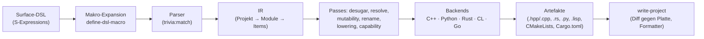

# plan.md — Konzeption: vereinheitlichter Multi-Target-Transpiler

Status: **Runde 3, freigegeben.** Die Antworten aus Runde 1 und 2 sind
eingearbeitet. Neu in dieser Runde: K1b (Lifetimes), die Moduldefinition in
K2 und K3 Stufe 2 mit Kompositions-Lowering für Rust und Go.
Implementierungsplan: [task.md](./task.md); Abhängigkeiten:
[deps.md](./deps.md).

## Goal

Aus **einer** Common-Lisp-ähnlichen S-Expression-Eingabe sollen mehrere
Zielsprachen erzeugt werden, und zwar **idiomatischer** Code, nicht nur
kompilierbarer. Die Brücke ist eine generische Zwischenrepräsentation (IR)
mit austauschbaren Backends. Das neue System wird direkt als Lisp-Code in
`/workspace/src/cl-cl-generator/example/13_polyglot_generator/` geschrieben.
Die bestehenden Generator-Repos bleiben unverändert.

## Entscheidungen aus Runde 1

| # | Thema | Entscheidung |
|---|---|---|
| 1 | Zielsprachen | Tier A: C++20, Python 3, Rust, Common Lisp. Tier B: **Go** als Nachweis, dass ein neues Backend den Kern nicht ändert (R3). JS/TS kommen später. |
| 2 | Umsetzung | Direkt als `.lisp` in `example/13_polyglot_generator/`, keine Meta-Generierung. |
| 3 | Dialekt | Neu und sauber mit CL-Semantik; nicht kompatibel zu `cl-cpp-generator2`. |
| 4 | Typen/Rust | Ziel ist **idiomatisches Rust**. Lösung siehe **K1** (offen). |
| 5 | Zahlen | `/` nur für Floats. `truncate`/`floor`/`mod`/`rem` haben CL-Semantik. |
| 6 | Stdlib | Portable Intrinsics nach dem Vorbild von Haxe, siehe **K4**. |
| 7 | Module | Der Header/Impl-Split ist **von Anfang an** Teil der Architektur, siehe **K2**. |
| 8 | OOP | Vererbung ist wichtig (vor allem für C++), soweit umsetzbar, siehe **K3** (offen). |
| 9 | Fehler | Portabel, wo es geht (`optional`), sonst sprachspezifisch. |
| 10 | Namen | `-` wird in allen Nicht-Lisp-Backends immer ersetzt, siehe **E4** (Konventionen je Rolle). |
| 11 | Lisp | SBCL ist Pflicht, ECL dient als zusätzlicher Ladetest. |
| 12 | Tests | FiveAM plus plist-Spec-Tabellen, aus denen auch die Doku entsteht. |
| 13 | Git | Kein Branch nötig, solange nur in `example/13_polyglot_generator/` gearbeitet wird. Commits lokal im Conventional-Commit-Format, **keine Pushes** ohne Freigabe. |
| 14 | Extras | (a) Header-Kommentar mit git-Hash, (b) CLI-Skript, (c) `define-dsl-macro`. |

## Entscheidungen aus Runde 2

| # | Thema | Entscheidung |
|---|---|---|
| 1 | Lifetimes | Explizite Lifetimes müssen möglich sein. Lösung: **K1b**, portable Borrow-Relationen, die Rust in Lifetimes übersetzt und andere Backends ignorieren oder als View-Typen abbilden. |
| 2 | Modul | Ein Modul ist **nicht** dasselbe wie eine Lisp-Datei, sondern eine Namens- und Übersetzungseinheit, siehe Definition in **K2**. Konvention: eine Lisp-Datei pro Modul. |
| 3 | Vererbung | Stufe 2 wird auch für **Rust und Go** gebaut, über einen backend-unabhängigen Pass `inheritance->composition`, siehe **K3**. |
| 4 | Randfälle | E1–E15 sind freigegeben. |

## Ist-Analyse (Kurzfassung)

Grundlage: 21 Verzeichnisse `cl-*-generator*` unter `/workspace/src`.
Gelesen wurden die Emitter, Tests und Beispiele, dazu DeepWiki für
`plops/cl-{cl,cpp,py,rust}-generator` und `HaxeFoundation/haxe`.

- **Gleiche Architektur überall.** Jeder Generator hat eine rekursive Funktion
  `emit-X (&key code level …)` mit einem riesigen `(case (car code) …)`
  (c.lisp:1122–2041, rund 920 Zeilen). Eine **IR gibt es nicht**: Jeder
  Knoten wird sofort zu einem String (C++: `string-op`, der nur den obersten
  Operator kennt).
- **Kopierte Infrastruktur.** `write-source` mit `*file-hashes*`/`sxhash`
  (nur im Image, kollisionsanfällig) und `print-sufficient-digits-f64`
  stecken in allen 18 Emittern, jeweils mit kleinen Abweichungen. Formatter
  werden über `sb-ext:run-program` mit hart codierten Pfaden gestartet.
- **Globaler Seiteneffekt.** `(setf (readtable-case *readtable*) :invert)`
  beim Laden (c.lisp:5, py.lisp:86, rs.lisp:20).
- **Klammern und Präzedenz** sind dreimal verschieden gelöst: C++ (`paren*`),
  Python (tabellengetrieben, `operand-needs-parentheses-p`) und Rust (eine
  Klausel pro Operator, `non`-Assoziativität). Alle drei haben einen voll
  geklammerten Modus als Oracle für differenzielle Tests. Diese Idee wird
  übernommen.
- **Der Header/Impl-Split in C++** läuft über Seiteneffekt-Hooks
  (`hook-defun`, `hook-defclass`), die jedes `defun` doppelt emittieren.
  `write-class` liegt als Kopie in den `util.lisp`-Dateien der einzelnen
  Beispiele, nicht in der Bibliothek. Im Implementierungsmodus lässt
  `defclass` Nicht-Methoden-Member fallen.
- **Namens- und Semantik-Kollisionen:** `and`/`or` bedeuten in C++ `&`/`|`.
  `/=` ist in Rust Division-Assign. `?` hat je nach Sprache andere
  Bedeutung. Strings werden **nirgends** escaped.
- **Kopien mit falschem Inhalt:** `ts.lisp` ≡ `js.lisp`, `erlang.lisp`
  erzeugt Elixir, `v_.lisp` ist ein C++-Generator.

### Learnings aus Haxe (`HaxeFoundation/haxe`, via DeepWiki)

Haxe übersetzt eine typisierte Sprache u. a. nach C++, Python, JS, Lua und
PHP. Folgende Mechanismen passen direkt zu unserem Problem:

- **Portable Stdlib:** Die API wird einmal unter `std/` deklariert und ist
  mit `@:coreApi` markiert. Die Implementierung pro Ziel liegt in
  `std/<target>/_std/`, z. B. `std/cpp/_std/Std.hx`. Native Anbindung läuft
  über `extern class` plus `@:native` (Namen umschreiben) plus `inline`
  (Expansion an der Aufrufstelle). Für Zielspezifisches gibt es `#if cpp`.
  Übernahme siehe K4.
- **`src/filters/renameVars.ml`** ist *ein* Pass für alle Ziele,
  konfiguriert pro Plattform mit `ri_reserved` (verbotene Namen),
  `ri_no_shadowing` und `ri_hoisting`. Das ist genau unsere Lösung für E3
  und E4.
- **`src/filters/safe/capturedVars.ml`** gibt Schleifenvariablen, die in
  Closures gefangen werden, pro Iteration einen eigenen Scope (JS/Flash).
  Übernahme siehe E3.
- **`src/optimization/analyzerTexpr.ml`** normalisiert Ausdrücke in eine
  kanonische Form, z. B. `&&`/`||` → `TIf`. Das entspricht dem
  Statement/Expression-Lowering in E9.
- **gencpp** (`cppGenClassHeader.ml`, `cppGenClassImplementation.ml`)
  erzeugt pro Klasse `.h` und `.cpp`. Referenzierte Typen werden per
  Analyse gefunden (`CppReferences.find_referenced_types_flags`). Der Header
  bekommt Includes nur für Superklassen und Interfaces, alles andere wird
  vorwärtsdeklariert. Die `.cpp` inkludiert alle referenzierten Typen.
  Übernahme siehe K2.

## Zielsprachen

| Tier | Sprachen | Begründung |
|---|---|---|
| **A (MVP, voll getestet)** | C++20, Python 3, Rust, Common Lisp | Die am besten getesteten Altgeneratoren. CL ist das **semantische Oracle**: Es lässt sich in SBCL auswerten, formatiert wird mit `cl-cl-generator:emit-cl`. |
| **B (Nachweis R3)** | Go | Statische Typen, Export über Großschreibung, `gofmt`, Interfaces und Struct-Embedding. Das prüft, ob die Protokolle aus K1–K3 allgemein genug sind. |
| **später** | JavaScript, TypeScript, Kotlin, Swift, C#, Julia | Gleicher Kern, nicht Teil dieses Plans. |
| **ausgeschlossen** | Verilog, Tcl, Wolfram, VBA, Erlang/Elixir, MATLAB, R, Ada | HDL-Semantik, reine String-Kommandos, Term-Rewriting, Sub/Function-Split, immutable Pattern-Matching bzw. 1-basierte Vektorsemantik. Sie passen nicht in einen imperativen Kern. |

## Architektur



1. **Frontend.**
   - Formen werden über den Symbolnamen erkannt (`string=`), nicht über
     die Paketidentität.
   - Die Readtable (`:invert`) kommt über `named-readtables`, ohne globale
     Mutation.
   - Die Semantik folgt CL: `and`/`or`/`not` sind logisch,
     `logand`/`logior`/`logxor`/`lognot` bitweise.
   - Zielspezifische Formen stehen in eigenen Paketen (`cpp:`, `py:`,
     `rs:`, `go:`). `(target-case (:cpp …) (t …))` entspricht Haxes
     `#if cpp`.
2. **IR.**
   - CLOS-Knoten, erzeugt per `define-node`. Jeder Knoten hält seine
     Quell-S-Expression für Fehlermeldungen.
   - Die Hierarchie ist `project` → `module` → Items (`function`, `struct`,
     `interface`, `class`, `const`, `extern`) → Statements → Expressions.
   - Typ-IR: `:i8…:i64 :u8…:u64 :int(=i64) :f32 :f64 :bool :string :char
     :void`, `(vec T)`, `(array T n)`, `(map K V)`, `(optional T)`,
     `(box T)`, `(dyn I)`, benannte Typen.
3. **Passes** (IR → IR, jeder ein eigenes kleines Modul mit Unit-Tests):
   - `desugar`
   - `resolve` (Scopes, Symboltabelle, Signaturen)
   - `mutability` (K1)
   - `rename` (E3/E4, konfiguriert im Stil von Haxes `renameVars`)
   - `lower-expressions` (E9/E10)
   - `order-args` (E8)
   - `capability-check` (Fehler `unsupported-construct`)
4. **Backends.**
   - Klasse `backend` mit einer Subklasse pro Sprache und den generischen
     Funktionen `emit-node`, `module-artifacts` (K2) und `backend-config`
     (reservierte Wörter, Scoping, Namenskonventionen, Capabilities).
   - Eine gemeinsame Präzedenz-Engine mit Operator-Tabelle pro Backend und
     zwei Modi: voll geklammert als Oracle, minimal für die Ausgabe.
   - Block-Layout: `:braces`, `:indent` oder `:sexpr`. CL senkt die IR in
     eine S-Expression ab und gibt sie an `emit-cl` weiter.
5. **Driver.** `write-project` schreibt alle Artefakte eines Projekts.
   - Idempotent: Vergleich mit dem Dateiinhalt auf der Platte.
   - Formatter über `uiop:run-program`; fehlt einer, gibt es eine Warnung.
   - Header-Kommentar „generated … do not edit“ mit git-Hash.
   - CLI-Skript `polyglot-gen.sh <gen.lisp> --target cpp,py,rs,cl,go`.
6. **Tests.**
   - FiveAM-Unit-Tests pro Modul.
   - Spec-Tabelle mit erwarteten Strings pro Backend; daraus wird
     `SUPPORTED_FORMS.md` erzeugt.
   - Tier 2: Formatter- und Compiler-Syntax-Check.
   - Tier 3: Cross-Backend-Differenzialtest mit gleicher stdout-Ausgabe in
     allen Backends; Referenz ist CL.
   - Präzedenz-Zufallstests, voll gegen minimal geklammert.
   - Idiomatik-Gates: `cargo clippy -- -D warnings`, `ruff check`,
     `g++ -Wall -Wextra -Werror`, `go vet`.

## K1 — Idiomatisches Rust ohne Borrow-Checker im Generator (Vorschlag)

Es gibt **keine** globale Typ- oder Lifetime-Inferenz; das wäre ein eigener
Compiler. Stattdessen deklariert man **Parameter-Übergabemodi**, angelehnt an
Hylo/Mojo (`let`/`inout`/`sink`). Sie lassen sich 1:1 auf idiomatisches Rust
und modernes C++ abbilden, und Python ignoriert sie einfach:

| DSL | Bedeutung | Rust | C++ | Python | Go |
|---|---|---|---|---|---|
| `:in` (Default) | nur lesen | `&T`, `&str`, `&[T]`; Primitive per Wert | `const T&`; Primitive per Wert | `x` | `T` bzw. `*T` bei großen Structs |
| `:inout` | verändern | `&mut T` | `T&` | `x` | `*T` |
| `:sink` | Ownership übernehmen | `T` | `T` (per Wert) | `x` | `T` |

```lisp
(defun add-point (poly p)
  (declare (type polygon poly) (mode :inout poly)
           (type point p) (mode :sink p))
  (push p (dot poly points)))              ; CL-Reihenfolge: (push item place)
```

- **Aufrufstellen:** Da `resolve` die Signaturen kennt, setzt das Backend
  selbst `&x`/`&mut x` (Rust) bzw. `&x` (Go) ein. `(move x)` wird zu
  `std::move(x)` in C++ und `x` in Rust.
- **Lokale Mutabilität wird inferiert** (lokal und billig). Eine Variable,
  die nach der Initialisierung per `setf`/`incf`/`push` verändert oder als
  `:inout` übergeben wird, bekommt `let mut`. Alle anderen werden `let`
  (Rust) bzw. `const auto` (C++, optional per Config).
- **Iteration:** `(dolist (x v) …)` wird zu `for x in &v` (bzw.
  `&mut v`/`v` je nach Nutzung), `for (const auto& x : v)` und
  `for x in v:`.
- **`optional`** wird zu `Option<T>`/`std::optional<T>`/`T | None`.
  `(if-let (x (map-get m k)) …)` wird zu `if let Some(x) = m.get(&k)` bzw.
  C++ `if (auto it = m.find(k); it != m.end())` bzw. Python
  `if (x := m.get(k)) is not None:`.
- **Methoden-Receiver** nutzen dieselben Modi, daraus werden
  `&self`/`&mut self`/`self` bzw. `const`-Methoden in C++.
- **Grenzen im MVP:** Keine `Rc<RefCell<…>>`-Graphen (später als
  `(shared T)`/`(shared-mut T)`). `Result`, `?` und Traits mit Generics
  gibt es nur zielspezifisch (`rs:`). Der eigentliche Checker ist
  `rustc`/`clippy` in den Tier-3-Tests.

## K1b — Lifetimes als portable Borrow-Relationen

Eine Lifetime drückt eine **Relation** aus: „dieser Wert leiht von jenem“.
Die DSL formuliert genau diese Relation, und zwar sprachneutral. Rust macht
daraus Lifetime-Parameter. C++ nutzt View-Typen bzw. Zeiger, die GC-Sprachen
ignorieren die Relation.

**Typen für geliehene Werte:**

| DSL | Rust | C++ | Python / Go / CL |
|---|---|---|---|
| `(ref T)` | `&T` | `const T&` (Param/Return), `const T*` (Feld) | `T` |
| `(mut-ref T)` | `&mut T` | `T&` / `T*` | `T` |
| `(view :string)` | `&str` | `std::string_view` | `str` / `string` / `string` |
| `(view (vec T))` | `&[T]` | `std::span<const T>` | `list[T]` / `[]T` / `vector` |
| `(ref T :a)` | `&'a T` (benannte Region) | wie `(ref T)` | `T` |
| `(view :string :static)` | `&'static str` | `std::string_view` (constexpr) | `str` |

**Funktionen.** Das Rust-Backend implementiert die **Elision-Regeln** von
Rust:
- Genau ein Referenz-Parameter ⇒ das Ergebnis erbt dessen Lifetime.
- Bei `&self`/`&mut self` erbt das Ergebnis die Lifetime von `self`.

Nur wenn die Regeln nicht eindeutig sind, verlangt der Check-Pass eine
Deklaration. Die Fehlermeldung nennt die Kandidaten.

```lisp
(defun longest (x y)
  (declare (type (view :string) x y) (values (view :string))
           (borrows-from x y))          ; Ergebnis leiht von x UND y
  (if (> (string-byte-length x) (string-byte-length y)) x y))
;; Rust:   fn longest<'a>(x: &'a str, y: &'a str) -> &'a str
;; C++:    std::string_view longest(std::string_view x, std::string_view y)
;; Python: def longest(x: str, y: str) -> str:
```

**Structs mit geliehenen Feldern.**
- Jede benannte oder unbenannte Region in den Feldern wird zu einem
  Lifetime-Parameter: `struct Parser<'a> { input: &'a str }` plus
  `impl<'a> Parser<'a>`.
- Unbenannte Regionen in einem Struct teilen sich *eine* Lifetime `'a`
  (Default). Wer getrennte Lifetimes braucht, benennt die Regionen:
  `(ref T :a)`, `(ref U :b)`.
- `(declare (outlives :a :b))` wird zu `'a: 'b`.
- C++ erhält View- bzw. `const T*`-Felder. Der Feldzugriff wird automatisch
  zu `->` umgeschrieben (Core Guideline C.12: keine Referenz-Member).

**Geltungsbereich.** Regionen sind reine Typinformation. Kein Pass „prüft“
Lifetimes; das macht `rustc`. Das Backend setzt nur die Annotationen
konsistent. Ausweg für Sonderfälle wie HRTB (`for<'a>`), `'_` in
`impl Trait` oder Varianz: `(rs:type "…")` als Raw-Typ.

**Tests:**
- `longest`
- ein `Parser<'a>` über `&str` mit Methode `next_token(&mut self) -> Option<&'a str>`
- ein Iterator-Struct über `&[T]`
- ein Negativtest: fehlendes `borrows-from` erzeugt eine verständliche
  Fehlermeldung

Gates: `clippy -D warnings`, `g++ -Wall -Wextra -Werror` und gleiche Ausgabe
in allen Backends.

## K2 — Module und Header/Impl-Split von Anfang an

**Was ist ein Modul?**
- Ein Modul ist eine **Namens- und Übersetzungseinheit** des erzeugten
  Programms. Es hat einen Namen, exportierte und private Items und Imports
  anderer Module.
- Das entspricht:
  - in C++ einem Paar `name.hpp` + `name.cpp` plus `namespace name`,
  - in Rust einer Datei `name.rs` plus `mod name;`,
  - in Python einer Datei `name.py`,
  - in Go einem Package-Verzeichnis `name/`,
  - in CL einem `defpackage` plus Datei.
- Ein Modul ist **nicht** an eine Lisp-Datei gebunden:
  - Die Lisp-Eingabe ist ein normales CL-Programm wie die heutigen
    `gen.lisp`. Es baut per Backquote, `loop` und Hilfsfunktionen
    `(defmodule …)`-Werte auf und übergibt sie mit `(defproject …)` an
    `write-project`.
  - Eine Lisp-Datei kann mehrere Module definieren, und ein Modul kann aus
    Teilen mehrerer Dateien zusammengesetzt sein.
- **Konvention** für Beispiele und Tests: eine Datei `dsl/<modul>.lisp` pro
  Modul und ein `gen.lisp`, das diese Dateien lädt und das Projekt schreibt.
  Im MVP sind Modulnamen flach; hierarchische Namen (`geo.shapes`) kommen
  später.

```lisp
;; dsl/geometry.lisp
(defmodule geometry (:export point distance)
  (defstruct point (x :f64) (y :f64))
  (defun distance (a b)
    (declare (type point a b) (values :f64))
    (sqrt (+ (square (- (dot a x) (dot b x))) (square (- (dot a y) (dot b y))))))
  (defun square (v) (declare (type :f64 v) (values :f64)) (* v v)))   ; privat
;; gen.lisp
(write-project (defproject demo (:modules geometry app) (:entry app))
               :targets '(:cpp :rust :python :go :cl) :out "source01/")
```

- **IR:** Jedes Item hat `visibility` (`:public`/`:private`). Wie in
  `defpackage` wird das über `(module geometry (:export area point) …)`
  gesteuert. Abhängigkeiten stehen in `(import other-module)` bzw. als
  abstrakter Import `(import :math)`.
- **Protokoll:** `(module-artifacts backend module)` liefert eine Liste von
  Artefakten `(relativer-pfad, art, inhalt)`. **Kein** Backend schreibt
  selbst; der Driver schreibt alles.
- **C++** bekommt pro Modul `geometry.hpp` und `geometry.cpp` (per Option
  auch pro Klasse, wie in Haxe gencpp).
  - `.hpp`: `#pragma once`; `namespace geometry`; vollständige Definitionen
    öffentlicher Structs/Klassen (Felder, Methoden-Prototypen,
    `virtual`/`override`); Prototypen öffentlicher Funktionen;
    `inline constexpr`-Konstanten.
  - Includes im Header nur für Typen, die **per Wert** benutzt werden
    (Felder, Basisklassen). Typen, die nur über
    `box`/`dyn`/Referenz-Parameter vorkommen, werden vorwärtsdeklariert.
  - `.cpp`: eigener Header zuerst, dann alle übrigen Includes; private
    Items in `namespace { … }`; Prototypen aller privaten Funktionen oben,
    damit die Reihenfolge egal ist; Definitionen, Methoden als
    `Class::m`.
  - **Typ-Ordnung:** Struct-Definitionen werden topologisch sortiert. Ein
    Zyklus über Werte ist ein Fehler, ein Zyklus über `box` wird per
    Vorwärtsdeklaration aufgelöst.
- **Rust:** `geometry.rs` mit `pub` für Exporte, `use crate::other::…`.
  Das Projekt bekommt `main.rs`/`lib.rs` mit `mod`-Deklarationen und eine
  `Cargo.toml`.
- **Python:** `geometry.py` mit `__all__`. Private Namen bekommen das Präfix
  `_` (PEP 8). Imports werden zu `from other import x`.
- **Go:** Package-Verzeichnis. Exporte werden über Großschreibung
  abgebildet (E4); `go.mod` wird erzeugt.
- **CL:** `defpackage` mit `:export`, `in-package`; dazu eine `.asd`.
- **Build-Dateien:** `CMakeLists.txt`, `Cargo.toml`, `go.mod` und `.asd`
  werden als Projekt-Artefakte erzeugt. Die Integrationstests brauchen sie
  ohnehin.

## K3 — Vererbung (Vorschlag, zwei Stufen)

**Stufe 1 (portabel, alle Backends): Interfaces mit Default-Methoden und
dynamischem Dispatch.**

```lisp
(definterface shape
  (defmethod area ((s :in)) (declare (values :f64)))              ; abstrakt
  (defmethod describe ((s :in)) (declare (values :string))
    (format-string "area={:.2f}" (area s))))                       ; Default
(defstruct circle (:implements shape) (r :f64))
(defmethod area ((c circle :in)) (* 3.14159d0 (dot c r) (dot c r)))
(let ((shapes (vec-of (dyn shape) (box (make-circle :r 1d0))))) …)
```

| | C++ | Rust | Python | Go | CL |
|---|---|---|---|---|---|
| Interface | abstrakte Klasse, `virtual … = 0`, virtueller Destruktor | `trait` mit Default-Methoden | `class Shape(ABC)`, `@abstractmethod` | `interface` (Default-Methoden als freie Funktionen) | `defgeneric` |
| Implementierung | `struct Circle : public Shape`, `override` | `impl Shape for Circle` | `@dataclass class Circle(Shape)` | implizit | `defclass` + `defmethod` |
| `(box T)` / `(dyn I)` | `std::unique_ptr<Shape>` | `Box<dyn Shape>` | Objekt | Interface-Wert | Objekt |

**Stufe 2: Implementierungsvererbung mit Feldern, Override und
`call-super`, in allen Backends.**

```lisp
(defclass widget ()
  (x :f64) (y :f64)
  (defmethod area ((w :in)) (declare (values :f64) (virtual)) 0d0)
  (defmethod describe ((w :in)) (declare (values :string))            ; nicht virtuell
    (format-string "area={:.2f}" (area w))))                           ; virtueller Aufruf!
(defclass button (widget)
  (label :string)
  (defmethod area ((b :in)) (declare (values :f64) (override))
    (+ 1d0 (call-super))))
```

- **Nativ:** C++ (`class Button : public Widget`, `virtual`/`override`,
  `Widget::area()`), Python (`super().area()`), CL (`call-next-method`).
- **Pass `inheritance->composition`**: IR → IR und backend-unabhängig. Er
  wird von jedem Backend mit der Capability
  `:implementation-inheritance nil` aktiviert, also **Rust und Go**. Go
  braucht ihn ebenfalls, denn Embedding bringt keinen virtuellen Dispatch
  (eine Basismethode, die `w.area()` aufruft, träfe immer die Basisversion).
  Der Pass:
  1. **Daten:** Jede Klasse wird zu einem Struct. Die direkte Basis wird zum
     ersten Feld `base`: `struct Button { base: Widget, label: String }`.
  2. **Dispatch:** Pro Hierarchie-Wurzel gibt es einen Trait bzw. ein
     Interface `WidgetDyn` mit allen virtuellen Methoden und den Accessoren
     `widget()`/`widget_mut()`. Pro Unterklasse mit neuen virtuellen
     Methoden kommt ein Sub-Trait `ButtonDyn: WidgetDyn` hinzu.
  3. **Methodenrümpfe:** Jeder Rumpf einer virtuellen Methode wird zu einer
     generischen freien Funktion `fn widget_area<T: WidgetDyn + ?Sized>(this: &T)`.
     In Go wird daraus `func widgetArea(this WidgetDyn)`. Aufrufe über
     `this` bleiben damit dynamisch, auch aus Basismethoden heraus.
  4. **Vtable-Auflösung:** Der Pass berechnet für jede konkrete Klasse die
     Methodentabelle und erzeugt `impl WidgetDyn for Button` mit den
     Accessoren und je einer Delegation an die am weitesten abgeleitete
     Implementierung (`button_area(self)`).
  5. **Rewrites:** `call-super` wird zum Aufruf der freien Funktion der
     Basis (`widget_area(this)`). Ein Zugriff auf ein geerbtes Feld wird zu
     `this.widget().x` bzw. `this.widget_mut().x = …`. Der Konstruktor
     `make-button` wird zu `Button { base: Widget::new(…), label }`.
     `(box widget)`/`(dyn widget)` wird zu `Box<dyn WidgetDyn>` bzw. zum
     Interface-Wert.
  6. **Nicht-virtuelle Methoden** werden inherente Methoden der Basis. Auf
     einer abgeleiteten Klasse werden sie über den Accessor aufgerufen.
- **Grenzen:** Mehrfachvererbung und Downcasts (`dynamic_cast`) gibt es nur
  zielspezifisch. `protected` wird zu `pub(crate)` (Rust) bzw.
  unexportiert (Go). Rust meldet Borrow-Konflikte (z. B. Aufruf einer
  `:inout`-Methode, während ein Feld-Borrow aktiv ist) selbst; das Backend
  hält jeden Feld-Borrow auf einen einzigen Ausdruck beschränkt.
- **Tests:** Widget → Button → FancyButton mit drei Ebenen, einer
  virtuellen Methode, die aus der Basis aufgerufen wird, `call-super` über
  zwei Ebenen, ein polymorpher `vec` von `box`, Feld-Mutation über
  `:inout`. Gleiche Ausgabe in allen fünf Backends, dazu
  `clippy -D warnings` und `go vet`.

## K4 — Portable Intrinsics nach dem Haxe-Muster (Vorschlag)

`define-intrinsic` entspricht Haxes `@:coreApi` plus `_std` plus
`inline`/`@:native`: **eine** Deklaration mit Signatur, dazu eine
Expansion pro Backend.

```lisp
(define-intrinsic print-line ((x :string)) :void
  (:cpp    "std::cout << $x << '\\n'" :includes ("<iostream>")) ; std::println erst ab C++23
  (:rust   "println!(\"{}\", $x)")
  (:python "print($x)")
  (:go     "fmt.Println($x)" :imports ("fmt"))
  (:cl     (format t "~a~%" $x)))
;; $x = Platzhalter für das bereits emittierte Argument (keine Kollision mit
;; CL-format-Direktiven oder C++-Klammern)
```

- **Satz:** `print-line`, `format-string` (Platzhalter `{}`/`{:.Nf}`, mappt
  auf C++20 `std::format`, Rust `format!`, Python f-Strings, Go
  `fmt.Sprintf`, CL `format`), `length`, `push`, `vec-of`,
  `map-get`/`map-set`/`map-contains`, `string-concat`, `sqrt`, `abs`,
  `min`, `max`, `truncate`, `floor`, `mod`, `rem`, `clone`, `move`.
- **Erfordert ein Ziel mehr als einen Ausdruck** (z. B. `floor`-Division
  mit negativen Zahlen in C++/Rust/Go), bekommt das Projekt eine kleine
  Prelude-Datei pro Backend (`polyglot_rt.hpp`, `polyglot_rt.rs`, …). Sie
  wird als Artefakt über K2 erzeugt und nur eingebunden, wenn sie benutzt
  wird.
- **`(defextern …)`** bindet native Bibliotheken mit Signatur und Namen pro
  Backend an, analog zu Haxes `extern class` plus `@:native`. Damit gelten
  die Aufrufstellen-Regeln aus K1 auch für externe Funktionen.

## Randfälle — Lösungsvorschläge

| # | Randfall | Vorschlag |
|---|---|---|
| E1 | **Unicode in Strings** | Alle Dateien werden als UTF-8 geschrieben (`:external-format :utf-8`). Escaped werden nur `\\`, `"`, `\n`, `\t`, `\r` und andere Steuerzeichen (`\x..`/`\u{..}` je nach Ziel); Nicht-ASCII bleibt literal. Die Option `:ascii-only t` erzeugt stattdessen `\u{e9}` (Rust) bzw. `\u00e9` (C++/Python/Go). `length` auf Strings ist **nicht portabel** (Bytes in C++/Rust/Go, Codepoints in Python/CL) und gibt einen Fehler. Stattdessen gibt es `string-byte-length` und `string-char-count`. Differenzialtests enthalten Umlaute und Emoji. |
| E2 | **Leere Blöcke** | Das Backend-Protokoll `emit-empty-block` erzeugt in Python `pass` (auch bei Blöcken, die nur Kommentare enthalten), in C++/Rust/Go `{}`, in CL `nil`. Ein leeres Struct wird zu `pass` bzw. `struct X {};` bzw. `struct X;`. Eine Nicht-`:void`-Funktion ohne Rückgabe ist ein Fehler im Check-Pass. |
| E3 | **Shadowing und Scopes** | Ein `rename`-Pass im Stil von Haxes `renameVars` mit Konfiguration pro Backend. **Rust:** Shadowing ist idiomatisch und bleibt erhalten. **C++/Go:** Verschachtelte `let` werden zu `{ … }`-Blöcken; bei Redeklaration im selben Scope wird umbenannt. **Python:** Es gibt keinen Block-Scope, deshalb werden überschattende Bindungen alpha-umbenannt (`x` → `x_2`). Ein Test sichert, dass sich danach die Werte nicht ändern. **Closures über Schleifenvariablen** (Haxe `capturedVars`) fangen per Wert: Python `lambda x=x:`, C++ `[=]`, Rust `move`, Go 1.22+ hat eine eigene Variable pro Iteration. |
| E4 | **Namen und reservierte Wörter** | `-` wird in allen Nicht-Lisp-Backends ersetzt, abhängig von der **Rolle** des Namens. Für idiomatisches Rust ist das Pflicht, sonst schlagen `non_camel_case_types` und `clippy -D warnings` an. Typen werden `PascalCase`, Funktionen und Variablen `snake_case`, Konstanten `UPPER_SNAKE`. In Go werden Exporte `PascalCase`, private Namen `camelCase` (so verlangt es die Sprache). CL behält `-`. Symbole in `\|Exakt\|`-Schreibweise bleiben unverändert. **Reservierte Wörter** kommen aus einer Liste pro Backend: Rust `r#type`, aber `self_`/`crate_`, wo raw identifiers nicht erlaubt sind. Python, C++ und Go hängen ein `_` an. CL shadowt gesperrte `CL`-Symbole im generierten `defpackage`. **Nach dem Mapping** folgt ein Kollisionscheck: Wenn z. B. `foo-bar` und `foo_bar` auf denselben Namen abgebildet werden, gibt es einen Fehler mit beiden Quellformen. Das Mapping ist deterministisch, damit Exporte über Module hinweg konsistent bleiben. |
| E5 | **Wert- gegen Referenzsemantik** | `(setf b a)` für Nicht-Copy-Typen (`vec`, `map`, `string`, Structs) kopiert in C++, verschiebt in Rust und aliast in Python. Für nicht-primitive Typen verlangt der Check-Pass deshalb `(clone a)` oder `(move a)`, sonst gibt es einen Fehler. `clone` wird zu C++-Copy, `.clone()` bzw. `copy.deepcopy()`. `move` wird zu `std::move(a)`, `a` bzw. `a`. |
| E6 | **Integer-Typen und Literale** | `:int` ist überall 64 Bit (`std::int64_t`, `i64`, `int`, `int64`). Float-Literale werden exakt round-trip gedruckt. Negative Literale sind im Präzedenzsystem Operanden der Klasse „unary“. Überlauf ist undefiniert und wird nicht getestet. |
| E7 | **Booleans und `nil`** | Es gibt explizite `true`/`false`-Symbole. `nil` ist nur als „none“ eines bekannten `optional`-Typs oder als leere Collection eines bekannten Typs erlaubt, sonst gibt es einen Fehler. Das CL-Backend übersetzt zurück in `t`/`nil`. |
| E8 | **Auswertungsreihenfolge von Argumenten** | In C++ ist sie bei Funktionsargumenten unspezifiziert. Der `order-args`-Pass zieht für C++ Argumente mit Seiteneffekten (Aufrufe nicht als `pure` deklarierter Funktionen) in Temporäre, sobald mehr als eines vorkommt. So bleiben die Differenzialtests deterministisch. |
| E9 | **Blöcke als Ausdruck** (`if`/`let` als Wert) | In Rust nativ. Sind beide Zweige einfache Ausdrücke, wird daraus ein Ternär-Ausdruck (C++ `?:`, Python `a if c else b`, CL `if`). Sonst wird gelowered: eine temporäre Variable plus Statements (C++/Python/Go). |
| E10 | **Python-Lambdas mit mehreren Statements** | Lambda-Lifting: Sie werden zu einer verschachtelten `def` vor der Verwendungsstelle. |
| E11 | **Kommentare in Ausdrücken** | Nur auf Statement- und Item-Ebene erlaubt. Steht ein Kommentar innerhalb eines Ausdrucks, wandert er vor das umgebende Statement, mit Warnung. |
| E12 | **Einstiegspunkt** | `(defun main …)` in einem Modul mit `(:entry t)` wird zu `int main()` (C++), `fn main()` (Rust), `if __name__ == "__main__": main()` (Python), `package main` (Go) bzw. einer Toplevel-Funktion plus Aufruf im Testskript (CL). |
| E13 | **Deklarationsreihenfolge** | C++: Prototypen und topologische Sortierung der Typen (K2). In Python, Rust und Go ist die Reihenfolge egal; CL bekommt `declaim ftype`, falls nötig. |
| E14 | **Float-Ausgabe im Vergleich** | `print-line` eines Floats gibt je nach Sprache verschiedenen Text aus (`1.0`, `1`). Differenzialtests geben Floats deshalb nur über `format-string` mit fester Präzision `{:.6f}` aus. Ein Float direkt an `print-line` ist ein Fehler. |
| E15 | **Determinismus** | Keine Iteration über Hash-Tables bei der Ausgabe (sortierte Listen). Map-Iteration im DSL-Programm ist nicht portabel geordnet; `map-keys-sorted` ist das portable Intrinsic. |

## Requirements

| # | Requirement |
|---|---|
| R1 | Ein Projekt aus dem portablen Kern erzeugt gültige, kompilier- bzw. ausführbare Artefakte für C++20, Python 3, Rust, CL und Go. |
| R2 | Gleiches Programm ⇒ gleiche stdout-Ausgabe in allen Backends (Referenz: CL). |
| R3 | Das Go-Backend wird ohne Änderungen an Kern und Passes ergänzt. Einzige Ausnahme sind neue Konfigurationswerte; jede Kernänderung wird im Walkthrough begründet. |
| R4 | Nicht unterstützte Konstrukte ⇒ `unsupported-construct` mit Quellform und Backend, nie stiller Falschcode. |
| R5 | Zielspezifische Formen, `target-case`, `defextern` und `raw` sind als Escape-Hatch vorhanden. |
| R6 | Kein globaler Readtable-Seiteneffekt, kein `sb-ext` im Kern; ECL lädt das System. |
| R7 | Minimale Klammerung ist korrekt (Zufallstests: voll = minimal, in jeder Sprache). |
| R8 | Strings werden korrekt escaped (E1), Floats round-trip gedruckt, negative Literale sind sicher. |
| R9 | `write-project` ist idempotent (mtime bleibt, wenn der Inhalt gleich ist) und die Ausgabe deterministisch (E15). |
| R10 | Fehlender Formatter ⇒ Warnung; fehlender Compiler ⇒ Test wird als „skipped“ gemeldet. |
| R11 | `SUPPORTED_FORMS.md` wird aus der Spec-Tabelle erzeugt und ist per Check-Modus aktuell. |
| R12 | Header/Impl-Split und Mehrmodul-Projekte ab Phase 1 (K2); `g++` kompiliert ein Projekt mit mindestens 2 Modulen und gegenseitigen Imports. |
| R13 | Idiomatik-Gates: `cargo clippy -- -D warnings`, `ruff check`, `g++ -Wall -Wextra -Werror`, `go vet` sind auf allen Integrationsbeispielen grün. |
| R14 | Parameter-Modi, Mutabilitäts-Inferenz und `optional` (K1) funktionieren für Rust, C++ und Go. |
| R15 | Interfaces mit Default-Methoden und `dyn`/`box` (K3, Stufe 1) sowie Implementierungsvererbung mit `call-super` (K3, Stufe 2) funktionieren in allen fünf Backends; Rust und Go über `inheritance->composition`. |
| R16 | Die Intrinsics aus K4 sind über `define-intrinsic` deklariert, eine Prelude nur bei Bedarf. |
| R17 | Namens-Mapping, reservierte Wörter und Kollisionscheck wie in E4; Scoping und Closures wie in E3. |
| R18 | Code-Hygiene: Funktionen ≤ 60 Zeilen, Dateien ≤ ~300 Zeilen, nach jeder Änderung SBCL-Ladetest (parenmedic als Zusatz). |
| R19 | Arbeit nur in `example/13_polyglot_generator/`; Conventional Commits mit ausführlichem Body; keine Pushes. |
| R20 | Borrow-Relationen (K1b): Elision nach den Rust-Regeln, `borrows-from`, benannte Regionen, Structs mit geliehenen Feldern; C++ nutzt View-Typen bzw. Zeiger. |

## Annahmen (bei Bedarf veto)

- **Modulnamen** sind im MVP flach. Eine Hierarchie kommt später.
- **`(shared T)`/`(shared-mut T)`** (`Rc`/`RefCell`, `shared_ptr`) kommen
  nach dem MVP.
- Die **C++-Artefakte** entstehen pro Modul, nicht pro Klasse. Build-Dateien
  (`CMakeLists.txt`, `Cargo.toml`, `go.mod`, `.asd`) werden erzeugt.
- **Floats in der DSL:** Beispiel- und Testdateien setzen per
  `(pg:in-dsl)` die Readtable und `*read-default-float-format*` auf
  `double-float`. Single-Float-Literale ohne `:f32`-Kontext führen zu
  einem Fehler.

## Offene Fragen

Keine Blocker. Die Runden 1 bis 3 sind abgeschlossen; Änderungswünsche
fließen direkt in `task.md` ein.

## Risiken

- **Scope-Explosion.** K1–K4 machen den MVP deutlich größer. Gegenmittel:
  Phasen mit harten Gates. Erst ein End-to-End-Durchstich mit einem
  Minimalprogramm über alle Tier-A-Backends inklusive Split, danach die
  Breite.
- **Klammerfehler durch KI-Agenten.** Gegenmittel: kleine Dateien,
  SBCL-Ladetest nach jeder Änderung, parenmedic, Backups (siehe spätere
  `task.md`).
- **Semantische Abweichungen.** Gegenmittel: das CL-Oracle und
  Differenzialtests ab Phase 1.
- **Toolchain-Lücken** (clang-format, ECL, Go fehlen im Container). Sie
  werden in Phase 0 per apt installiert und im Walkthrough als
  Dockerfile-Kandidaten gelistet.
