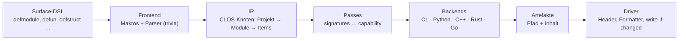
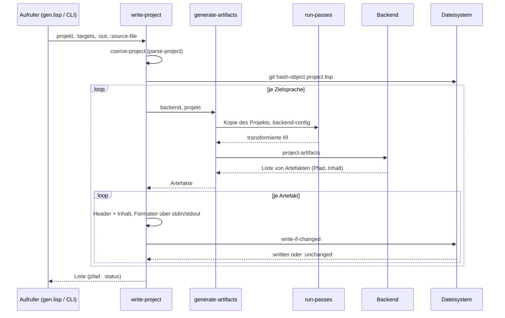
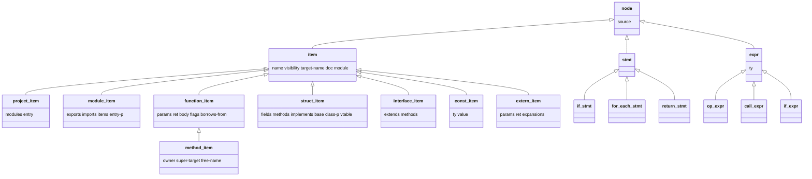
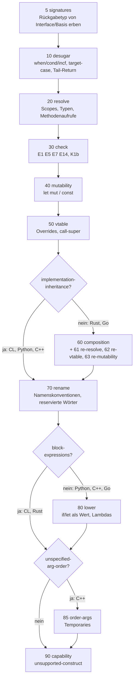
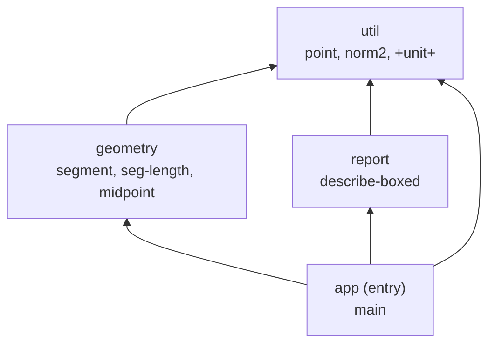
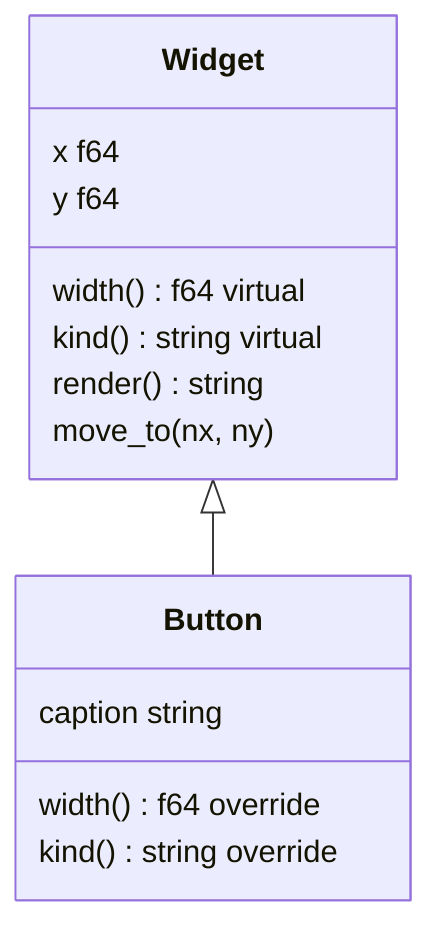
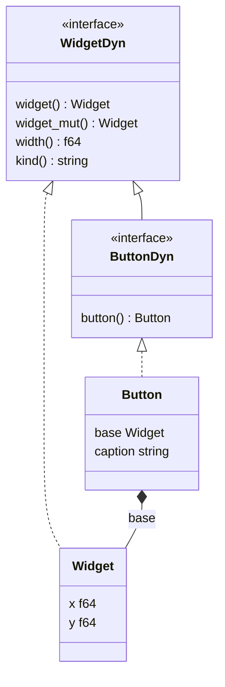
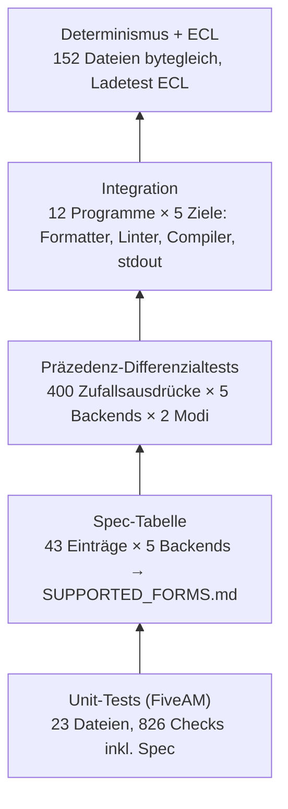

# Walkthrough — Polyglot-Generator: ein Transpiler, fünf Zielsprachen

> Ordner: `example/13_polyglot_generator/` · Plan:
> [plan.md](./plan.md), [task.md](./task.md) · Zeitraum: 2026-09-29,
> 06:49–09:28 Uhr (UTC) plus dieses Dokument · Commits: `9a112e0` …
> `7d42145` (Stand vor diesem Dokument), alle lokal, nicht gepusht

## Einleitung

In `/workspace/src` liegen 21 Repositories `cl-*-generator*`. Jedes übersetzt
S-Expressions in genau eine Sprache, und jedes hat seine eigene Kopie derselben
Ideen: Präzedenzregeln, Dateischreiben mit Hash-Vergleich, Formatter-Aufrufe.
Der Polyglot-Generator ersetzt das durch **einen** Transpiler. Ein Transpiler
ist ein Übersetzer von einer Quellsprache in eine andere Quellsprache, hier
von einer Lisp-DSL nach C++20, Python, Rust, Go und Common Lisp. Das Ziel ist
nicht bloß kompilierbarer, sondern idiomatischer Code, der die Linter der
jeweiligen Sprache ohne Warnung passiert.

Das Dokument richtet sich an alle, die den Generator benutzen oder erweitern
wollen. Kapitel 1 erklärt den Aufbau entlang eines Beispiels. Kapitel 2 nennt
ehrlich, wo die Umsetzung vom Plan abweicht und welcher Test das erzwungen hat.
Kapitel 3 und 4 sind Ausblick und Betriebsnotizen. Wer es eilig hat, liest die
Einleitung, 1.1, 1.2 und Kapitel 2.

Zum Einstieg eine einzige DSL-Funktion aus dem Beispielprojekt:

```lisp
(defun total-area (items)
  "Sum of the areas of all shapes."
  (declare (type (vec (box (dyn shape))) items) (values :f64))
  (let ((sum 0d0))
    (dolist (s items)
      (incf sum (area s)))
    sum))
```
Quelle: `examples/01_shapes/project.lisp`

```cpp
double total_area(const std::vector<std::unique_ptr<Shape>> &items) {
  double sum = 0.0;
  for (const auto &s : items) {
    sum += s->area();
  }
  return sum;
}
```
Quelle: `examples/01_shapes/source01/cpp/shapes.cpp`

```rust
/// Sum of the areas of all shapes.
pub fn total_area(items: &[Box<dyn Shape>]) -> f64 {
    let mut sum = 0.0;
    for s in items {
        sum += s.area();
    }
    sum
}
```
Quelle: `examples/01_shapes/source01/rust/src/shapes.rs`

```python
def total_area(items: list[Shape]) -> float:
    """Sum of the areas of all shapes."""
    sum_ = 0.0
    for s in items:
        sum_ += s.area()
    return sum_
```
Quelle: `examples/01_shapes/source01/python/shapes.py`

```go
// TotalArea Sum of the areas of all shapes.
func TotalArea(items []Shape) float64 {
	sum := 0.0
	for _, s := range items {
		sum += s.Area()
	}
	return sum
}
```
Quelle: `examples/01_shapes/source01/go/shapes/shapes.go`

Man sieht schon hier, was der Generator pro Sprache entscheidet: `const &`
und `->` in C++, ein Slice `&[…]` und `let mut` in Rust, `sum_` in Python
(weil `sum` ein Builtin ist), ein exportierter Name `TotalArea` in Go.

## 1. Was exakt implementiert wurde

### 1.1 Überblick

Der Generator ist eine klassische Übersetzerkette. Das Diagramm zeigt den Weg
einer Eingabe vom Lisp-Reader bis zu den Dateien auf der Platte.



Die IR (Zwischenrepräsentation, engl. *intermediate representation*) ist die
sprachneutrale Datenstruktur zwischen Eingabe und Ausgabe. Anders als ein AST
(abstrakter Syntaxbaum, der die Struktur des Quelltexts abbildet) trägt sie
nach den Passes auch Typen, Zielnamen und Mutabilität. Die Quellen verteilen
sich so (Zeilen per `wc -l`, Stand `36442ac`):

| Bereich | Dateien | Zeilen | Zuständigkeit |
|---|---|---|---|
| `src/00–03` | 4 | 228 | Paket, Readtable, Conditions, Namen |
| `src/ir/` | 5 | 530 | `define-node`, Typ-IR, Ausdrücke, Statements, Items |
| `src/frontend/` | 9 | 1073 | Makro-Registry, Parser, Deklarationen, Module, Intrinsics |
| `src/passes/` | 21 | 2173 | Pipeline und 15 Passes |
| `src/printer/` | 3 | 189 | Zeilen-Writer, Präzedenz-Engine, Literale |
| `src/backend/60–61` | 2 | 204 | Backend-Protokoll, gemeinsame Text-Hilfen |
| `src/backend/cl/` | 7 | 701 | Common Lisp (Oracle) |
| `src/backend/python/` | 6 | 555 | Python 3 |
| `src/backend/cpp/` | 8 | 893 | C++20 mit Header/Impl-Split |
| `src/backend/rust/` | 9 | 960 | Rust mit Lifetimes und Traits |
| `src/backend/go/` | 7 | 665 | Go |
| `src/driver/` | 4 | 215 | Artefakte, Formatter, `write-project`, CLI |
| **Summe** | **85** | **8386** | größte Datei 211 Zeilen, jede Funktion ≤ 60 Zeilen |

Dazu kommen 47 Testdateien mit 2818 Zeilen.

Alle Pfade in diesem Dokument sind relativ zu `example/13_polyglot_generator/`.
Pfade unter `build/` sind nicht eingecheckt (`.gitignore`); sie entstehen mit
`./run-integration.sh <programm>` bzw. `./run-tests.sh --paren`. Die Dateien
unter `examples/01_shapes/source01/` sind committet.

### 1.2 Ein Programm auf dem Weg durch den Transpiler

Am besten versteht man die Kette, wenn man ein Programm durch sie verfolgt. Das
Sequenzdiagramm zeigt, was ein Aufruf von `write-project` auslöst.



Wie sich die IR dabei verändert, zeigt `total-area` von oben. Die folgenden
Baumausdrucke stammen aus einem temporären Hilfsskript, das `run-passes` mit
`:until` aufruft (nicht im Repository; gekürzt auf die relevanten Slots).
Direkt nach dem Parser:

```text
function-item name="total-area" visibility=:PUBLIC ret=:F64
  var-def name="items" declared-ty=(:VEC (:BOX (:DYN "shape"))) ty=:UNKNOWN mode=:IN kind=:PARAM
  block-stmt scope=T
    decl-stmt
      var-def name="sum" ty=:UNKNOWN kind=:LOCAL
      lit-expr value=0.0d0 kind=:FLOAT
    for-each-stmt
      var-def name="s" kind=:LOOP
      var-expr name="items"
      incf-stmt op=:ADD
        var-expr name="sum"
        call-expr name="area"
          var-expr name="s"
    expr-stmt
      var-expr name="sum"
```

Nach `desugar` ist `incf` zu `op-assign-stmt` geworden, und der letzte
Ausdruck ist ein explizites `return-stmt`. Nach `resolve` und `rename` (hier
für Python) sind die Typen bekannt, `area` ist als Methodenaufruf erkannt,
`sum` ist veränderlich und hat den Zielnamen `sum_`:

```text
function-item name="total-area" target-name="total_area" ret=:F64
  var-def name="items" ty=(:VEC (:BOX (:DYN "shape" #<INTERFACE-ITEM #>))) target-name="items"
  block-stmt scope=T
    decl-stmt
      var-def name="sum" ty=:F64 target-name="sum_" mutable=T
      lit-expr ty=:F64 value=0.0d0
    for-each-stmt iter-mode=:REF
      var-def name="s" ty=(:BOX (:DYN "shape" #<INTERFACE-ITEM #>)) target-name="s"
      var-expr name="items"
      op-assign-stmt op=:ADD
        var-expr ty=:F64 name="sum"
        method-call-expr ty=:F64 name="area"
          var-expr name="s"
    return-stmt
      var-expr ty=:F64 name="sum"
```

Daraus drucken die Backends die fünf Fassungen aus der Einleitung. Rust lässt
das `return` am Ende weg (Block-Ausdruck), C++ und Go behalten es.

### 1.3 Die DSL (Frontend)

Die Eingabesprache sieht aus wie Common Lisp und verhält sich auch so. Das ist
eine bewusste Entscheidung aus plan.md: Wer Lisp kennt, soll nicht umlernen.

`and`/`or`/`not` sind logisch, `logand`/`logior` bitweise, `/=` heißt
„ungleich“. Die Spec-Tabelle hält das pro Backend fest:

```lisp
(define-spec logic
  :tags (:operators) :doc "and/or/not are logical (CL semantics)."
  :params ((a :bool) (b :bool) (c :bool)) :ret :bool
  :lisp (or (and a b) (not c))
  :expect (:cl "(or (and a b) (not c))"
               :python "a and b or not c"
               :cpp "return (a && b) || !c;"
               :rust "a && b || !c"
               :go "a && b || !c"))
```
Quelle: `tests/spec/table-core.lisp`

Die Klammern in C++ sind kein Zufall. g++ warnt mit `-Wparentheses` bei `&&`
innerhalb von `||`. Die Operator-Tabelle des C++-Backends hat dafür eine
Liste `:clarity`, die solche Klammern erzwingt (siehe 1.6).

**Readtable.** Eine Readtable legt fest, wie der Lisp-Reader Zeichen in
Objekte übersetzt. Die DSL braucht `readtable-case :invert`, damit `Point`
als `Point` ankommt und `point` als `point`. Die alten Generatoren setzten das
global per `setf` beim Laden. Hier kapselt eine benannte Readtable das; eine
DSL-Datei beginnt mit `(in-dsl)`:

```lisp
(named-readtables:defreadtable polyglot-syntax
  (:merge :standard)
  (:case :invert))
```
Quelle: `src/01-syntax.lisp`

`:invert` speichert `point` intern als `"POINT"`. `source-spelling` kehrt das
um, sodass der Generator immer die geschriebene Form sieht; der Unit-Test
`invert-readtable-keeps-mixed-case` prüft `Point`, `point` und `POINT`.

**Fluchtwege.** `(target-case (:cpp …) (t …))` wählt einen Zweig pro Backend
(Vorbild ist Haxes `#if cpp`). Formen aus den Paketen `polyglot.cpp`,
`polyglot.py`, `polyglot.rs` und `polyglot.go` sind nur für ihr Backend
erlaubt:

```lisp
(define-spec target-form-rejected
  :lisp (polyglot.rs::raw "unsafe {}")
  :expect (:rust "unsafe {}")
  :expect-error (:cl unsupported-construct :python unsupported-construct
                 :cpp unsupported-construct :go unsupported-construct))
```
Quelle: `tests/spec/table-more.lisp` (gekürzt um `:tags`/`:doc`)

`define-dsl-macro` definiert eigene Surface-Formen, die vor dem Parsen
expandiert werden. `tests/unit/test-macros.lisp` prüft verschachtelte
Expansion und bricht endlose Rekursion mit einem `dsl-error` ab.

### 1.4 Die Zwischenrepräsentation (IR)

Die alten Generatoren verwandeln jeden Knoten sofort in einen String. Danach
kann niemand mehr fragen „welcher Operator steht hier oben?“ oder „ist diese
Variable veränderlich?“. Die IR hält diese Information als CLOS-Objekte, bis
das Backend sie druckt.

Jeder Knotentyp entsteht mit `define-node`. Das Makro legt Klasse, Accessoren
`ir-<slot>` und Konstruktor `make-<name>` an und merkt sich, welche Slots
Kindknoten enthalten. Daraus folgen die generischen Operationen
`walk-nodes`, `map-tree` (Nachordnung, baut neue Knoten, verändert die Eingabe
nie) und `copy-node-tree`:

```lisp
(define-node function-item (item)
  ((params :child :list) (ret :initform :void) (body :child :list)
   (flags) (borrows-from) (outlives) (ret-declared))
  "Function. FLAGS is a list of :pure :virtual :override :abstract.")
```
Quelle: `src/ir/14-items.lisp`

Das Klassendiagramm zeigt die obersten Ebenen der Hierarchie (insgesamt 58
Knotenklassen; die 20 Ausdrucks- und 22 Statement-Klassen sind nur
angedeutet).



Typen sind dagegen einfache Listen, keine Knoten: `:i64`, `(:vec T)`,
`(:box T)`, `(:dyn "name")`, `(:optional T)` und die Referenztypen
`(:ref T region)`, `(:mut-ref T region)`, `(:view T region)`. Die *Region* ist
`nil` (anonym), ein Keyword wie `:a` oder `:static`; aus ihr erzeugt das
Rust-Backend Lifetimes (1.8).

### 1.5 Die Passes

Ein Pass ist eine Funktion IR → IR mit genau einer Aufgabe. Jeder Pass hat eine
Ordnungsnummer und eine Bedingung, ob er für das aktuelle Backend läuft. Die
Bedingungen fragen die *Capabilities* ab: Fähigkeiten einer Zielsprache wie
„kennt Block-Ausdrücke“ oder „kennt Implementierungsvererbung“.



Die Details stehen in den Kopfkommentaren der Dateien `src/passes/*.lisp`.
Drei Vorher/Nachher-Beispiele zeigen, was die Passes bewirken.

**lower** (Lowering bedeutet: ein Konstrukt in einfachere Konstrukte zerlegen,
die die Zielsprache direkt kennt). Die DSL erlaubt `if` als Wert:

```lisp
(end (if (< space 0) n space))
```
Quelle: `tests/integration/programs/p06_borrows/project.lisp`

Rust braucht kein Lowering, Python hat einen Ternär-Ausdruck, Go hat keinen:

```rust
let end = if space < 0 { n } else { space };
```
```python
end = n if space < 0 else space
```
```go
var end int64
if space < 0 {
	end = n
} else {
	end = space
}
```
Quelle: `build/p06_borrows/{rust/src/main.rs,python/borrows.py,go/main.go}`
(erzeugt von `./run-integration.sh p06_borrows`)

**order-args.** C++ legt die Auswertungsreihenfolge von Funktionsargumenten
nicht fest. Sind mindestens zwei Argumente unrein (etwa Aufrufe von
Funktionen, die nicht als `:pure` markiert sind), wandern sie der Reihe nach
in Temporaries:

```cpp
std::string Shape::describe() const {
  const std::string arg_1 = label();
  const double arg_2 = area();
  return std::format("{} with area {:.2f}", arg_1, arg_2);
}
```
Quelle: `examples/01_shapes/source01/cpp/shapes.cpp`

**rename.** `sum` wird in Python zu `sum_` (siehe Einleitung), `input` zu
`input_`. Die Konventionen pro Rolle (Typ, Funktion, Feld, Konstante …)
stehen in `backend-config`; die eigentliche Umwandlung `point-3d` →
`point_3d`/`Point3d`/`point3d` übernimmt seit `36442ac` die Bibliothek
`cl-change-case` (Kapitel 2, Nr. 14).

### 1.6 Die Backends

Ein Backend ist der sprachspezifische Teil: Es druckt die fertige IR als Text
einer Zielsprache. Alle fünf implementieren dasselbe Protokoll aus
`src/backend/60-protocol.lisp` (`backend-config`, `emit-expr`, `emit-stmt`,
`emit-item`, `module-artifacts`). Gemeinsam ist die Präzedenz-Engine. Die
Präzedenz eines Operators bestimmt, wie stark er bindet (`*` stärker als `+`);
die Assoziativität bestimmt, wie gleich starke Operatoren gruppiert werden
(`a - b - c` ist `(a - b) - c`). Jedes Backend liefert eine Tabelle:

```lisp
(:op :mul :token "*" :level 15) (:op :div :token "/" :level 15)
(:op :add :token "+" :level 14) (:op :sub :token "-" :level 14)
(:op :lt :token "<" :level 11 :assoc :non)
(:op :and :token "&&" :level 6) (:op :or :token "||" :level 5)
;; -Wparentheses
:clarity '(((:or) (:and)) ...)
```
Quelle: `src/backend/cpp/config.lisp` (Auszug)

Die Engine druckt in zwei Modi: `:minimal` (nur nötige Klammern, für die
Ausgabe) und `:full` (alles geklammert, als Oracle für Tests, siehe 1.12).

| Backend | Formatter | Idiomatik-Gate | Besonderheiten |
|---|---|---|---|
| CL | — (Pretty-Printer) | SBCL-Load ohne WARNING | senkt die IR in S-Expressions ab; Referenz für Differenzialtests; Scratch-Pakete für Symbole |
| Python | `ruff format` | `ruff check` (Standardregeln 0.16.9) | `@dataclass`, `ABC`, `__all__`, `_`-Präfix für private Items |
| C++20 | `clang-format --style=llvm` | `g++ -std=c++20 -Wall -Wextra -Werror` | `.hpp`/`.cpp` pro Modul, `std::format`, `unique_ptr`, Designated Initializers |
| Rust | `rustfmt --edition 2021` | `cargo clippy -- -D warnings` | Modi → `&`/`&mut`/Wert, Lifetimes, Traits, Komposition |
| Go | `gofmt` | `go vet ./...` | ein Package pro Modul, Pointer-Receiver, Komposition |

Die Capabilities aus `src/backend/*/config.lisp` im Vergleich:

| Capability | CL | Python | C++ | Rust | Go |
|---|---|---|---|---|---|
| `:block-expressions` | ja | nein | nein | ja | nein |
| `:ternary` | ja | ja | ja | nein | nein |
| `:multi-statement-lambda` | ja | nein | ja | ja | ja |
| `:implementation-inheritance` | ja | ja | ja | nein | nein |
| `:inout-scalars` | nein | nein | ja | ja | ja |
| Shadowing | `:allow` | `:rename` | `:rename` | `:allow` | `:rename` |

Ein DSL/Ausgabe-Paar pro Backend liefert die Einleitung; CL sieht so aus:

```lisp
(defun total-area (items)
  "Sum of the areas of all shapes."
  (let ((sum 0.0d0))
    (loop for s across items
          do (incf sum (area s)))
    sum))
```
Quelle: `examples/01_shapes/source01/cl/shapes.lisp`

### 1.7 Module und Header/Impl-Split

Ein Modul ist eine Namens- und Übersetzungseinheit des erzeugten Programms,
nicht eine Lisp-Datei (Konvention: eine Datei pro Modul). Es exportiert und
importiert Namen; daraus entstehen Namespaces, Header, `mod`/`use`,
Python-Module und Go-Packages. Das Programm `p09_multimodule` hat vier Module:



Die Include-Analyse unterscheidet, ob ein Header einen Typ **als Wert**
braucht (dann `#include`) oder nur **hinter einem Zeiger** (dann genügt eine
Vorwärtsdeklaration). `segment` enthält zwei `point`-Felder, `describe-boxed`
nimmt nur `(box point)`:

```cpp
#pragma once

#include "util.hpp"

namespace geometry {

struct Segment {
  util::Point a{};
  util::Point b{};
};
```
Quelle: `build/p09_multimodule/cpp/geometry.hpp` (Auszug)

```cpp
#pragma once

#include <memory>
#include <string>

namespace util {
struct Point;
} // namespace util

namespace report {

std::string describe_boxed(const std::unique_ptr<util::Point> &p);

} // namespace report
```
Quelle: `build/p09_multimodule/cpp/report.hpp` (Auszug)

Was ein Modul nicht exportiert, bleibt privat. In `geometry` ist das die
Hilfsfunktion `half`: Sie steht nicht in `(:export segment seg-length
midpoint)`. Deshalb taucht sie in `geometry.hpp` gar nicht auf, und in
`geometry.cpp` steht sie in einem Namespace ohne Namen (`namespace { … }`).
Ein solcher anonymer Namespace bedeutet in C++: Der Name ist nur in dieser
einen `.cpp`-Datei sichtbar, so wie `static` bei einer Funktion. Andere
Module können `half` also nicht aufrufen, auch nicht als `geometry::half`:

```cpp
namespace geometry {
namespace {
double half(double v);
} // namespace
...
util::Point midpoint(const Segment &s) {
  return util::Point{.x = half(s.a.x + s.b.x), .y = half(s.a.y + s.b.y)};
}

namespace {
double half(double v) { return v / 2.0; }
} // namespace

} // namespace geometry
```
Quelle: `build/p09_multimodule/cpp/geometry.cpp` (Auszug)

Die Vorwärtsdeklaration oben erlaubt, dass `midpoint` die Funktion benutzt,
obwohl ihre Definition erst weiter unten steht. Die anderen Sprachen
kennzeichnen private Items auf ihre Weise; Beispiel ist die private Funktion
`square` aus dem Modul `util`: in Python `_square` mit Unterstrich (siehe
unten), in Rust `fn square` ohne `pub`, in Go `func square` mit kleinem
Anfangsbuchstaben.

Eine Ausnahme ist das Entry-Modul `app`, das `main` enthält: Es bekommt keinen
Namespace, weil C++ den Einstiegspunkt `main` nur im globalen Namespace
akzeptiert. Die anderen Sprachen bilden die Modulstruktur so ab:

```rust
mod geometry;
mod report;
mod util;

use crate::geometry::{midpoint, seg_length, Segment};
use crate::report::describe_boxed;
use crate::util::{Point, UNIT};
```
Quelle: `build/p09_multimodule/rust/src/main.rs`

```python
def _square(v: float) -> float:
    """Private helper."""
    return v * v
...
__all__ = ["UNIT", "Point", "norm2"]
```
Quelle: `build/p09_multimodule/python/util.py` (Auszug)

```go
import (
	"fmt"

	"multimodule/geometry"
	"multimodule/report"
	"multimodule/util"
)
```
Quelle: `build/p09_multimodule/go/main.go`

Zyklische Importe sind ein `dsl-error`, weil Go sie verbietet.

### 1.8 Parameter-Modi, Mutabilität und Lifetimes

Rust verlangt, dass jede Referenz entweder geteilt (`&T`) oder exklusiv
(`&mut T`) ist. Das nennt man Borrowing (Ausleihen). Eine Lifetime ist die
Angabe, wie lange eine geliehene Referenz gültig ist. Ein eigener
Borrow-Checker im Generator wäre ein eigener Compiler. Deshalb deklariert die
DSL stattdessen, **wie** ein Parameter übergeben wird (angelehnt an Hylo/Mojo),
und rustc prüft den Rest. Aus `p05_modes`:

```lisp
(defun add-point (poly p)
  (declare (type polygon poly) (mode :inout poly) (type point p) (mode :sink p))
  (push (move p) (dot poly points)))
```

| Modus | Rust | C++ | Python | Go |
|---|---|---|---|---|
| `:in` (Default) `total(poly)` | `fn total(poly: &Polygon) -> i64` | `std::int64_t total(const Polygon &poly)` | `def total(poly: Polygon) -> int` | `func total(poly polygon) int64` |
| `:inout` `poly` | `poly: &mut Polygon` | `Polygon &poly` | `poly: Polygon` | `poly *polygon` |
| `:sink` `p` | `p: Point` | `Point p` + `std::move(a)` beim Aufruf | `p: Point` | `p point` |

Quelle: `build/p05_modes/{rust/src/main.rs,cpp/modes.cpp,python/modes.py,go/main.go}`

Der Pass `mutability` leitet daraus ab, welche Locals `let mut` bzw. nicht
`const` sein müssen (zugewiesen, Feld verändert, als `:inout` übergeben …).

**Lifetimes (K1b).** Gibt eine Funktion eine Referenz zurück, muss Rust wissen,
aus welchem Parameter sie stammt. Die DSL sagt das mit `borrows-from`:

```lisp
(defun longest (x y)
  (declare (type (view :string) x y) (values (view :string)) (borrows-from x y))
  (if (> (string-byte-length x) (string-byte-length y)) x y))
```
Quelle: `tests/integration/programs/p06_borrows/project.lisp`

```rust
fn longest<'a>(x: &'a str, y: &'a str) -> &'a str {
    if x.len() as i64 > y.len() as i64 {
        x
    } else {
        y
    }
}
```
```cpp
std::string_view longest(std::string_view x, std::string_view y) {
  if (static_cast<std::int64_t>(x.size()) >
      static_cast<std::int64_t>(y.size())) {
    return x;
  } else {
    return y;
  }
}
```
Quelle: `build/p06_borrows/{rust/src/main.rs,cpp/borrows.cpp}`

Elision (Weglassen) heißt: Rust ergänzt die Lifetime selbst, wenn es genau
einen Referenzparameter gibt oder die Methode `&self` nimmt. Dann schreibt der
Generator keine Lifetime, und `borrows-from` darf fehlen:
`fn first_word(s: &str) -> &str`. Hält eine Struktur eine View, bekommt sie
einen Lifetime-Parameter:

```rust
struct Parser<'a> {
    input: &'a str,
    pos: i64,
}

impl<'a> Parser<'a> {
    fn next_token(&mut self) -> Option<&'a str> {
```
Quelle: `build/p06_borrows/rust/src/main.rs` (Auszug)

In C++ wird daraus ein `std::string_view`-Feld, Python und Go ignorieren die
Regionen. Wo zwei Referenzparameter ohne `borrows-from` eine Referenz
liefern, meldet der Pass `check` einen `dsl-error` (K1b „mehrdeutig“).

### 1.9 Interfaces, Vererbung und Komposition

C++, Python und CL kennen Implementierungsvererbung, Rust und Go nicht. Damit
dieselbe DSL-Hierarchie überall läuft, schreibt der Pass `composition` sie für
Rust und Go in Komposition um. Komposition heißt: Die abgeleitete Struktur
**enthält** die Basis als Feld, statt von ihr zu erben. Die Hierarchie aus
`examples/01_shapes/project.lisp`:



Nach dem Pass gibt es pro Klasse ein Interface `CDyn` mit Accessoren und den
virtuellen Methoden, eine Datenstruktur mit dem Feld `base` und freie
Funktionen für die Methodenrümpfe:



Das erzeugte Rust (Auszug):

```rust
trait ButtonDyn: WidgetDyn {
    fn button(&self) -> &Button;
}

struct Button {
    base: Widget,
    caption: String,
}

impl WidgetDyn for Button {
    fn widget(&self) -> &Widget {
        &self.base
    }
    ...
    fn width(&self) -> f64 {
        button_width(self)
    }
}

fn button_width(this: &dyn ButtonDyn) -> f64 {
    widget_width(this) + this.button().caption.chars().count() as i64 as f64
}

fn widget_render(this: &dyn WidgetDyn) -> String {
    format!(
        "{} at ({:.1}, {:.1}) width {:.1}",
        this.kind(),
        this.widget().x,
        this.widget().y,
        this.width()
    )
}
```
Quelle: `examples/01_shapes/source01/rust/src/main.rs` (Auszug, `#[derive]`
und leere Zeilen gekürzt)

`call-super` wird zum direkten Aufruf `widget_width(this)`. C++ und Python
bleiben nativ:

```cpp
double Button::width() const {
  return Widget::width() +
         static_cast<double>(polyglot_rt::utf8_char_count(caption));
}
```
```python
    def width(self) -> float:
        return super().width() + float(len(self.caption))
```
Quelle: `examples/01_shapes/source01/{cpp/app.cpp,python/app.py}`

Go hätte mit Struct-Embedding eine scheinbar einfachere Lösung. Die trägt aber
nicht: Ruft eine Methode des eingebetteten `widget` intern `w.width()` auf,
landet der Aufruf immer bei `widget.width`, nie beim Override von `button`.
`render` würde für den Button `width 1.0` drucken. Deshalb nutzt Go dieselbe
Umschreibung:

```go
func buttonWidth(this buttonDyn) float64 {
	return widgetWidth(this) + float64(int64(utf8.RuneCountInString(this.button().caption)))
}
```
Quelle: `examples/01_shapes/source01/go/main.go`

Alle fünf Fassungen drucken dieselbe Zeile
`button 'OK' at (10.0, 5.0) width 3.0`. Geprüft wurden alle fünf Programme in
`examples/01_shapes/source01/` (g++ `-Wall -Wextra -Werror`, `cargo run`,
`python3`, `go run`, SBCL): Die Ausgabe hat jeweils die md5-Summe
`ec2bd997…`. Die Vtable (Tabelle, welche
Implementierung eine virtuelle Methode für einen Typ hat) berechnet der Pass
`vtable`; nach der Komposition läuft er als `re-vtable` erneut.

### 1.10 Portable Intrinsics und Preludes

Ein Intrinsic ist eine eingebaute Funktion mit **einer** Signatur und einer
Expansion pro Backend. Das Vorbild ist Haxe: Dort beschreibt `@:coreApi` die
Schnittstelle, und `_std` enthält die Implementierung pro Plattform. Die
Signaturen stehen zentral:

```lisp
(define-intrinsic string-char-count ((s :string)) :i64)
(define-intrinsic mod ((a :integer) (b :integer)) (:type-of a))
(define-intrinsic string-find ((s :string) (ch :char) (start :integer)) :i64)
```
Quelle: `src/frontend/25-intrinsics.lisp`

Die 24 Intrinsics sind `print-line format-string length string-byte-length
string-char-count push map-get map-set map-contains map-keys-sorted
string-concat sqrt abs min max truncate floor mod rem to-float int-to-string
string-find string-slice`. Einige Expansionen:

| Intrinsic | Python | C++ | Rust | Go |
|---|---|---|---|---|
| `string-char-count` | `len($s)` | `polyglot_rt::utf8_char_count($s)` | `….chars().count() as i64` | `int64(utf8.RuneCountInString($s))` |
| `mod` | Operator `%` | `polyglot_rt::mod($a, $b)` | `polyglot_rt::modulo($a, $b)` | `polyglotrt.Mod($a, $b)` |
| `map-keys-sorted` | `sorted($m)` | `polyglot_rt::sorted_keys($m)` | `polyglot_rt::sorted_keys(&m)` | `slices.Sorted(maps.Keys($m))` |

Quelle: `src/backend/*/intrinsics.lisp`

Eine *Prelude* ist eine kleine Laufzeitbibliothek, die der Generator mit
ausgibt. Sie entsteht nur, wenn ein Programm einen Helfer wirklich benutzt,
und enthält nur diese Helfer. `p06_borrows` braucht in Go `FindChar` (für
`string-find`) und `Ptr` (für `some` auf einen Wert):

```go
// Package polyglotrt holds the runtime helpers of the polyglot generator.
package polyglotrt

// FindChar is the byte offset of c in s at or after start, -1 when absent.
func FindChar(s string, c rune, start int64) int64 {
	i := strings.IndexRune(s[start:], c)
	...
// Ptr returns a pointer to a copy of v.
func Ptr[T any](v T) *T {
```
Quelle: `build/p06_borrows/go/polyglotrt/polyglotrt.go` (Auszug)

### 1.11 Driver, CLI und Idempotenz

Idempotenz heißt: Ein zweiter Lauf mit derselben Eingabe ändert nichts. Die
alten Generatoren merkten sich dazu `sxhash`-Werte im Lisp-Image. Das ist
kollisionsanfällig und nach einem Neustart vergessen. `write-project`
vergleicht stattdessen mit dem Dateiinhalt auf der Platte, und zwar **nach**
dem Formatieren:

```lisp
(defun write-if-changed (path text)
  "Write TEXT to PATH unless the file already has exactly this content.
Returns :written or :unchanged."
  (if (equal text (read-file-or-nil path))
      :unchanged
      ...
```
Quelle: `src/driver/82-write.lisp`

Jede Datei beginnt mit einem Header, hier in C++:

```cpp
// Code generated by polyglot-generator. DO NOT EDIT.
// Source: project.lisp (git blob f2715e5101)
```

`f2715e5101` ist der Blob-Hash von `examples/01_shapes/project.lisp`
(`git hash-object` liefert `f2715e5101f7…`). Er hängt nur vom Inhalt ab; mehr
dazu in Kapitel 2, Nr. 3. Aufruf der CLI, zweimal hintereinander:

```text
$ ./polyglot-gen.sh examples/01_shapes/project.lisp --targets rust,go --out /tmp/pg-out
written  /tmp/pg-out/rust/src/main.rs
written  /tmp/pg-out/rust/src/shapes.rs
written  /tmp/pg-out/rust/Cargo.toml
written  /tmp/pg-out/go/shapes/shapes.go
written  /tmp/pg-out/go/main.go
written  /tmp/pg-out/go/go.mod
6 files, 6 written, 0 unchanged
$ ./polyglot-gen.sh examples/01_shapes/project.lisp --targets rust,go --out /tmp/pg-out
...
unchanged  /tmp/pg-out/go/main.go
unchanged  /tmp/pg-out/go/go.mod
6 files, 0 written, 6 unchanged
```

Fehlt ein Formatter, gibt es eine `dsl-warning` (einmal pro Werkzeug), und die
Datei wird unformatiert geschrieben.

### 1.12 Tests und Ergebnisse

Die Tests sind in Schichten gebaut: viele schnelle unten, wenige teure oben.



Ein Differenzialtest vergleicht die Ausgaben mehrerer Implementierungen
derselben Sache. Die Referenz ist ein Oracle, also eine Quelle, deren Ergebnis
als richtig gilt. Bei den Präzedenztests ist das SBCL: Es wertet jeden
Zufallsausdruck direkt aus. Jedes Backend erzeugt daraus ein Programm, einmal
voll und einmal minimal geklammert, und beide müssen dieselben Werte drucken.
Der achte Ausdruck (Seed 42) als Beispiel, erwarteter Wert −10:

```lisp
(logxor (- (- -4 a) (floor c (+ 1 (abs 7)))) (logxor 2 (- -1)))
```
```python
print(f"{(((-4) - a) - (c // (1 + abs(7)))) ^ (2 ^ (-(-1)))}")   # :full
print(f"{-4 - a - c // (1 + abs(7)) ^ (2 ^ -(-1))}")             # :minimal
```
```rust
println!("{}", -4 - a - polyglot_rt::floor_div(c, 1 + i64::abs(7)) ^ (2 ^ -(-1)));
```
Quelle: `build/_paren/{python-full,python-minimal}/python/paren.py`,
`build/_paren/rust-minimal/rust/src/main.rs`

Jedes Integrationsprogramm hat eine `expected.txt`. Jedes Ziel muss zuerst
sein Idiomatik-Gate bestehen (Tabelle in 1.6) und dann genau diese Ausgabe
drucken. Ergebnisse vom 2026-09-29 auf Stand `36442ac` (Laufzeiten mit warmem
FASL- und Cargo-Cache):

| Suite | Befehl | Ergebnis |
|---|---|---|
| Unit + Spec | `./run-tests.sh` | 826 Checks, 0 Fehler, 1,8 s |
| Doku aktuell | `./run-tests.sh --docs-check` | `SUPPORTED_FORMS.md is up to date` |
| Präzedenz (zufällig) | `./run-tests.sh --paren` | 5 Backends × {full, minimal} × 401 Werte PASS, 3,3 s |
| ECL | `./run-tests.sh --ecl` | 826 Checks, 0 Fehler, 2,7 s (kalt mit Kompilierung: 28,7 s) |
| Integration | `./run-integration.sh` | PASS 60, FAIL 0, SKIPPED 0, 15,3 s |
| Determinismus | `./run-integration.sh --determinism` | 152 Dateien, 0 Probleme, 17,1 s |

401 statt 400 Werte: Jedes Programm druckt zum Schluss `(+ a b c d)` = 17 als
Kontrollwert, damit ein abgeschnittenes Programm auffällt.

Das Abschluss-Gate (task.md Schritt 5.3) lief nach diesem Dokument noch einmal
über alles. Es fand eine letzte Lücke: Die in Phase 4 hinzugekommenen Programme
p03, p10, p11 und p12 waren nicht durch den Emacs-Reindent gelaufen. Nach der
reinen Leerraum-Korrektur waren alle Prüfungen der Tabelle grün, dazu
`tools/lisp-check.sh --indent --tests --ecl` über alle 132 Lisp-Dateien unter
`src/` und `tests/`.

## 2. Architektur-Entscheidungen, die aufgrund von Tests geändert werden mussten

Kein Plan überlebt den ersten Compilerlauf unverändert. Die Tabelle nennt jede
Abweichung von plan.md/task.md, den Test, der sie erzwungen hat, und den
Commit. Nach der Tabelle folgen Vorher/Nachher-Beispiele für die wichtigsten
Einträge.

| # | Plan (plan.md/task.md) | Welcher Test hat es gezeigt? | Was wurde geändert? | Commit |
|---|---|---|---|---|
| 1 | Pass-Liste ohne `signatures` | Beispiel K3 (`defmethod area` ohne `values`) in test-signatures: desugar setzte kein Tail-Return | neuer Pass `:signatures` (Order 5) erbt Rückgabetypen von Interface/Basis | a4ad62c |
| 2 | E11 (Kommentar im Ausdruck) im lower-Pass | Pass-Reihenfolge: resolve prüft Aritäten vor lower, ein Kommentar als Argument wäre dort schon ein Fehler | Parser (`parse-exprs`/`parse-stmt`) zieht Kommentare mit `dsl-warning` vor das Statement | d1f82e0 |
| 3 | Header mit `git rev-parse HEAD` | kein Test, sondern die Idempotenz-Anforderung: Mit dem Commit-Hash wäre jede committete Ausgabe nach dem nächsten Commit veraltet | Blob-Hash der Quelldatei (`git hash-object`). Später bestätigt: zweiter Lauf von `gen.lisp` schreibt 0 Dateien | c476a14 |
| 4 | Formatter über temporäre Datei | kein Test; beim Bau entschieden (portabel, keine Temporärdateien) | Formatter über stdin/stdout | c476a14 |
| 5 | Idiomatik-Gate `ruff check` wie bisher | ruff 0.16.9 hat einen stark erweiterten Standardregelsatz (I001, SIM102, SIM201, B023, E731) | isort-Sektionen, `def` statt Lambda-Zuweisung; `desugar` vereinfacht `(not (= a b))` und verschachtelte `if` für **alle** Backends | cc7f9a9 |
| 6 | „gegenseitige Imports“ (R12) | Go-Toolchain verbietet Importzyklen | Zyklen sind `dsl-error` | a4ad62c |
| 7 | C++: jedes Modul mit Namespace und Header | kein eigener Test dokumentiert; beim Bau der C++-Integration (p01/p02) entschieden, weil `main` global sein muss | Entry-Modul ohne Namespace, Header nur bei öffentlichen Items | d311121 |
| 8 | Komposition mit generischen Funktionen `T: CDyn + ?Sized` | `cargo clippy` / rustc bei p08 | `&dyn CDyn` (Trait-Upcasting), `.as_mut()`/`.as_ref()` für `Box<dyn T>`, Accessoren nur bei Bedarf (sonst `dead_code`), Re-Passes 61–63 | 35c5f28 |
| 9 | Rust `fn`-Parameter als `impl Fn` | clippy `needless_borrows_for_generic_args` (p10) | `&dyn Fn(..)`; Closures in Vec/Feldern als `Box::new`; `useless_vec` | 7adf6bb |
| 10 | Go ohne Kernänderung (R3) | Go-Integration (35/35 PASS) | **eingehalten**: nur neue Dateien in `src/backend/go/` plus `.asd`. Backend-intern: Shadowing `:rename`, `go 1.23`, Pointer-Receiver, Default-Methoden als freie Funktionen | b52b216 |
| 11 | Rust `.abs()`/`.floor()` als Methodenaufruf | Präzedenz-Zufallstest: rustc E0689 bei Receivern nur aus Literalen | `constant-expr-p` → `i64::abs(7)` bzw. `f64::floor(…)` | cb3deb8 |
| 12 | CL-Schleifen mit einer Bindung | neue Programme p03/p10/p11, sichtbar in p10_closures: CL wich von den anderen Backends ab | Neubindung pro Iteration; leerer Rumpf bekommt `(values)` | 7adf6bb |
| 13 | rename: nur Kollisionen unter Locals | neue Programme p03/p10/p11 (C++): `const auto match = match(...)` liest die neue Variable | Locals dürfen Modul-Items nicht verdecken | 7adf6bb |
| 14 | eigene Case-Konvertierung in `03-names.lisp` | Review-Hinweis: Nachbau von `cl-change-case` | Umwandlung über `cl-change-case`; Validierung und „gemischte Schreibweise bleibt“ bleiben eigener Code; `lisp-check.sh` liest Abhängigkeiten aus der `.asd` | 36442ac |
| 15 | Python: nur Schlüsselwörter reserviert | Review des Beispiels: `sum = 0.0` verdeckt das Builtin | häufige Builtins (`sum`, `map`, `id`, `input` …) sind reserviert | fb2e0b9 |
| 16 | `SUPPORTED_FORMS.md` aus der Spec-Tabelle | `--docs-check` schlug je nach Ladehistorie fehl | deterministische Reihenfolge in `dsl-string` | 7b96062 |

Weitere kleine Erweiterungen des Kerns ohne Planänderung: die Intrinsics
`to-float`, `int-to-string`, `string-find`, `string-slice`; die Form
`(some x)` für `optional`; `(box T)` darf an einen `:in`-Parameter vom Typ `T`
übergeben werden (e0c9756).

**Nr. 8, vorher/nachher.** plan.md sah für die freien Funktionen eine
generische Form vor: `fn widget_render<T: WidgetDyn + ?Sized>(this: &T)`.
Umgesetzt ist `&dyn WidgetDyn`. Das ist kürzer, und seit Trait-Upcasting
stabil ist, kann `button_width(this: &dyn ButtonDyn)` einfach
`widget_width(this)` aufrufen. Ein zweites, davon unabhängiges Problem:
`&mut Box<dyn T>` wird beim Aufruf nicht automatisch zu `&mut dyn T`, weil das
Unsizing Vorrang vor dem Deref hat. Deshalb setzt der Generator `.as_mut()`
bzw. `.as_ref()` ein:

```rust
fn widget_move_to(this: &mut dyn WidgetDyn, nx: f64, ny: f64) {
...
        widget_move_to(ui[i as usize].as_mut(), (10 * i) as f64, 5.0);
```
Quelle: `examples/01_shapes/source01/rust/src/main.rs`

**Nr. 11, vorher/nachher.** Aus `(abs 7)` wurde zuerst `7.abs()`. rustc
lehnt das ab (E0689: Der Typ des Literals ist beim Methodenaufruf noch
unbestimmt). Jetzt entsteht `i64::abs(7)` (siehe Beispiel in 1.12).

**Nr. 12, vorher/nachher.** `LOOP` aktualisiert eine einzige Bindung. Ein
Lambda, das die Schleifenvariable einfängt, sieht deshalb nach der Schleife
nur den letzten Wert. Die anderen Backends binden pro Iteration neu. Das CL-
Backend bindet jetzt ebenfalls im Rumpf neu, wenn die Variable eingefangen
wird. Der Differenzialtest gegen die anderen vier Backends hat die Abweichung
gezeigt.

```lisp
(loop for i from 0 below 3
      do (let ((i i))
           (vector-push-extend
            (lambda (x)
              (+ x i))
            adders)))
```
Quelle: `build/p10_closures/cl/closures.lisp` (Auszug)

**Nr. 14, vorher/nachher.** Vorher standen in `03-names.lisp` die
Hilfsfunktionen `name-words`, `capitalize-word` und `join-words`. Jetzt:

```lisp
(defun to-pascal (name)
  "point-3d -> Point3d."
  (change-case name (lambda (n) (cl-change-case:upper-case-first (merged-camel-case n)))))
```
Quelle: `src/03-names.lisp`

Die Falle war `:merge-numbers`: Ohne die Option macht die Bibliothek aus
`point-3d` den Namen `Point_3d`. Bewiesen ist die Gleichheit durch einen
Byte-Vergleich aller 152 erzeugten Quelldateien vor und nach der Änderung.

## 3. Learnings und mögliche zukünftige Erweiterungen

### 3.1 Learnings

**Technisch.**
- Eine Präzedenz-Engine mit Tabellen plus einem voll geklammerten Oracle-Modus
  ist wenig Code und leicht zu testen. Die 4010 Zufallsvergleiche fanden genau
  einen Fehler (Nr. 11), und der war kein Präzedenzfehler.
- Parameter-Modi statt Borrow-Inferenz tragen weit. Alle Rust-Programme
  bestehen `clippy -D warnings`, ohne dass der Generator Lebensdauern
  berechnet. Explizite Regionen braucht es nur bei Rückgabe-Referenzen und bei
  Views in Structs.
- Der Header/Impl-Split ist von Anfang an ein Modulkonzept und kein Hook. Das
  macht die Include-Analyse zu einer reinen Funktion über die IR.
- Die Linter sind der eigentliche Maßstab für „idiomatisch“. ruff 0.16.9 und
  clippy erzwangen mehr Änderungen (Nr. 5, 9) als die Compiler.

**Prozess (Klammer-Hygiene).** Jede neue Datei lief sofort durch
`tools/lisp-check.sh` (formweises Lesen, Laden mit `:force t`, Emacs-Reindent).
Das Gate fing zwei echte Klammerfehler, beide als „unmatched close
parenthesis“ mit Formnummer: `src/backend/cl/items.lisp` (zweimal eine `)` zu
viel) und `src/backend/go/config.lisp` (Form #9). Dazu kamen:
- eine Paketsperre (`find-method` ist ein CL-Symbol, jetzt `lookup-method`),
- ein nicht quotierter Plist-Wert im Makro `define-intrinsic`,
- ASDF-Style-Warnings, die das Gate als Fehler wertet, z. B. weil die
  `artifact`-Struktur vor den Backends geladen werden muss.

Die Spec-Tabelle fand fünf Fehler:
- extern-Items brachten den rename-Pass zum Absturz,
- der CL-Extern-Name wurde im falschen Paket gelesen,
- der Rust-Methodenname hatte einen Offset-Fehler,
- `**x` für `:inout`-Skalare,
- der K1b-Check meldete benannte Regionen fälschlich als mehrdeutig.

Sie fand außerdem die LOOP-Schlüsselwörter, die als `polyglot::for` gedruckt
wurden. Die zwölf Integrationsprogramme fanden die Fehler Nr. 9, 12 und 13
sowie das fehlende `<vector>`-Include.

**Werkzeuge.**
- SBCL ist die Ground Truth für die Syntax. parenmedic lief nur als Hinweis
  mit. Ob es einen Fehler vor SBCL gemeldet hat, wurde nicht protokolliert
  (nicht verifiziert).
- ECL lädt denselben Code ohne Änderung. Der Mehrwert war vor allem die
  Sicherheit, keine SBCL-Erweiterungen zu benutzen.
- Formatter über stdin/stdout sind portabel (`uiop:run-program`) und
  hinterlassen keine Temporärdateien.
- Bibliotheken zuerst suchen: Die Case-Konvertierung war ein unnötiger
  Nachbau (Nr. 14).
- Der Container ist nicht dauerhaft: Nach einem Reset fehlten die
  apt-Pakete aus Schritt 0.1 wieder. Deshalb gehört Kapitel 4 ins
  Dockerfile.

### 3.2 Mögliche zukünftige Erweiterungen

Nach Nutzen sortiert; der Aufwand ist grob geschätzt und nicht verifiziert.

1. **`(shared T)`/`(shared-mut T)`.** Geteilter Besitz (`Rc`/`shared_ptr`) für
   Graphen und Bäume mit Rückverweisen. Mittlerer Aufwand, vor allem in
   `rust/types.lisp` und im check-Pass.
2. **Portable Fehler-Propagation (`result`).** `Result`/`?` in Rust,
   `std::expected` in C++, Ausnahmen in Python, `error` in Go. Großer
   Nutzen für echte Programme, mittlerer bis hoher Aufwand im lower-Pass.
3. **Generics/Templates.** Funktionen über Typparameter. Hoher Aufwand
   (resolve braucht Substitution), aber Voraussetzung für Bibliotheken.
4. **Hierarchische Module** (`a.b.c`). Geringer bis mittlerer Aufwand, weil
   der Split schon modulbasiert ist.
5. **JS/TS-Backends.** Laut R3 ein reines Backend ohne Kernänderung. Das
   Go-Backend (7 Dateien, 665 Zeilen) gibt einen Anhaltspunkt für den
   Umfang.
6. **Source-Maps.** Jeder Knoten kennt seine Quellform. Zeilenzuordnungen
   würden Compilerfehler auf die DSL zurückführen. Geringer Aufwand im Writer.
7. **Ownership-Hinweise statt expliziter Modi.** `:in`/`:inout` aus der
   Benutzung ableiten und nur noch bei Mehrdeutigkeit fragen. Mittlerer
   Aufwand; die Mutability-Analyse existiert schon.
8. **Legacy-Frontend für den `cl-cpp-generator2`-Dialekt.** Erlaubt eine
   schrittweise Migration alter Beispiele. Hoher Aufwand wegen der vielen
   Sonderformen.

## 4. Neue Programme und Pakete für das Dockerfile

Diese Pakete fehlten im Container und werden dauerhaft gebraucht. Nach dem
Container-Reset während der Arbeit fehlten sie erneut, und dieselbe
apt-Installation stellte dieselben Versionen wieder her.

| Paket | Quelle | Version | Wozu | Pflicht/optional |
|---|---|---|---|---|
| `ecl` | apt | ECL 24.5.10 | zweiter Lisp-Portabilitätstest (`--ecl`) | Pflicht für `./run-tests.sh --all` |
| `clang-format` | apt | 21.1.8 | C++-Formatter | Pflicht (ohne ihn: unformatierte Ausgabe + Warnung) |
| `golang-go` | apt | go1.26.0 | Go-Backend: gofmt, go vet, go run | Pflicht für das Go-Ziel |
| `emacs-nox` | apt | GNU Emacs 30.2 | Reindent-Check (`lisp-check.sh --indent`) | Pflicht für das Syntax-Gate |
| trivia, fiveam, named-readtables, cl-change-case | Quicklisp (Preload) | Dist 2026-01-01 (`cl-change-case-20250622-git`) | Bibliotheken des Generators und der Tests | Pflicht (sonst Download beim ersten Laden) |
| Symlink `cl-cl-generator` in `~/quicklisp/local-projects` | Dockerfile `RUN ln -s` | — | Laden ohne `asdf:*central-registry*`-Eintrag | optional |
| libnss3 libnspr4 libatk1.0-0t64 libatk-bridge2.0-0t64 libcups2t64 libdrm2 libxkbcommon0 libxcomposite1 libxdamage1 libxfixes3 libxrandr2 libgbm1 libasound2t64 libpango-1.0-0 libcairo2 | apt | Ubuntu 26.04 | Chromium für `npx @mermaid-js/mermaid-cli` (Diagrammprüfung) | optional |

Bereits vorhanden und unverändert genutzt: SBCL 2.6.0, g++ 15.2.0, Python
3.14.4 mit ruff 0.16.9, rustc/clippy 1.98.1, cmake 4.2.3.

Das Dockerfile wird aus
`example/05_dockerfile_meta/source01/examples/03_ai_env/gen_ai_env.lisp`
erzeugt. Dort gibt es schon den Schalter `*install-emacs*` (derzeit `nil`) mit
`emacs-nox` in `*dependency-packages*`, und `clang-format` steht
auskommentiert in `*ubuntu-packages*`. Vorschlag (**nicht angewendet**):

```lisp
;; 1. Schalter
(defparameter *install-emacs* t)          ; war nil; lisp-check.sh --indent
(defparameter *install-go* t)             ; neu: Go-Backend des Polyglot-Generators
(defparameter *install-ecl* t)            ; neu: zweiter Lisp-Ladetest
(defparameter *install-mermaid-deps* nil) ; neu: Chromium-Libs für mermaid-cli

;; 2. in *ubuntu-packages*, Zweig (when *install-gcc* ...):
;;    "clang-format" einkommentieren

;; 3. *dependency-packages* ergänzen
(defparameter *dependency-packages*
  `(((or *install-gcc* *install-rust*) "build-essential" "gcc")
    (*install-sbcl* "sbcl" "rlwrap")
    (*install-ecl* "ecl")
    (*install-emacs* "emacs-nox")
    (*install-go* "golang-go")
    ((or *install-python* *install-python-libs*) "python3-full")
    ((or *install-codex* *install-jscpd* *install-archify*) "nodejs" "npm")
    ((or *install-azure-cli* *install-docker-cli*) "gnupg")
    (*install-azure-cli* "lsb-release")
    (*install-mermaid-deps* "libnss3" "libnspr4" "libatk1.0-0t64" "libatk-bridge2.0-0t64"
                            "libcups2t64" "libdrm2" "libxkbcommon0" "libxcomposite1"
                            "libxdamage1" "libxfixes3" "libxrandr2" "libgbm1"
                            "libasound2t64" "libpango-1.0-0" "libcairo2")
    (*install-archify* ,@*archify-browser-packages*)))

;; 4. Quicklisp-Abschnitt (when *install-sbcl* ...): Symlink und Preload
"ln -s /workspace/src/cl-cl-generator /root/quicklisp/local-projects/cl-cl-generator"
;; an den bestehenden Preload-RUN anhängen:
;;   --eval '(ql:quickload "trivia")' --eval '(ql:quickload "fiveam")'
;;   --eval '(ql:quickload "named-readtables")' --eval '(ql:quickload "cl-change-case")'
```

Nicht verifiziert: ob ein so erzeugtes Image baut. Das Snippet wurde weder in
`gen_ai_env.lisp` eingetragen noch ausgeführt.

## Glossar

| Begriff | Erklärung |
|---|---|
| AST | Abstrakter Syntaxbaum: Baum, der die Struktur eines Quelltexts abbildet, ohne Klammern und Leerzeichen. |
| Assoziativität | Legt fest, wie gleich starke Operatoren gruppiert werden: links (`a-b-c` = `(a-b)-c`), rechts oder gar nicht (`:non`, z. B. Vergleiche: `a < b < c` wird immer geklammert). |
| Backend | Sprachspezifischer Teil des Generators, der die IR als Text einer Zielsprache ausgibt. |
| Borrow/Lifetime | Borrow: eine geliehene Referenz ohne Besitz (`&T`, `&mut T`). Lifetime: die Angabe in Rust, wie lange eine solche Referenz gültig ist (`'a`). |
| Capability | Fähigkeit einer Zielsprache (z. B. Block-Ausdrücke, Implementierungsvererbung), nach der Passes ein- oder ausgeschaltet werden. |
| Desugaring | Zurückführen bequemer Schreibweisen (`when`, `incf`, `cond`) auf wenige Kernformen. |
| Differenzialtest | Test, der die Ausgaben mehrerer Implementierungen derselben Sache vergleicht, hier fünf Backends gegen ein Oracle. |
| Elision | Weglassen von Lifetimes, wenn Rust sie nach festen Regeln selbst ergänzt (ein Referenzparameter oder `&self`). |
| Idempotenz | Eine Operation ändert beim zweiten Ausführen nichts mehr; hier: zweiter Generatorlauf schreibt 0 Dateien. |
| Intrinsic | Eingebaute DSL-Funktion mit einer Signatur und einer Expansion pro Backend. |
| IR / Zwischenrepräsentation | Sprachneutrale Datenstruktur zwischen Eingabe und Ausgabe; hier CLOS-Knoten mit Typen und Zielnamen. |
| Komposition | Wiederverwendung durch Enthalten statt Erben: Die abgeleitete Struktur hat die Basis als Feld `base`. |
| Lowering | Zerlegen eines Konstrukts in einfachere, die die Zielsprache direkt kennt (z. B. `if` als Wert → Variable plus `if`-Statement). |
| Oracle | Referenz, deren Ergebnis als richtig gilt: SBCL-Auswertung bzw. voll geklammerte Ausgabe. |
| Pass | Eine Transformation IR → IR mit genau einer Aufgabe und fester Position in der Pipeline. |
| Präzedenz | Bindungsstärke eines Operators; bestimmt, wo Klammern nötig sind. |
| Prelude | Kleine, mit ausgegebene Laufzeitbibliothek, die nur die tatsächlich benutzten Helfer enthält. |
| Readtable | Tabelle des Lisp-Readers, die festlegt, wie Zeichen gelesen werden; hier mit `readtable-case :invert`. |
| Region | Name einer Borrow-Beziehung in der DSL (`:a`, `:static`), aus dem Rust-Lifetimes entstehen. |
| Spec-Tabelle | Tabelle aus DSL-Form und erwarteter Ausgabe pro Backend; Test und Quelle von `SUPPORTED_FORMS.md` zugleich. |
| Transpiler | Übersetzer von einer Quellsprache in eine andere Quellsprache. |
| Vtable | Tabelle, die für jeden Typ angibt, welche Implementierung eine virtuelle Methode hat. |

## Anhang: Befehle zum Nachvollziehen

```bash
# Setup (einmalig, als root im Container)
apt-get install -y ecl clang-format golang-go emacs-nox
sbcl --non-interactive --eval '(ql:quickload (list "trivia" "fiveam" "named-readtables" "cl-change-case"))'

# alle weiteren Befehle in example/13_polyglot_generator/
tools/lisp-check.sh --indent --tests --ecl $(find src tests -name '*.lisp')
./run-tests.sh                       # Unit + Spec (SBCL)
./run-tests.sh --ecl                 # dieselben Tests mit ECL
./run-tests.sh --docs-check          # SUPPORTED_FORMS.md aktuell?
./run-tests.sh --paren               # Präzedenz-Differenzialtests
./run-tests.sh --all                 # SBCL, ECL und docs-check
./run-integration.sh                 # 12 Programme x 5 Ziele
./run-integration.sh p06_borrows --targets rust,go
./run-integration.sh --determinism   # zweimal erzeugen, bytegleich?

# Beispiel erzeugen (zweiter Lauf: 0 written)
sbcl --non-interactive --load examples/01_shapes/gen.lisp
./polyglot-gen.sh examples/01_shapes/project.lisp --targets cpp,rust,python,go,cl --out /tmp/out
```

Aufwand: Der Hauptteil der Umsetzung (Phasen 0–4 und Schritt 5.1) kostete laut
Kiro-CLI ca. 640 Credits (`Credits: 640.55 • Time: 125m 21s`).
