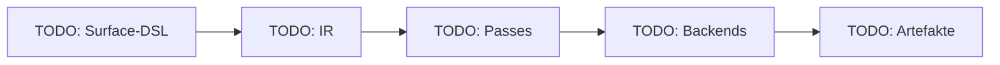
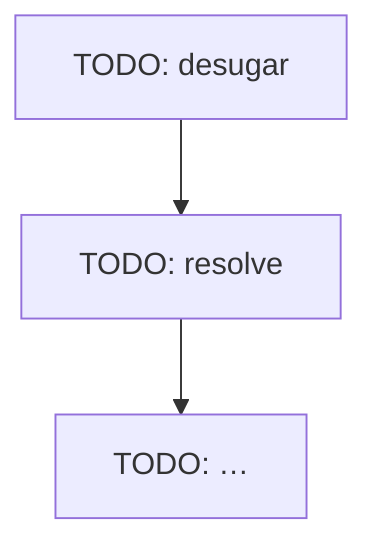

<!--
============================================================================
SCHREIBREGELN FÜR DEN AUSFÜHRENDEN AGENTEN (verbindlich)
Diesen Kommentarblock erst entfernen, wenn das Dokument fertig ist.
============================================================================

1. Sprache: Das Dokument MUSS vollständig auf DEUTSCH verfasst sein.
   Englisch ist nur erlaubt für Code, Bezeichner, Befehle und
   feststehende Fachbegriffe; diese beim ersten Auftreten erklären.
2. Stil: didaktisch, flüssig lesbar, den Leser abholen und mitnehmen.
   - Jedes Kapitel beginnt mit 1–3 Sätzen: Worum geht es, und warum ist
     es wichtig?
   - Vom Konkreten zum Abstrakten: erst ein kleines Beispiel, dann das
     Prinzip.
   - Kurze Absätze; Aufzählungen nur für echte Listen.
   - Keine Füllsätze, keine Marketing-Sprache, keine unbelegten
     Superlative.
3. Fachbegriffe: Jeden Fachbegriff beim ersten Auftreten kurz und
   verständlich erklären (ein Satz reicht) UND ins Glossar am Ende
   aufnehmen. Mindestens: Transpiler, IR/Zwischenrepräsentation, AST,
   Pass, Backend, Lowering, Desugaring, Präzedenz, Assoziativität, Oracle,
   Differenzialtest, Readtable, Borrow/Lifetime, Elision, Vtable,
   Komposition, Idempotenz, Capability.
4. Visualisierung:
   - Reichlich Code-Beispiele: immer DSL-Eingabe UND erzeugte Ausgabe
     gegenüberstellen (mindestens C++, Rust und Python; wo sinnvoll auch Go
     und CL).
   - Beispiele müssen ECHT sein: aus den committeten Dateien bzw. aus
     build/ kopiert, nicht erfunden. Quelle (Pfad) unter jedem Block
     angeben.
   - Mermaid-Diagramme für Architektur, Datenfluss, Pass-Pipeline,
     Modul-Abhängigkeiten, Klassenhierarchie/Komposition und die
     Test-Pyramide. Mindestens 6 Diagramme. Jedes Diagramm bekommt einen
     einleitenden Satz, der sagt, was man darin sieht.
   - Jedes Mermaid-Diagramm vor dem Einchecken auf gültige Syntax prüfen
     (z. B. `npx -y @mermaid-js/mermaid-cli -i … -o /tmp/x.svg`, falls
     verfügbar; sonst sorgfältig gegenlesen).
5. Belege: Zahlen (Tests, Checks, Zeilen, Laufzeiten) nur aus echten
   Läufen; Commit-Hashes und Dateipfade angeben. Was nicht verifiziert
   werden konnte, ausdrücklich als "nicht verifiziert" kennzeichnen.
6. Inhaltliche Struktur: exakt die Kapitel 1–4 unten (plus Einleitung,
   Glossar, Anhang). Kapitel 2 ist Pflicht, auch wenn es kurz ist.
   Abweichungen vom Plan werden dort EHRLICH benannt, nicht versteckt.
7. Länge: so lang wie nötig, so kurz wie möglich. Keine Kapitel
   wiederholen den Inhalt anderer Kapitel.
8. Vor Abgabe: alle `TODO`-Marker ersetzt, alle Links/Pfade existieren,
   dieser Kommentarblock entfernt.
============================================================================
-->

# Walkthrough — Polyglot-Generator: ein Transpiler, fünf Zielsprachen

> Ordner: `example/13_polyglot_generator/` · Plan:
> [plan.md](./plan.md), [task.md](./task.md) · Zeitraum: `TODO` ·
> Commits: `TODO erster Hash` … `TODO letzter Hash`

## Einleitung

<!-- TODO: 1–2 Absätze.
     - Ausgangslage: 21 einzelne cl-*-generator-Repos, jedes mit eigener
       Kopie derselben Ideen.
     - Ziel: eine Eingabe, mehrere idiomatische Ausgaben.
     - Für wen ist dieses Dokument, und wie liest man es (Lesepfad)?
     - Ein allererstes Mini-Beispiel: eine DSL-Funktion und darunter ihre
       Ausgabe in C++, Rust und Python. -->

```lisp
;; TODO: Mini-Beispiel (DSL), Quelle: examples/01_shapes/…
```

```cpp
// TODO: erzeugtes C++ — Quelle: examples/01_shapes/source01/cpp/…
```

```rust
// TODO: erzeugtes Rust — Quelle: examples/01_shapes/source01/rust/…
```

```python
# TODO: erzeugtes Python — Quelle: examples/01_shapes/source01/python/…
```

## 1. Was exakt implementiert wurde

### 1.1 Überblick

<!-- TODO: Architekturdiagramm (Frontend → IR → Passes → Backends → Driver);
     danach eine Tabelle "Datei → Zuständigkeit → Zeilen" der wichtigsten
     src/-Dateien. -->



### 1.2 Ein Programm auf dem Weg durch den Transpiler

<!-- TODO: Ein kleines Programm Schritt für Schritt verfolgen:
     S-Expression → IR-Knoten (Ausschnitt, gedruckt) → nach desugar → nach
     rename → Ausgabe je Backend. Sequenzdiagramm (mermaid sequenceDiagram)
     des Aufrufs von write-project. -->

### 1.3 Die DSL (Frontend)

<!-- TODO:
     - CL-Semantik (and/or logisch, logand bitweise, /= ungleich)
     - Readtable :invert via named-readtables, erklärt an `Point` vs `point`
     - target-case, Erweiterungspakete cpp:/py:/rs:/go:, define-dsl-macro
     - Beispiel und Ausgabe -->

### 1.4 Die Zwischenrepräsentation (IR)

<!-- TODO: define-node, Knotenhierarchie (mermaid classDiagram), Typ-IR mit
     Regionen. Warum CLOS und nicht Strings wie in den Altgeneratoren? -->

### 1.5 Die Passes

<!-- TODO: Pipeline-Diagramm mit allen Passes in tatsächlicher Reihenfolge
     und der Aktivierung pro Backend. Je Pass 2–3 Sätze plus ein
     Vorher/Nachher-Beispiel. -->



### 1.6 Die Backends

<!-- TODO: Pro Backend (CL, Python, C++, Rust, Go) ein Unterkapitel:
     - Besonderheiten
     - Operator-Tabelle (Auszug)
     - Formatter
     - Idiomatik-Gate
     - ein DSL/Ausgabe-Paar
     Danach eine Vergleichstabelle Backend × Feature. -->

### 1.7 Module und Header/Impl-Split

<!-- TODO:
     - Was ein Modul ist (Namens-/Übersetzungseinheit, nicht Lisp-Datei)
     - Abhängigkeitsgraph von p09_multimodule (mermaid)
     - erzeugte .hpp/.cpp nebeneinander
     - Include-Analyse (Wert vs. Vorwärtsdeklaration)
     - Rust mod/use, Python __all__, Go-Packages -->

### 1.8 Parameter-Modi, Mutabilität und Lifetimes

<!-- TODO: Tabelle :in/:inout/:sink → Rust/C++/Python/Go. longest und
     Parser<'a> als DSL + Rust + C++. Elision-Regeln in einfachen Worten.
     Warum es keinen eigenen Borrow-Checker gibt. -->

### 1.9 Interfaces, Vererbung und Komposition

<!-- TODO:
     - classDiagram der Widget-Hierarchie
     - dieselbe Hierarchie nach inheritance->composition als Diagramm
     - erzeugtes Rust (Dyn-Trait, freie Funktionen, Delegation) und Go
       gegenüber nativem C++/Python
     - Erklärung, warum Go den Pass ebenfalls braucht -->

### 1.10 Portable Intrinsics und Preludes

<!-- TODO: define-intrinsic (Haxe-Vorbild @:coreApi/_std), Tabelle der
     Intrinsics, wann eine Prelude entsteht (mit Beispiel). -->

### 1.11 Driver, CLI und Idempotenz

<!-- TODO: write-project, Vergleich mit Dateiinhalt statt sxhash,
     Header-Kommentar, polyglot-gen.sh-Aufruf mit echter Ausgabe. -->

### 1.12 Tests und Ergebnisse

<!-- TODO: Test-Pyramide (mermaid) plus Tabelle mit ECHTEN Zahlen:
     - Unit-Checks
     - Spec-Einträge
     - Zufalls-Präzedenztests pro Backend
     - Integrationsprogramme × Targets (PASS/SKIPPED)
     - Idiomatik-Gates
     - ECL
     - Determinismus
     Dazu die Befehle zum Reproduzieren. -->

| Suite | Befehl | Ergebnis |
|---|---|---|
| Unit + Spec | `./run-tests.sh` | TODO |
| Doku aktuell | `./run-tests.sh --docs-check` | TODO |
| Präzedenz (zufällig) | `./run-tests.sh --paren` | TODO |
| ECL | `./run-tests.sh --ecl` | TODO |
| Integration | `./run-integration.sh` | TODO |
| Determinismus | `./run-integration.sh --determinism` | TODO |

## 2. Architektur-Entscheidungen, die aufgrund von Tests geändert werden mussten

<!-- TODO: Pro Änderung ein Eintrag in der Tabelle und darunter ein kurzer
     Absatz mit Vorher/Nachher-Code. Quellen: worklog.md und Commit-Bodies.
     Auch Kernänderungen beim Go-Backend (R3) hier aufführen. Gab es keine,
     das ausdrücklich schreiben. -->

| # | Plan (plan.md/task.md) | Welcher Test hat es gezeigt? | Was wurde geändert? | Commit |
|---|---|---|---|---|
| 1 | TODO | TODO | TODO | TODO |

## 3. Learnings und mögliche zukünftige Erweiterungen

### 3.1 Learnings

<!-- TODO: Technisch (z. B. Präzedenz, Borrowing, Split), prozessual (z. B.
     Klammer-Hygiene: welche Checks haben tatsächlich Fehler gefangen,
     Zahlen aus worklog.md) und werkzeugbezogen (parenmedic, ECL, Formatter). -->

### 3.2 Mögliche zukünftige Erweiterungen

<!-- TODO: priorisierte Liste mit je 1–2 Sätzen Nutzen und Aufwand, z. B.:
     - (shared T)/(shared-mut T)
     - hierarchische Module
     - Generics/Templates
     - Result/Fehler-Propagation portabel
     - JS/TS-Backends
     - Legacy-Frontend für cl-cpp-generator2-Dialekt
     - Source-Maps
     - Ownership-Hinweise statt expliziter Modi -->

## 4. Neue Programme und Pakete für das Dockerfile

<!-- TODO: Nur Pakete, die im Container gefehlt haben und dauerhaft nötig
     sind. Versionen aus worklog.md (Schritt 0.1).
     Hinweis: Das Dockerfile wird aus
     example/05_dockerfile_meta/source01/examples/03_ai_env/gen_ai_env.lisp
     generiert. Hier nur VORSCHLAGEN (inkl. Snippet für gen_ai_env.lisp),
     nicht selbst ändern. -->

| Paket | Quelle | Version | Wozu | Pflicht/optional |
|---|---|---|---|---|
| `ecl` | apt | TODO | zweiter Lisp-Portabilitätstest | TODO |
| `clang-format` | apt | TODO | C++-Formatter | TODO |
| `golang-go` | apt | TODO | Go-Backend: gofmt, go vet, go run | TODO |
| `emacs-nox` | apt | TODO | Reindent-Check (`lisp-check.sh --indent`) | TODO |
| trivia, fiveam, named-readtables | Quicklisp (Preload) | TODO | Bibliotheken des Generators | TODO |
| Symlink `cl-cl-generator` in `~/quicklisp/local-projects` | Dockerfile `RUN ln -s` | — | Laden ohne Push auf die Registry | optional |

```lisp
;; TODO: Vorschlag für die Ergänzung in gen_ai_env.lisp (nicht angewendet)
```

## Glossar

<!-- TODO: alphabetisch; jeder Begriff 1–2 Sätze; mindestens die Begriffe
     aus Regel 3. -->

| Begriff | Erklärung |
|---|---|
| TODO | TODO |

## Anhang: Befehle zum Nachvollziehen

```bash
# TODO: exakte Befehle (cwd example/13_polyglot_generator/) für Setup,
# Tests, Integration und Beispielgenerierung
```
